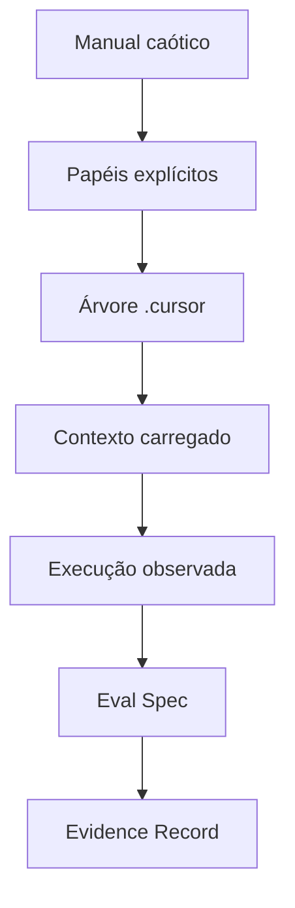

# Estrutura Editorial da V5 Beta 2

## Objetivo

Levar um desenvolvedor iniciante de um modelo mental simples até a execução auditável de contexto no Cursor, sem confundir organização de arquivos com comportamento do runtime.

## Progressão

1. **Orientação:** público, rotas de leitura, limites e vocabulário mínimo.
2. **Oficina desorganizada:** responsabilidades misturadas e separação lúdica.
3. **Ponte técnica:** contexto, progressive disclosure, temperatura e custo como hipótese.
4. **Cursor executável:** mecanismos nativos, experimento mínimo e roteiro acumulativo do pedido à evidência.
5. **Artefatos verificáveis:** separação do arquivo caótico, pontes de leitura e responsabilidades de agent, playbook, skill, knowledge, rule e contract.
6. **Avaliação:** origem das assertions, Eval Spec, captura e Evidence Record.
7. **Caso assíncrono:** API, job, persistência, SignalR, reconciliação e evidência.
8. **Governança:** classificação híbrida, autoridade, escrita, orçamento e adoção.
9. **Laboratórios:** Kit A, Kit B, templates, checklist e generalização.

## Linha narrativa

## Decisões estruturais

| Decisão | Aplicação na V5 Beta 2 |
|---|---|
| Fonte única | Artefatos específicos ficam sob `.cursor/`; não existe `ai-context/`. |
| Playbook fora de knowledge | `.cursor/playbooks/` permanece no primeiro nível do contexto. |
| Host explícito | O Cursor é a implementação de referência. |
| Fronteira semântica | `CURSOR NATIVE`, `OPEN SPEC` e `BOOK ONTOLOGY`. |
| Schema canônico | Campos próprios do livro usam lowerCamelCase e `schemaVersion`. |
| Avaliação rastreável | Assertions ligam fonte original, artefato atual, método e verificador. |
| Caso semi-completo | Segurança e infraestrutura detalhadas permanecem fora do recorte. |
| Hands-on real | Kit A e Kit B existem como arquivos executáveis no pacote. |
| Aprofundamento opcional | A anatomia ampliada de skill fica na Parte VI, depois do template mínimo. |
| Fechamento do capítulo 5 | Uma tabela liga cada artefato à pergunta respondida e à evidência mínima. |

## Recursos visuais

- Capa: oficina mecânica transformada em arquitetura modular de contexto.
- Mapa inicial: quatro movimentos e rotas de leitura.
- Separação: caos versus responsabilidade explícita.
- Progressive disclosure: navegação, gatilho, detalhe, execução e prova.
- Runtime: montagem de contexto no Cursor.
- Árvore: `.cursor/` e fronteira nativo/curado.
- Eval e Evidence: expectativa, execução e fato observado.
- Operação assíncrona: persistir → confirmar → notificar → reconciliar.
- Adoção: POC → Gate 1 → piloto → Gate 2 → padrão controlado.

## Critério de conclusão editorial

- Um iniciante consegue nomear o consumidor de cada artefato.
- O livro não apresenta frontmatter como garantia de cache ou roteamento.
- O caso assíncrono termina em Evidence Record comparável.
- Os exemplos próprios usam um schema consistente.
- O laboratório executa sem dependências externas além de Python e PyYAML.
