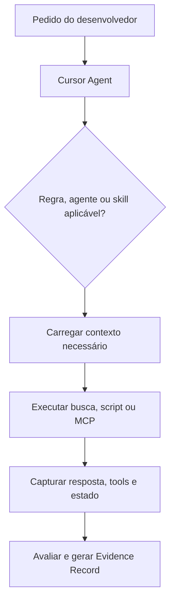

# Parecer técnico progressivo para a V4

## 1. Escopo e método

Este parecer confronta o manuscrito V3.1 com três avaliações fornecidas em sequência:

1. crítica inicial produzida no Cursor;
2. revisão adversarial da crítica anterior;
3. consolidação produzida pelo Gemini.

As três avaliações não constituem três confirmações independentes. A segunda revisa a primeira, e a terceira consolida as duas. Por isso, repetição de um achado entre os arquivos aumenta a necessidade de verificação, mas não aumenta automaticamente sua validade.

Cada hipótese foi classificada como:

- **ACEITAR:** o problema está presente e a correção proposta é adequada;
- **ACEITAR COM AJUSTE:** o problema existe, mas a justificativa, a gravidade ou a solução sugerida precisa ser corrigida;
- **REJEITAR:** a hipótese não é sustentada pelo manuscrito ou causaria regressão;
- **DECISÃO HUMANA:** há mais de uma solução tecnicamente defensável e a escolha altera o posicionamento do livro.

Foram usados quatro tipos de evidência:

- leitura integral do manuscrito;
- comparação literal de campos e exemplos;
- métricas editoriais do Markdown;
- documentação oficial atual do Cursor e da especificação Agent Skills.

Este documento não reescreve o e-book. Ele congela decisões propostas antes da construção da V4.

## 2. Diagnóstico executivo

O V3.1 já possui uma base técnica e pedagógica acima da média: diferencia coordenação, capacidade, conhecimento, regra, contrato, avaliação e evidência; evita afirmar que HOT/WARM/COLD é universal; separa recuperação de aplicação; trata SignalR como canal e não como fonte de verdade; e oferece exemplos progressivos.

A principal fragilidade não é conteúdo incorreto. É a falta de um **caminho executável único e consistente** que conecte:

```text
documento caótico
→ artefatos canônicos
→ arquivos reconhecidos pelo Cursor
→ seleção e carregamento
→ execução observada
→ Eval Spec
→ Evidence Record validado
```

As revisões externas identificaram partes dessa lacuna, mas exageraram alguns vereditos. A V4 deve ser estruturalmente mais forte sem transformar o livro em uma documentação exaustiva do Cursor ou em um manual genérico de RAG.

## 3. Evidências quantitativas do V3.1

O manuscrito possui aproximadamente 14.937 palavras e 2.665 linhas.

| Bloco | Palavras aproximadas | Participação |
|---|---:|---:|
| Parte I — oficina | 2.624 | 17,6% |
| Parte II — ponte | 658 | 4,4% |
| Parte III — estrutura técnica | 5.321 | 35,6% |
| Parte IV — estudo de caso | 1.035 | 6,9% |
| Parte V — governança | 2.060 | 13,8% |
| Parte VI — templates | 1.547 | 10,4% |

O arquivo contém 70 delimitadores de caixas Pandoc, 179 linhas de tabela e 13 diagramas ou árvores em blocos `text`, mas nenhuma imagem referenciada e nenhum diagrama Mermaid.

Conclusão observável: a Parte III, e não a metáfora isoladamente, é o maior ponto de densidade cognitiva. A V4 deve reduzir a carga enciclopédica da Parte III antes de simplesmente cortar a Parte I.

## 4. Análise progressiva das hipóteses

### 4.1 C1 — A Parte IV não fecha o ciclo do método

**Veredito: ACEITAR COM AJUSTE. Severidade: alta para coerência didática; média para correção técnica.**

Evidência no V3.1:

- A Parte III define `must_retrieve`, `must_apply`, `must_not_claim`, assertions e um Evidence Record com veredito.
- A Parte IV termina com um YAML operacional contendo job, estados, notificação e contagem de testes, mas não o identifica como captura bruta nem o transforma no Evidence Record ensinado.
- A Parte IV descreve bem a operação assíncrona, porém não mostra como o corpus de contexto foi carregado e aplicado pelo agente.

A crítica inicial está correta ao apontar a ruptura. A afirmação de que o livro “não fecha o loop” seria excessiva, pois a Parte III demonstra parte do ciclo. O problema real é uma regressão de consistência entre partes.

**Proposta:** preservar o caso assíncrono, renomear o YAML final da Parte IV para `captura operacional observada` e acrescentar:

1. árvore do corpus usado no caso;
2. sequência de carregamento Cursor → agent/rule/skill → playbook/knowledge;
3. Eval Spec do caso;
4. Evidence Record final gerado a partir da captura.

### 4.2 C2 + C6 — Metadados sem consumidor e ausência de descoberta real

**Veredito: ACEITAR COM AJUSTE. Severidade: alta.**

“O consumidor nunca é explicado” não é literalmente verdadeiro. O V3.1 alerta que MCP não interpreta frontmatter arbitrário e que campos YAML só funcionam quando um componente os consome. Entretanto, o manuscrito não mostra um runtime concreto selecionando os artefatos.

Como o Cursor passou a ser a implementação de referência, a V4 deve explicar o comportamento real do host:

| Necessidade | Mecanismo de referência no Cursor | Observação |
|---|---|---|
| Instrução persistente e escopo por arquivo | `.cursor/rules/*.mdc` ou `AGENTS.md` | Project Rules usam frontmatter próprio; um `.md` solto em `.cursor/rules` não é equivalente. |
| Capacidade ativável | `.cursor/skills/**/SKILL.md` ou `.agents/skills/**/SKILL.md` | O Cursor suporta Agent Skills e carregamento progressivo. |
| Coordenador especializado | `.cursor/agents/*.md` | Subagents possuem contexto próprio e precisam receber contexto relevante do agente pai. |
| Tools e dados externos | `.cursor/mcp.json` | MCP expõe ferramentas; aprovação, autenticação e governança continuam necessárias. |
| Guardrail ou auditoria determinística | `.cursor/hooks.json` + scripts | Hooks podem observar ou bloquear eventos suportados; não substituem testes de domínio. |
| Busca no código | ferramentas de busca do Agent | Não deve ser descrita genericamente como “RAG” sem especificar indexação, ranking e captura observável. |

A documentação oficial atual confirma os mecanismos de [Rules](https://cursor.com/docs/rules), [Agent Skills](https://cursor.com/docs/skills), [Subagents](https://cursor.com/docs/subagents), [MCP](https://cursor.com/docs/mcp), [Hooks](https://cursor.com/docs/hooks) e [Search](https://cursor.com/docs/agent/tools/search).

**Proposta:** substituir o “consumidor fantasma” por um capítulo curto de **montagem de contexto no Cursor**, sem transformar o livro em manual completo de RAG. RAG customizado fica como Deep Dive opcional.

### 4.3 C3 — Catálogo completo antes de um corpus mínimo

**Veredito: ACEITAR. Severidade: média-alta.**

O reaproveitamento dos mesmos IDs entre exemplos ajuda, mas não substitui a experiência de ver os arquivos funcionando juntos. O leitor atravessa Agent, Playbook, Skill, Knowledge, anatomia, frontmatter, Rules e Contracts antes de executar uma consulta contra uma árvore integrada.

**Proposta:** após o primeiro Agent, Playbook, Rule e Contract, inserir um checkpoint obrigatório chamado **Primeiro contexto funcional no Cursor**:

1. árvore mínima;
2. quatro arquivos preenchidos;
3. prompt de teste;
4. lista de arquivos que o agente deveria consultar;
5. captura mínima do resultado;
6. uma pergunta de autoverificação.

Esse checkpoint não deve ser chamado de “MVP” sem qualificador. “Contexto mínimo executável” descreve melhor o objetivo didático.

### 4.4 C4 — Agent Skills e ontologia do livro estão visualmente próximos demais

**Veredito: ACEITAR COM AJUSTE. Severidade: média após adoção explícita do Cursor.**

O V3.1 já contém dois disclaimers corretos. Portanto, a fronteira não está ausente. O problema é que skill, playbook e rule aparecem com blocos visuais muito semelhantes, embora obedeçam a contratos diferentes.

Na V4, cada exemplo deve receber um marcador estável:

| Marcador | Significado |
|---|---|
| `CURSOR NATIVE` | Estrutura interpretada diretamente pelo Cursor. |
| `OPEN SPEC` | Estrutura definida pela especificação Agent Skills. |
| `BOOK ONTOLOGY` | Convenção semântica proposta pelo livro; requer adapter, regra, skill ou harness que a consuma. |

Não é recomendável adicionar comentários repetitivos dentro de todos os snippets. Uma legenda visual e uma tabela de conformidade reduzem repetição e tornam a fronteira verificável.

### 4.5 C5 — A metáfora da oficina está longa demais

**Veredito: ACEITAR PARCIALMENTE. Severidade: baixa-média.**

A recomendação do Gemini para encerrar a oficina imediatamente após “Cinco falhas” deve ser rejeitada. As seções seguintes possuem funções úteis:

- “Como saber se está organizada” prepara o conceito de eval;
- “Como evoluir o acervo” prepara governança;
- “Limites da metáfora” evita transferência literal incorreta;
- “Modelo mental completo” consolida o mapeamento.

O problema é repetição, não existência dessas seções.

**Proposta:** manter a jornada completa e fundir “Como saber” + “Como evoluir” em um checkpoint visual de uma página. Preservar “Limites” e “Modelo mental” como ponte curta. A redução estimada deve ficar entre 10% e 20% da Parte I, não 60%.

### 4.6 C7 — Autoridade é usada antes de ser ensinada

**Veredito: ACEITAR. Severidade: alta para iniciantes.**

`authority: advisory` aparece na primeira skill e `NORMATIVE`, `ADVISORY` e `ILLUSTRATIVE` aparecem no catálogo da skill muito antes da definição formal na Parte V.

**Proposta:** introduzir antes do primeiro frontmatter híbrido uma caixa obrigatória com:

- definição dos três níveis;
- diferença entre autoridade e temperatura;
- precedência mínima;
- stop condition para conflito material.

A Parte V continua responsável pelo aprofundamento, ciclo de vida e governança.

### 4.7 C8 — A Parte VI não entrega o pacote Backend prometido

**Veredito: ACEITAR. Severidade: alta.**

A rota hands-on promete artefatos completos e copiáveis. A Parte VI oferece o kit do avaliador e templates vazios, mas não o corpus completo do `Backend Development Agent` usado no worked example.

**Proposta:** a Parte VI deve conter dois laboratórios versionados:

- **Kit A — contexto sob avaliação:** arquivos completos do caso assíncrono, adaptados ao Cursor;
- **Kit B — harness de avaliação:** agente avaliador, skill de auditoria, Eval Spec, fixtures, schema e Evidence Record.

Os templates vazios devem vir depois dos dois kits e ser apresentados como material para generalização, não como cumprimento da rota hands-on.

### 4.8 C9 — A escrita de `description` está subensinada

**Veredito: ACEITAR. Severidade: média; esforço baixo.**

O V3.1 apenas informa que uma descrição ampla ativa demais e uma estreita pode não ser encontrada. Isso é correto, mas insuficiente para execução.

A [documentação oficial de otimização de descriptions](https://agentskills.io/skill-creation/optimizing-descriptions) recomenda casos realistas que devem e não devem ativar, múltiplas execuções e separação entre conjuntos de ajuste e validação.

**Proposta para o fluxo principal:** description ruim → description melhor → três prompts (`shouldTrigger`, paráfrase e `shouldNotTrigger`) → interpretação do resultado.

**Deep Dive opcional:** aproximadamente 20 queries, múltiplas execuções, taxa de ativação e divisão treino/validação. Os números devem ser apresentados como ponto de partida da especificação, não como garantia universal.

### 4.9 Schema drift entre Partes III, IV e VI

**Veredito: ACEITAR COM CORREÇÃO DE GRAVIDADE. Severidade: alta editorial; funcional ainda não comprovada.**

As divergências são reais:

- `correlation_fields` versus `correlationFields`;
- `output.accepted` versus `output.success`;
- `must_not_retrieve` aparece apenas no template final;
- `evaluation_method` mistura mecanismo concreto e classe abstrata;
- `verify_with` surge apenas depois;
- o Evidence Record muda de forma plana para `expected`/`observed`;
- `threshold: 0.85` aparece sem definição da métrica.

O Gemini exagera ao afirmar que isso necessariamente “quebra parsers”. O livro não entrega um parser único nem um schema executável que esses snippets aleguem satisfazer. A consequência comprovada é perda de confiança, impossibilidade de cópia consistente e risco de implementações incompatíveis. A quebra de parser só pode ser afirmada depois que existir um schema e um validador.

**Proposta canônica:**

1. definir um schema versionado para Contract, Eval Spec e Evidence Record;
2. validar todos os exemplos na geração do livro;
3. preservar nomes exigidos por padrões externos, sem tentar impor um casing global;
4. usar `evaluationMethod` para `deterministic|semantic|hybrid` e `verifyWith` para `traceOrder|jsonSchema|approvedLlmJudge`;
5. manter `mustNotRetrieve`, mas apresentá-lo junto aos demais campos;
6. remover o threshold mágico ou definir fórmula, população, severidade e calibração;
7. adotar a estrutura `expected`/`observed` no Evidence Record, pois ela coincide com a própria recomendação do livro.

Padronizar “tudo em camelCase” ou “tudo em snake_case” seria tecnicamente incorreto. Cursor, Agent Skills, JSON de API e ontologia do livro possuem contratos externos diferentes. A consistência deve ser **por schema**, não por aparência global.

## 5. Achados independentes das três revisões

### 5.1 Termo usado antes da definição

Na Parte I, a caixa do “cartão operacional” chama o Agent Card de “conteúdo HOT” antes de HOT ser introduzido na Parte II. Isso viola a decisão editorial de manter a oficina sem jargão técnico.

**Correção:** remover “HOT” dessa caixa. A ponte posterior realiza o mapeamento.

### 5.2 Contagem de rotas inconsistente

“Existem duas rotas” é seguido por três rotas: essencial, aprofundamento e hands-on.

**Correção:** trocar por “Existem três rotas complementares”.

### 5.3 Glossário tardio

O glossário final é útil para consulta, mas não resolve a primeira ocorrência de termos densos. Para iniciantes, `runtime`, `host`, `corpus`, `assertion`, `trace`, `schema` e `frontmatter` devem receber microdefinições no ponto de uso.

**Correção:** manter o glossário final e adicionar caixas “Em uma frase” somente na primeira ocorrência dos termos de maior carga.

### 5.4 Conflito entre “rule” do livro e Cursor Project Rule

Uma `rule` semântica do livro não é automaticamente uma `.cursor/rules/*.mdc`. Com Cursor como referência, essa diferença torna-se central.

**Correção:** distinguir:

- **Domain Rule:** obrigação canônica do domínio;
- **Cursor Project Rule:** adapter nativo que injeta ou aponta a obrigação no contexto do host.

Se houver duplicação mínima entre as duas, deve existir `sourceId`, teste de sincronização e um único proprietário.

### 5.5 “RAG” não deve virar explicação genérica

O Cursor possui regras, skills, agentes, busca, MCP e hooks. Chamar toda recuperação de “RAG” esconderia mecanismos diferentes e suas evidências.

**Correção:** ensinar primeiro o mecanismo concreto do Cursor; apresentar RAG customizado como alternativa quando o time controla indexação, chunking, ranking e observabilidade.

## 6. Arquitetura de referência proposta para a V4

### 6.1 Princípio

Usar o Cursor como implementação principal, mantendo um núcleo semântico migrável. O livro não deve fingir portabilidade automática; deve mostrar quais partes são nativas e quais exigem adaptação.

### 6.2 Estrutura recomendada

```text
repository/
├── AGENTS.md                         # orientação simples e hierárquica, se adotada
├── .cursor/
│   ├── rules/                        # Project Rules nativas (.mdc)
│   ├── agents/                       # subagents nativos (.md)
│   ├── hooks.json                    # guardrails/auditoria suportados pelo host
│   └── mcp.json                      # configuração sem segredos versionados
├── .agents/
│   └── skills/                       # Agent Skills portáveis e aceitas pelo Cursor
├── ai-context/
│   ├── playbooks/                    # coordenação canônica, não nativa do Cursor
│   ├── knowledge/                    # conteúdo consultivo
│   ├── rules/                        # regras de domínio canônicas, se separadas do adapter
│   ├── contracts/                    # schemas e contratos verificáveis
│   ├── evals/                        # casos, assertions e fixtures
│   └── evidence/                     # registros de execuções identificadas
└── scripts/                          # validação editorial e dos schemas do laboratório
```

Essa estrutura usa `.agents/skills/` como núcleo portável de skills, porque o Cursor o reconhece, e reserva `.cursor/` para capacidades específicas do host. A alternativa Cursor-first, com `.cursor/skills/`, também é válida, mas aumenta o custo de migração.

### 6.3 Fluxo que o livro precisa demonstrar



O diagrama deve vir acompanhado de uma tabela que informe qual arquivo ou componente produz cada transição. Sem isso, o fluxo seria apenas ilustrativo.

## 7. Proposta de índice da V4

### 7.1 Opção recomendada — revisão estrutural controlada

1. **Como ler e executar o laboratório.** Público, três rotas, limitações e pré-requisitos.
2. **Parte I — A oficina desorganizada.** Metáfora, funções, jornada e checkpoint condensado.
3. **Parte II — Da oficina ao runtime.** Mapeamento, contexto, progressive disclosure, temperatura, autoridade mínima e consumidor.
4. **Parte III — Contexto mínimo executável no Cursor.** Rules, agents, skills, MCP, hooks, núcleo portável e primeiro experimento.
5. **Parte IV — Worked example: relatório assíncrono.** Documento caótico → corpus → execução → captura observada.
6. **Parte V — Evals, Evidence e governança.** Assertions, origem dos valores, execução, schemas, interpretação, ciclo de vida e custo.
7. **Parte VI — Laboratório copiável.** Kit A, Kit B, validadores, templates vazios e exercícios.
8. **Glossário, conclusão e referências.**

Essa opção altera a ordem para que o leitor execute um contexto mínimo antes do catálogo completo. É a melhor opção para aproximar o material do objetivo hands-on.

### 7.2 Alternativa — revisão cirúrgica

Manter as seis partes atuais e apenas inserir consumidor, checkpoint, corpus na Parte IV, kits na Parte VI e schemas canônicos.

Essa alternativa reduz risco editorial e esforço, mas preserva parte da densidade enciclopédica da Parte III. Não é a recomendação principal para uma V4 anunciada como evolução estrutural.

## 8. Plano visual e atenção do leitor

Não é recomendável adicionar uma imagem a cada capítulo por obrigação. Imagens decorativas podem aumentar carga extrínseca e dividir a atenção. A regra deve ser: **um visual somente quando ele reduz o esforço para compreender uma relação, sequência ou fronteira**.

| Local | Visual proposto | Função pedagógica |
|---|---|---|
| Capa | Ilustração “oficina → árvore de contexto → agente” | Comunicar metáfora, tema e progressão sem parecer manual mecânico. |
| Parte I | Antes/depois do manual monolítico | Tornar visível a separação das cinco responsabilidades. |
| Parte II | Fluxo de montagem do contexto | Mostrar que pasta e YAML não executam sozinhos. |
| Parte III | Arquitetura Cursor-native × núcleo portável | Evitar confusão entre host, open spec e ontologia do livro. |
| Parte IV | Diagrama de sequência do relatório | Unificar API, job, persistência, SignalR e reconciliação. |
| Parte V | Ciclo Eval Spec → Runner → Evaluador → Evidence | Clarificar origem e destino dos dados. |
| Parte VI | Mapa Kit A × Kit B | Mostrar dependências do laboratório copiável. |

Regras visuais:

- não repetir no parágrafo tudo que o diagrama já mostra;
- aproximar legenda e visual;
- usar as mesmas cores para HOT/WARM/COLD, com rótulos textuais para acessibilidade;
- evitar mais de sete nós em um único fluxo;
- fornecer descrição alternativa;
- gerar SVG para PDF e PNG de fallback;
- validar contraste e legibilidade em escala de cinza;
- manter tabelas para mapeamentos exatos e diagramas para relações ou sequência.

A capa atual não pôde ser avaliada visualmente porque o material fornecido nesta rodada é o Markdown do manuscrito. A V4 deve preservar autoria de Hernandes Junio de Assis e evitar elementos de capa que sugiram um livro específico sobre mecânica ou apenas sobre Cursor.

## 9. Decisões solicitadas ao autor

### D1 — Estrutura física

- **A — núcleo portável + adapter Cursor (recomendada):** `.agents/skills` + `.cursor` + `ai-context`.
- **B — Cursor-first:** tudo que o Cursor suporta diretamente sob `.cursor`; migração posterior documentada.

### D2 — Grau de revisão

- **A — estrutural controlada (recomendada):** adotar o índice da seção 7.1.
- **B — cirúrgica:** manter a ordem atual e inserir correções.

### D3 — Caso assíncrono

- **A — preservar e recentrar (recomendada):** manter .NET/SignalR, reduzir detalhes não essenciais e fechar o corpus/eval.
- **B — substituir por exemplo mais simples:** menor carga de domínio, porém perde o caso já amadurecido.

### D4 — Convenção dos schemas próprios

- **A — lowerCamelCase nos schemas do livro (recomendada):** alinhamento com JSON/.NET; padrões externos preservam seus nomes.
- **B — snake_case nos schemas do livro:** boa legibilidade em YAML; exige conversão explícita para payloads .NET.

### D5 — Escopo visual

- **A — seis diagramas funcionais + capa (recomendada).**
- **B — apenas três diagramas críticos + capa:** runtime, Cursor e eval/evidence.

## 10. Definition of Done da V4

- [ ] Nenhum termo técnico obrigatório é usado antes de uma definição ou microdefinição.
- [ ] “Cursor native”, “Agent Skills open spec” e “ontologia do livro” são visualmente distinguíveis.
- [ ] O livro mostra quem descobre, carrega, executa e registra cada artefato.
- [ ] Existe um contexto mínimo executável antes do catálogo completo.
- [ ] A Parte IV conecta domínio, corpus, carregamento, execução, eval e Evidence Record.
- [ ] Kit A e Kit B estão preenchidos, versionados e copiáveis.
- [ ] Contract, Eval Spec e Evidence Record possuem schemas canônicos.
- [ ] Todos os exemplos estruturados válidos passam nos schemas; exemplos negativos são marcados.
- [ ] Nenhum threshold aparece sem métrica, população e regra de aprovação definidas.
- [ ] Descriptions possuem casos positivos, paráfrases e negativos.
- [ ] O laboratório possui validação determinística e instrução de execução no Cursor.
- [ ] Conteúdo sensível, credenciais e payloads privados possuem guardrails explícitos.
- [ ] Diagramas possuem função pedagógica, legenda, contraste e texto alternativo.
- [ ] Referências externas são atuais, primárias quando possível e acessadas na data da publicação.
- [ ] Uma leitura simulada por iniciante consegue seguir o fluxo sem saltar para definições futuras.
- [ ] Uma revisão humana aprova decisões de autoridade, assertions normativas e casos de domínio.

## 11. Evidence Record editorial

```json
{
  "evidenceId": "EV-EDITORIAL-V4-2026-08-05-001",
  "source": {
    "file": "context-engineering-para-times-de-desenvolvimento-v3.1.md",
    "lines": 2665,
    "wordsApprox": 14937
  },
  "reviews": [
    "1.critica-cursor-ebook.md",
    "2.avaliacao-copilot-cursor-ebook.md",
    "3.diretrizes-revisao-gemini.md"
  ],
  "method": [
    "full_source_read",
    "line_level_comparison",
    "schema_field_diff",
    "editorial_metrics",
    "official_cursor_docs_check",
    "agent_skills_spec_check"
  ],
  "accepted": ["C3", "C7", "C8", "C9"],
  "acceptedWithAdjustment": ["C1", "C2+C6", "C4", "C5", "schema_drift"],
  "rejectedAsWritten": [
    "three_reviews_are_independent_confirmation",
    "schema_drift_proves_parser_failure_without_a_parser",
    "cut_part_i_immediately_after_five_failures",
    "apply_one_global_casing_to_external_and_internal_schemas"
  ],
  "newFindings": [
    "HOT_used_before_definition",
    "two_routes_statement_lists_three",
    "cursor_project_rule_conflicts_with_book_rule_term",
    "glossary_only_at_end",
    "part_iii_is_the_largest_density_center"
  ],
  "status": "AWAITING_HUMAN_DECISIONS",
  "limitations": [
    "cover_not_visually_available_in_the_attached_markdown",
    "no_v4_files_generated",
    "no_cursor_runtime_experiment_executed_in_this_review"
  ]
}
```

