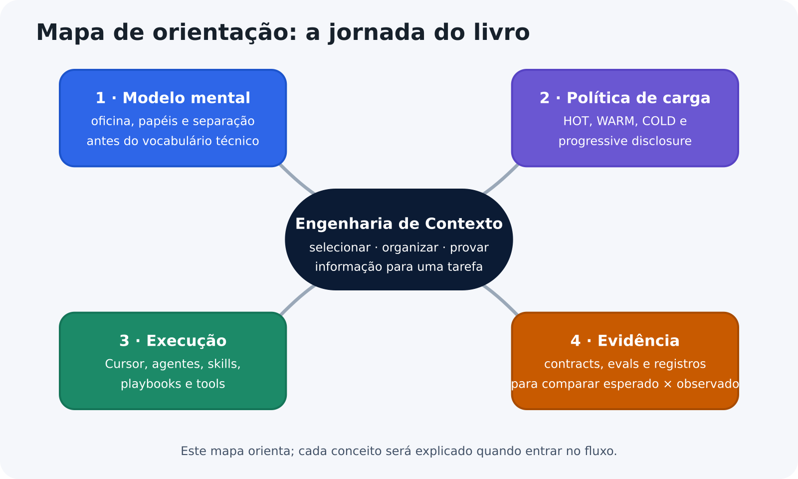
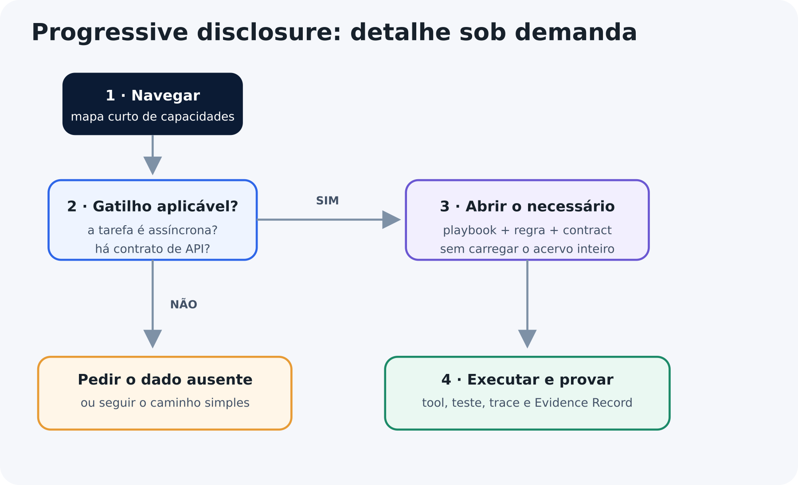
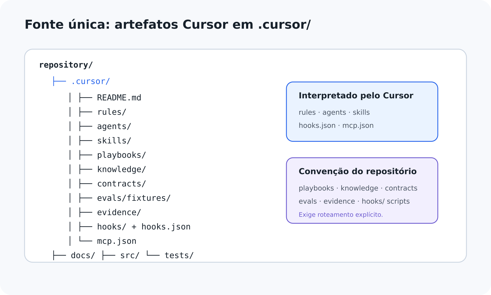
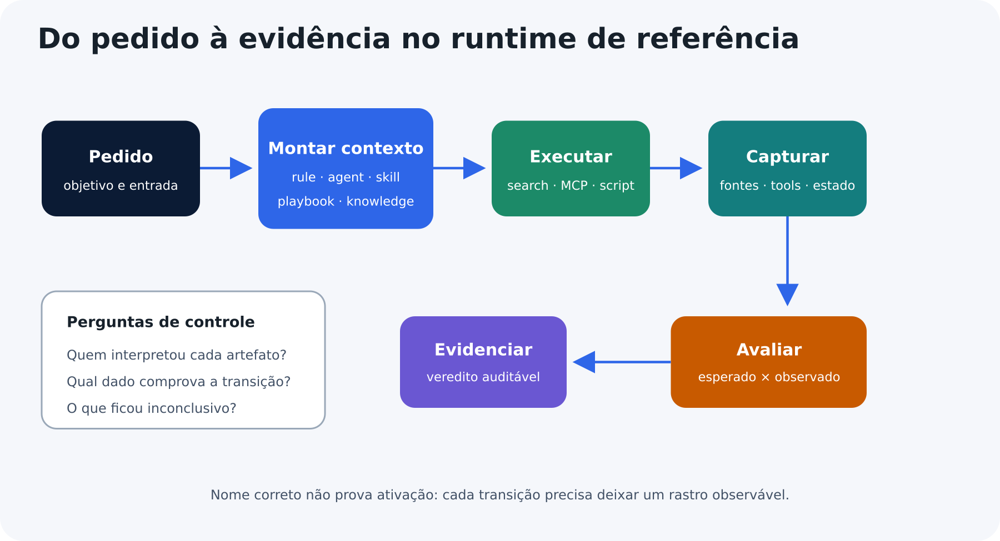
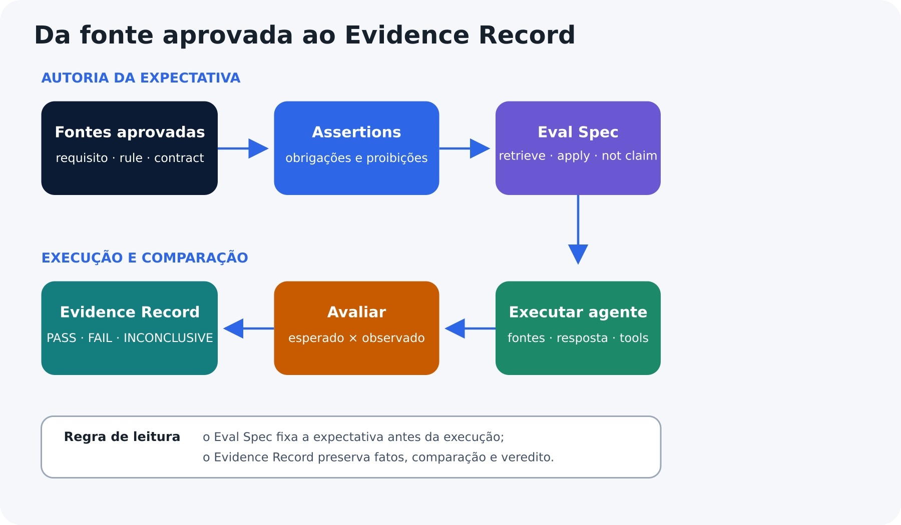
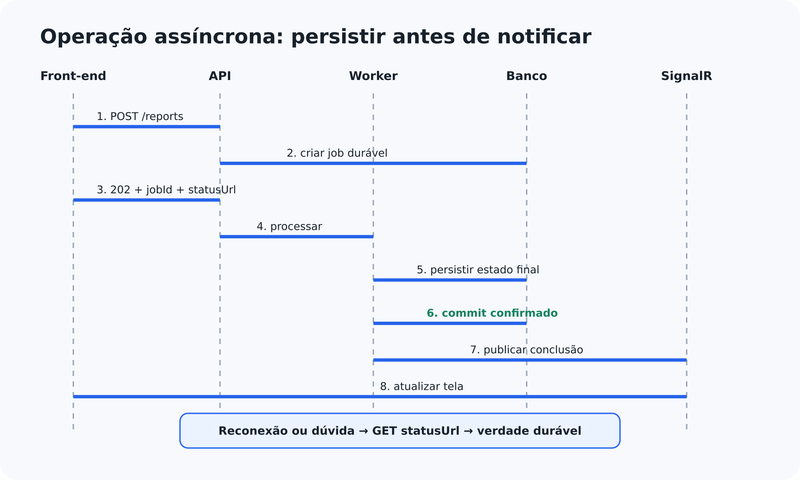
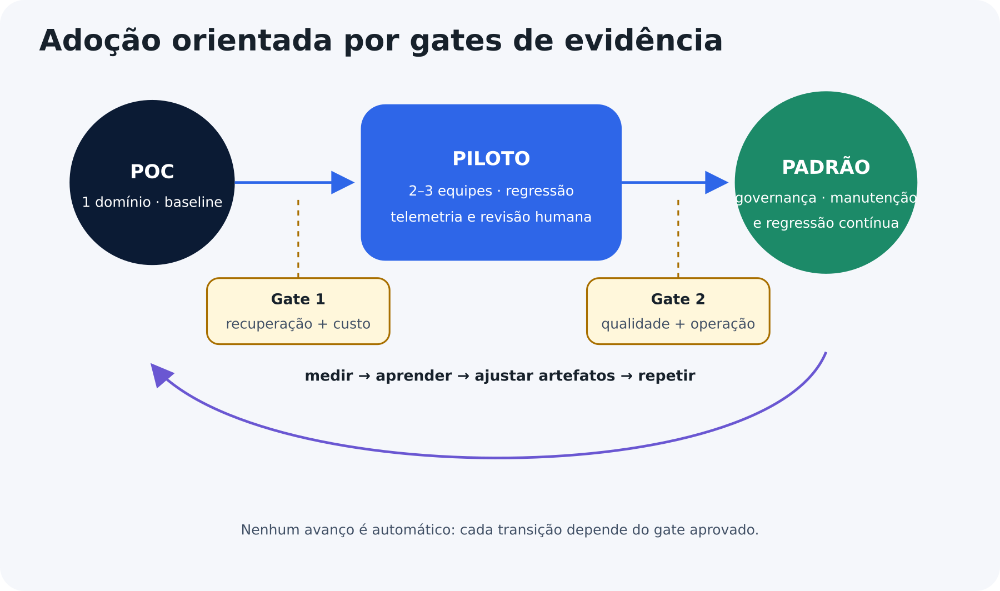

::: {.info title="Propósito da edição Beta 2"}
Esta é a primeira edição integral submetida a revisores externos. Ela transforma o método em um caminho executável no Cursor: documento caótico, artefatos canônicos, montagem de contexto, execução observada, Eval Spec e Evidence Record validado. A oficina constrói o modelo mental; o backend mostra o uso real; os laboratórios finais entregam o corpus e o harness de avaliação completos.
:::

::: {.warning title="Exemplo mecânico fictício"}
O motor, os procedimentos, as medições e as especificações deste livro são exclusivamente didáticos. Não utilize o conteúdo para manutenção mecânica real.
:::

::: {.warning title="Limites de sistemas com IA"}
Modelos de linguagem possuem comportamento probabilístico. Organização de contexto, skills, regras, contratos e avaliações reduzem riscos, mas não garantem resultados perfeitos.
:::

\newpage

# Como ler este E-book

O livro foi desenhado para desenvolvedores que conhecem software, mas estão entrando no universo de agentes, context engineering e sistemas orientados por LLM.

## Um mapa antes da jornada

O mapa abaixo apresenta quatro movimentos sem exigir que você conheça previamente os artefatos. Os nomes são destinos; cada conceito será definido antes de ser usado para tomar uma decisão.

{ width=94% }

1. construir um modelo mental com uma oficina fictícia;
2. organizar políticas para carregar o detalhe aplicável;
3. observar como um host monta contexto e executa recursos;
4. comparar expectativa com execução e preservar a evidência.

O centro do mapa não é uma ferramenta. **Engenharia de contexto** é o trabalho de selecionar, organizar e manter informações que aumentam a chance de uma tarefa ser decidida, executada e verificada corretamente.

## Três rotas de leitura

Existem três rotas complementares:

**Rota essencial.** Leia o fluxo principal. Ele apresenta a oficina, realiza a ponte para backend e termina com um exemplo assíncrono semi-completo, recortado para aprendizado.

**Rota de aprofundamento.** Leia também as caixas “Para curiosos” e “Deep Dive”. Elas tratam de classificação híbrida, governança, conflitos, avaliação entre modelos e orçamento de contexto.

**Rota hands-on.** Ao chegar aos exercícios de eval e evidência, use a referência para a Parte VI. Lá estão os artefatos completos e copiáveis; no fluxo principal permanecem apenas os conceitos e o exemplo mínimo necessário.

Os marcadores possuem funções estáveis:

| Marcador | Função |
|---|---|
| Exemplo | Demonstra uma aplicação reduzida. |
| Cuidado | Expõe risco ou interpretação incorreta. |
| Dica | Resume uma decisão prática. |
| Evidência | Mostra como provar uma conclusão. |
| Para curiosos | Aprofundamento opcional. |

O fluxo principal contém o necessário para compreender e aplicar o método. Conteúdo normativo, stop conditions e critérios de evidência nunca são escondidos em aprofundamentos opcionais.

# Introdução - o problema não é falta de documentação

Times de desenvolvimento acumulam instruções em `README`, arquivos de agentes, wikis, comentários, tickets, ADRs, contratos, exemplos e prompts. Quando um agente de IA recebe uma tarefa, essa informação precisa ser descoberta, selecionada, carregada, interpretada e aplicada.

Adicionar mais conteúdo não resolve automaticamente o problema. Um documento pode ser completo e ainda falhar porque:

- mistura obrigação com explicação;
- esconde regras em exemplos;
- não informa quando um procedimento deve ser ativado;
- possui fontes divergentes;
- carrega detalhes irrelevantes em todas as tarefas;
- não permite provar qual informação foi utilizada;
- não possui testes de recuperabilidade.

Context engineering é o trabalho de selecionar e manter o conjunto de informações que aumenta a chance do comportamento desejado. O objetivo não é o menor prompt possível. É o **contexto mínimo suficiente** para decidir, executar e verificar.

::: {.tip title="Minimal não significa curto"}
Um agente com poucas linhas pode ser vago. Um agente um pouco maior pode ser mais eficiente se concentrar responsabilidade, invariantes, roteamento, critérios de parada e evidência final.
:::

Esta edição começa longe do backend de propósito. Antes de olhar pastas, schemas ou APIs, vamos observar uma oficina em que todo conhecimento foi colocado no mesmo manual.

{ width=95% }

\newpage

# Parte I - A oficina desorganizada

## O manual que parecia completo

Uma oficina decidiu registrar em um único documento tudo que seus mecânicos precisavam saber sobre montagem e diagnóstico de motores.

O manual continha:

- a responsabilidade do mecânico;
- explicações sobre peças;
- procedimentos de desmontagem e montagem;
- regras de segurança;
- valores de referência;
- histórias de serviços antigos;
- formulários de inspeção;
- testes finais;
- dicas transmitidas por profissionais experientes.

Em uma primeira leitura, a solução parecia excelente. Tudo estava no mesmo lugar. Ninguém precisava procurar em várias fontes.

O problema surgiu durante um serviço urgente. O mecânico precisava descobrir rapidamente:

1. qual motor estava diante dele;
2. qual instrução era obrigatória;
3. qual procedimento se aplicava àquele modelo;
4. quando deveria interromper;
5. como comprovar que o serviço havia terminado corretamente.

O manual apresentava todas essas informações, mas elas estavam misturadas. Uma observação histórica aparecia ao lado de uma regra de segurança. Uma dica informal tinha o mesmo destaque de uma especificação aprovada. Um procedimento de outro modelo parecia semelhante o suficiente para induzir uma decisão incorreta.

O documento fictício abaixo é deliberadamente ruim. Leia como se você precisasse executar um serviço urgente e observe quantas responsabilidades precisa separar mentalmente.

```markdown
<!-- ANTI-PATTERN: responsabilidades misturadas no mesmo arquivo -->

Você é um mecânico sênior responsável por montar e diagnosticar motores.

O cabeçote fecha a parte superior do motor e ajuda a formar a câmara
de combustão. Nunca invente valores de torque e não continue se o
modelo exato do motor não estiver identificado.

Para instalar o cabeçote, limpe as superfícies, verifique a planicidade,
confirme a junta correta, consulte a sequência de aperto, aplique a
especificação correspondente e registre o resultado.

Para verificar a planicidade, posicione a régua de precisão nos sentidos
longitudinal, transversal e diagonal. Utilize o instrumento apropriado
e compare o maior desvio com a fonte aprovada.

O motor fictício Aurora X1 utiliza a tabela TQ-AUR-X1. Outros motores
podem utilizar materiais, parafusos e sequências diferentes. Nunca
reutilize um parafuso identificado como de uso único.

Se o motor apresentar baixa compressão depois da montagem, verifique
vedação, válvulas, junta, sincronismo e condições do cilindro.

Use o formulário de montagem para registrar o motor, as peças, o
instrumento utilizado, a sequência e o responsável pela inspeção.

Os primeiros cabeçotes eram frequentemente construídos com materiais
diferentes dos utilizados em motores modernos. Mudanças de material
podem alterar expansão térmica e métodos de inspeção.

Depois da montagem, execute os testes de vedação e compressão. Não
considere o serviço concluído apenas porque o motor ligou.

Se o resultado estiver fora da especificação, não tente compensar
aumentando o torque. Interrompa e execute o diagnóstico.
```

Todas as frases podem ser úteis, mas não possuem a mesma função.

| Trecho | Função percebida |
|---|---|
| “Você é um mecânico sênior...” | Define papel. |
| “O cabeçote fecha...” | Explica o domínio. |
| “Nunca invente valores...” | Impõe uma regra. |
| “Para instalar o cabeçote...” | Coordena um procedimento. |
| “Para verificar a planicidade...” | Descreve capacidade especializada. |
| “Os primeiros cabeçotes...” | Registra contexto histórico. |
| “Use o formulário...” | Indica recurso de saída. |
| “Não considere concluído...” | Define teste e critério de conclusão. |

O primeiro aprendizado é simples: **proximidade textual não significa responsabilidade igual**.

## O custo do manual monolítico

O manual único cria quatro dificuldades:

- **Decisão:** o mecânico precisa ler explicações extensas antes de encontrar o próximo passo.
- **Autoridade:** uma história antiga pode parecer tão obrigatória quanto uma regra atual.
- **Aplicabilidade:** um procedimento correto para determinado motor pode ser perigoso em outro.
- **Evidência:** mesmo quando o serviço funciona, outra pessoa pode não conseguir reconstruir qual fonte, medição ou decisão foi utilizada.

::: {.warning title="Conteúdo completo pode continuar inutilizável"}
O problema não é apenas ausência de conhecimento. É dificuldade de localizar a informação correta, reconhecer sua autoridade e aplicá-la na situação adequada.
:::

## O cartão operacional do chefe da oficina

::: {.info title="Uma metáfora para o Agent Card"}
“Cartão operacional” não é um termo universal de oficinas. Neste exemplo, ele representa uma ficha curta que o chefe consulta para coordenar qualquer serviço. No cenário técnico, seu equivalente é o **Agent Card**: o conteúdo HOT que concentra missão, invariantes, roteamento, condições de parada e evidência mínima.
:::

O primeiro refactor não cria várias pastas. Ele separa o que o mecânico precisa lembrar em praticamente todos os serviços.

O cartão operacional contém:

- responsabilidade: coordenar montagem e diagnóstico;
- identificação: confirmar motor e componente antes de agir;
- segurança: não inventar especificações;
- encaminhamento: usar a ordem de serviço correspondente;
- especialização: chamar quem possui uma habilidade específica;
- parada: interromper quando fonte, ferramenta ou condição estiver ausente;
- conclusão: finalizar somente depois de testes e registros.

O cartão é curto porque não tenta ensinar mecânica inteira. Sua densidade vem das decisões que concentra.

### O que não deve entrar no cartão

Não pertencem ali:

- catálogo completo de motores;
- todas as sequências de montagem;
- histórico de incidentes;
- formulários de todas as inspeções;
- explicações extensas sobre materiais;
- medições específicas de um componente.

Se todos os detalhes voltarem para o cartão operacional, o refactor apenas mudará o nome do manual monolítico.

## A ordem de serviço

O cartão informa que um procedimento precisa ser escolhido. A ordem de serviço coordena uma atividade específica.

Para instalar um cabeçote, uma ordem de serviço poderia conter:

### Pré-condições

- motor identificado;
- peça compatível;
- manual aplicável disponível;
- instrumentos verificados;
- superfície preparada.

### Procedimento

1. Inspecionar as superfícies.
2. Medir a planicidade.
3. Validar junta e parafusos.
4. Consultar sequência e valores aplicáveis.
5. Executar a instalação.
6. Registrar medições e componentes.
7. Realizar os testes finais.

### Condições de parada

- especificação ausente;
- medição fora da tolerância;
- componente incompatível;
- instrumento sem verificação;
- evidência insuficiente.

A ordem de serviço não precisa explicar profundamente a função de cada componente. Ela coordena pessoas, fontes, instrumentos e verificações para atingir um resultado.

## A capacidade especializada

Durante a instalação, medir planicidade exige habilidade, instrumento e método próprios. Essa capacidade pode ser usada em diferentes serviços: diagnóstico, montagem, retífica ou inspeção.

Uma capacidade especializada possui:

- condição clara de ativação;
- escopo delimitado;
- método conhecido;
- entradas necessárias;
- resultado verificável;
- critérios de falha;
- registro correspondente.

Nem todo procedimento é uma capacidade independente. “Instalar o cabeçote” coordena várias ações e fontes. “Medir planicidade” é uma capacidade reutilizável que pode participar de diferentes ordens de serviço.

::: {.tip title="Coordenação e capacidade resolvem problemas diferentes"}
A ordem de serviço responde “como atingir este objetivo?”. A capacidade especializada responde “como executar bem esta atividade reutilizável?”.
:::

## O manual consultivo

O manual deixa de ser uma mistura de tudo e passa a fundamentar decisões.

Ele pode explicar:

- função dos componentes;
- diferenças entre materiais;
- tipos de falha;
- instrumentos de medição;
- sinais de desgaste;
- compatibilidade entre peças;
- histórico de determinado modelo.

O manual não coordena sozinho o serviço. Também não deve esconder uma obrigação crítica em um parágrafo explicativo.

Quando uma regra muda, ela precisa possuir fonte e autoridade reconhecíveis. Quando uma explicação muda, o impacto pode ser diferente. Separar essas responsabilidades reduz o risco de tratar conhecimento ilustrativo como determinação obrigatória.

## O teste e o laudo

Uma oficina organizada não considera o trabalho concluído apenas porque o motor ligou.

O teste responde se o resultado atende aos critérios esperados. O laudo registra:

- identificação do motor;
- ordem de serviço utilizada;
- fonte consultada;
- instrumentos e medições;
- peças aplicadas;
- testes executados;
- resultado;
- exceções e riscos residuais.

Encontrar a instrução correta não prova que ela foi aplicada. Aplicar o procedimento não prova que o resultado foi validado. Validar o resultado não prova que outra pessoa conseguirá reconstruir a execução.

A sequência passa por cinco momentos: escolher a ordem correta, consultar o manual aplicável, executar a capacidade necessária, realizar o teste e registrar o laudo.

::: {.evidence title="O laudo fecha o ciclo"}
Outra pessoa deve conseguir compreender o que foi feito, quais fontes foram utilizadas, quais testes passaram e por que o serviço foi considerado concluído.
:::

## Uma jornada completa pela oficina

Para testar o modelo mental, acompanhe um serviço fictício do início ao fim.

Um veículo chega com perda de potência depois de um reparo recente. O cliente relata aquecimento e consumo de líquido de arrefecimento. A oficina não sabe ainda se a causa está no cabeçote, na vedação, na circulação ou em outro componente.

**1. Recepção e identificação.**

A primeira atividade não é desmontar. A oficina registra:

- identificação do veículo e do motor;
- serviço anterior conhecido;
- sintomas relatados;
- momento em que a falha aparece;
- alertas observados;
- autorização inicial.

Se a identificação do motor estiver incompleta, o cartão operacional obriga a interromper a seleção do procedimento. Uma ordem aparentemente semelhante não pode ser escolhida por conveniência.

**2. Escolha da ordem de serviço.**

O chefe seleciona uma ordem de diagnóstico inicial, não uma ordem de instalação. Essa diferença importa: o sintoma ainda não prova a causa.

A ordem escolhida orienta:

1. confirmar os sintomas;
2. executar inspeções não invasivas;
3. registrar medições iniciais;
4. comparar resultados com a fonte aplicável;
5. decidir se existe fundamento para desmontagem;
6. solicitar autorização adicional quando necessária.

Uma oficina desorganizada pode pular diretamente para “trocar a junta”. A oficina organizada distingue hipótese, teste e conclusão.

**3. Consulta ao manual.**

O mecânico consulta apenas as seções relacionadas ao motor identificado e aos testes previstos. O manual explica o significado das medições, os possíveis padrões de falha e as limitações de cada teste.

Uma medição isolada pode ter várias interpretações. A função do manual é sustentar a leitura; a função da ordem de serviço é dizer quando essa leitura participa da decisão.

**4. Ativação de capacidades especializadas.**

A ordem exige duas capacidades que não estão disponíveis com o mesmo profissional:

- teste do sistema de arrefecimento;
- medição de vedação dos cilindros.

Cada especialista recebe a entrada necessária, executa o método conhecido e devolve um resultado verificável. O chefe não precisa copiar o método completo para dentro da ordem de serviço.

**5. Decisão intermediária.**

Os resultados apontam para perda de vedação, mas ainda existe uma inconsistência entre duas medições. A condição de parada impede a desmontagem automática.

A oficina então:

- repete a medição com instrumento verificado;
- registra o valor anterior e o novo;
- consulta a nota aplicável ao modelo;
- confirma a hipótese somente depois da convergência.

Parar não representa fracasso. É uma decisão de segurança quando o fundamento ainda é insuficiente.

**6. Execução e conclusão.**

Depois da autorização, outra ordem coordena a desmontagem, inspeção, preparação, montagem e testes finais. As capacidades especializadas são acionadas nos momentos correspondentes.

O veículo não é liberado porque o motor simplesmente entrou em funcionamento. A oficina verifica os critérios definidos e produz um laudo com medições, componentes, fontes e resultado.

::: {.tip title="A jornada preserva a diferença entre funções"}
O cartão orienta decisões permanentes; a ordem coordena o objetivo; as capacidades executam atividades delimitadas; o manual explica; o teste verifica; o laudo registra.
:::

## O mesmo pedido em uma oficina desorganizada

Agora imagine o mesmo serviço com o manual monolítico.

O primeiro mecânico encontra um relato antigo sobre um motor semelhante e conclui que a junta é a causa mais provável. O segundo lembra de uma recomendação informal e sugere outro teste. O chefe possui uma atualização mais recente, mas ela está em uma folha separada. O especialista executa uma medição correta, porém não registra a condição do instrumento. O motor funciona ao final, mas ninguém consegue explicar por que determinada sequência foi escolhida.

O problema não foi falta de experiência. Cada pessoa tinha uma parte útil do conhecimento. O fracasso surgiu porque a oficina não conseguia responder com segurança:

- qual informação tinha força obrigatória;
- qual informação era apenas histórica;
- qual procedimento se aplicava;
- qual especialista deveria participar;
- qual resultado permitia avançar;
- qual registro provava a conclusão.

## Cinco falhas que a separação precisa evitar

- **Instrução órfã:** uma folha diz “verifique a vedação”, mas não informa em qual serviço, para qual motor ou com qual resultado esperado. Conecte a instrução a uma ordem, a uma fonte aplicável e a um registro.
- **Ordem que tenta ensinar tudo:** a ordem copia capítulos inteiros do manual e descreve todos os instrumentos. Mantenha a coordenação na ordem e consulte o detalhe quando a etapa exigir.
- **Especialista sem limite:** o profissional domina uma medição, mas passa a decidir sozinho se o veículo pode ser liberado. Delimite a capacidade e devolva o resultado à coordenação responsável.
- **Dica tratada como obrigação:** uma solução antiga passa a ser aplicada como regra geral. Verifique origem, aplicabilidade e autoridade antes de transformar experiência em determinação.
- **Laudo sem lastro:** o documento declara “aprovado” sem relacionar testes, medições e critérios. Registre evidências que permitam conferir a conclusão.

## Como saber se a oficina está realmente organizada

Uma árvore de armários bem etiquetada não basta. A organização precisa melhorar o trabalho observado.

Perguntas práticas:

- O mecânico identifica rapidamente a ordem aplicável?
- Uma busca por um sintoma conduz à fonte correta?
- Ordens inadequadas permanecem fora da seleção?
- O profissional reconhece quando deve parar?
- Capacidades especializadas devolvem resultados comparáveis?
- O teste final distingue “motor ligou” de “serviço aprovado”?
- O laudo permite auditoria por outra pessoa?

::: {.evidence title="Organização deve mudar resultados"}
Se os armários ficaram mais bonitos, mas as pessoas continuam escolhendo instruções erradas, a oficina apenas reorganizou o caos.
:::

## Como evoluir o acervo sem voltar ao caos

Cada novo conteúdo precisa responder a uma pergunta principal.

| Pergunta | Destino mais provável |
|---|---|
| Muda uma decisão permanente do responsável? | Cartão do chefe. |
| Coordena uma sequência para um objetivo? | Ordem de serviço. |
| Ensina uma atividade reutilizável? | Capacidade especializada. |
| Explica o domínio ou sustenta comparação? | Manual consultivo. |
| Define como verificar ou registrar? | Teste e laudo. |

Quando uma informação parece pertencer a todos os lugares, ela provavelmente contém mais de uma responsabilidade e precisa ser dividida.

Uma revisão periódica deve procurar:

- ordens sem responsável;
- capacidades nunca utilizadas;
- manuais sem fonte;
- versões concorrentes;
- registros que não provam nada;
- conteúdo duplicado;
- instruções que não informam quando se aplicam.

## Os limites da metáfora

A oficina ajuda a enxergar funções, mas não substitui arquitetura de software.

No mundo técnico:

- o responsável pode ser um modelo probabilístico;
- a seleção pode depender de busca semântica;
- uma capacidade pode executar código ou chamar uma API;
- a mesma tarefa pode atravessar vários serviços;
- o resultado pode chegar depois de minutos;
- falhas precisam ser correlacionadas automaticamente;
- acesso, privacidade e custo precisam ser medidos.

Essas diferenças justificam a próxima parte. A metáfora construiu o mapa; agora precisaremos de nomes, estruturas e critérios próprios da engenharia de contexto.

## O modelo mental completo da oficina

Antes da transição, a oficina possui cinco elementos:

| Elemento | Responsabilidade |
|---|---|
| Cartão do chefe | Papel, decisões permanentes, encaminhamento e parada. |
| Ordem de serviço | Sequência coordenada para um objetivo. |
| Capacidade especializada | Atividade reutilizável e verificável. |
| Manual consultivo | Conhecimento para compreender e decidir. |
| Teste e laudo | Verificação e registro do resultado. |

Até aqui, não foi necessário discutir repositórios, APIs, schemas ou modelos de linguagem. O objetivo foi construir uma estrutura que o leitor possa reconhecer antes de aprender os nomes técnicos.

\newpage

# Parte II - A ponte para engenharia de contexto

## Da oficina para o repositório

Agora os cinco elementos recebem nomes técnicos.

| Oficina | Engenharia de contexto | Responsabilidade |
|---|---|---|
| Cartão do chefe | Agent | Define papel, invariantes, roteamento, parada e conclusão. |
| Ordem de serviço | Playbook | Coordena etapas para atingir um objetivo. |
| Capacidade especializada | Skill | Encapsula capacidade reutilizável e ativável. |
| Manual consultivo | Knowledge | Fundamenta compreensão e decisão. |
| Teste e laudo | Eval e Evidence | Verifica comportamento e registra execução. |

O mapeamento não afirma que uma oficina funciona como software. Ele preserva relações que agora receberão implementação técnica: coordenação, capacidade, conhecimento, verificação e evidência.

## Contexto não é apenas prompt

Em um sistema com agentes, contexto inclui tudo que o modelo pode utilizar durante uma decisão:

- instruções do sistema;
- conversa;
- descrição de skills e tools;
- arquivos recuperados;
- resultados de APIs;
- memória;
- plano atual;
- estado da execução;
- mensagens de erro;
- evidências já produzidas.

Context engineering é a disciplina de selecionar, organizar e manter esse estado para aumentar a chance de comportamento correto.[^anthropic-context]

O objetivo é maximizar utilidade, não simplesmente diminuir texto. Conteúdo irrelevante aumenta ruído. Conteúdo obrigatório ausente produz decisões sem fundamento.

\Needspace{15\baselineskip}

::: {.info title="Duas cargas, duas medições"}
**Carga para o leitor** diz respeito à quantidade de elementos novos que uma pessoa precisa relacionar para compreender o conteúdo. Ela é reduzida por ordem didática, definição anterior ao uso, exemplos trabalhados e apoio visual.

**Carga para o runtime** diz respeito ao que foi realmente enviado ao modelo: tokens, descrições de tools, arquivos recuperados e resultados intermediários. Ela deve ser medida por traces, contagem de tokens, latência, custo e qualidade por caso.

Um texto conceitualmente difícil não consome mais KV Cache apenas por ser abstrato. Para a infraestrutura de inferência, quantidade de tokens, arquitetura do modelo, representação numérica e concorrência são fatores mais diretamente observáveis.
:::

## Quando carregar: HOT, WARM e COLD

Na oficina, alguns elementos permaneciam disponíveis em quase todo serviço e outros eram consultados somente quando um sinal os tornava aplicáveis. HOT/WARM/COLD dá nome a essa política de carregamento; não classifica importância, autoridade ou qualidade.

### HOT

**Definição:** conteúdo disponível desde o início ou consultado em quase toda decisão daquele agente.

**Problema resolvido:** evita que o agente precise redescobrir missão, limites e caminho de navegação a cada tarefa.

Exemplos explicados:

- **Missão:** delimita o resultado que o agente coordena.
- **Invariante crítica:** condição que deve continuar verdadeira nas execuções relevantes, como “não afirmar conclusão sem evidência”.
- **Mapa de capacidades:** catálogo curto que informa quais skills e playbooks existem e quais sinais os ativam.
- **Condição de parada:** informa quando pedir dado, autorização ou ajuda.
- **Definition of Done:** descreve o resultado mínimo verificável.

**Critério de decisão:** se retirar o conteúdo fizer o agente perder orientação em uma parcela ampla das tarefas, ele é candidato a HOT. Confirme por testes; importância isolada não basta.

**Contraexemplo:** o manual completo de uma integração pode ser importante, mas não precisa permanecer carregado numa tarefa que apenas renomeia uma classe.

### WARM

**Definição:** conteúdo carregado sob demanda. A abertura ocorre quando a tarefa apresenta um gatilho observável de aplicabilidade.

**Problema resolvido:** mantém o contexto inicial enxuto sem obrigar o agente a trabalhar sem instrução especializada.

Exemplos explicados:

- playbook de operação assíncrona, ativado quando o processamento continua depois da resposta HTTP;
- skill de validação OpenAPI, ativada quando um contrato é criado ou alterado;
- documentação SignalR, carregada quando existe atualização em tempo real;
- catálogo de falhas, consultado quando o erro observado pertence àquele componente.

**Critério de decisão:** o conteúdo possui sinais claros de uso, entradas conhecidas e custo razoável de recuperação.

**Erro comum:** chamar um arquivo de WARM sem declarar seus gatilhos. Nesse caso, “abrir quando necessário” depende de adivinhação.

### COLD

**Definição:** conteúdo consultado em exceções, investigações, auditorias ou aprofundamentos.

**Problema resolvido:** preserva conhecimento valioso sem competir com a tarefa comum.

Exemplos explicados:

- ADR substituída, recuperada para compreender uma decisão histórica;
- post-mortem de incidente raro;
- comparação extensa entre alternativas;
- Evidence Record arquivado para auditoria ou regressão.

**Critério de decisão:** baixa frequência de uso, alto nível de detalhe ou aplicação restrita a eventos específicos.

**Contraexemplo:** uma norma regulatória rara pode continuar COLD para um agente geral e ser normativa quando recuperada. COLD não significa opcional.

Temperatura depende do consumidor. Um catálogo de falhas pode ser WARM para um agente de diagnóstico e COLD para um agente que apenas corrige documentação.

::: {.warning title="Temperatura não é propriedade física do arquivo"}
HOT/WARM/COLD descreve uma política de carregamento para determinado consumidor e tarefa. A classificação deve ser reavaliada quando o uso mudar.
:::

## Progressive disclosure

Separar arquivos cria um problema operacional: se o agente recebe todo o acervo, aumenta o ruído; se recebe apenas uma frase genérica, pode não descobrir a instrução necessária.

**Progressive disclosure** começa com navegação suficiente para reconhecer um gatilho. Depois abre o detalhe correspondente, executa o recurso necessário e registra a evidência.

{ width=94% }

Exemplo:

1. o Agent Card informa que existe um playbook para operações longas;
2. a tarefa diz que o relatório pode levar minutos;
3. o agente abre o playbook assíncrono;
4. o playbook exige uma rule e um contract específicos;
5. a skill valida o contrato;
6. a execução registra fontes e resultados.

Se a tarefa for síncrona, o playbook assíncrono não precisa ser aberto. Se o gatilho estiver ambíguo, o agente pergunta ou interrompe conforme a condição de parada.

Na especificação Agent Skills, o agente pode receber inicialmente metadados, carregar o `SKILL.md` quando a skill é ativada e acessar recursos adicionais conforme a necessidade.[^agentskills-spec]

HOT/WARM/COLD não faz parte obrigatória dessa especificação. É uma taxonomia didática deste livro para discutir carregamento.

### O que progressive disclosure não garante

Uma estrutura progressiva pode reduzir tokens quando evita overfetch e duplicação. Ela também pode aumentar o número de leituras, chamadas e decisões de roteamento.

Cache, latência e custo são efeitos do sistema:

```text
Custo por tarefa válida
    = modelo
    + recuperação
    + tools
    + infraestrutura
    + latência operacional
    + retrabalho humano
```

::: {.warning title="Segregação não garante economia"}
Dividir arquivos somente melhora eficiência quando o roteamento encontra a fonte correta, o conteúdo recuperado é suficiente e o número de leituras não destrói o ganho obtido.
:::

Experimentos de contexto longo encontraram degradação quando a informação relevante ocupava certas posições intermediárias. Esse resultado justifica testar posição, tamanho e ruído, mas não cria um limite universal nem prova que todo contexto longo falhará. O comportamento depende de modelo, tarefa e protocolo.[^lost-middle]

HOT/WARM/COLD é uma taxonomia de **quando carregar**. Progressive disclosure descreve **como chegar ao detalhe**. Eles se complementam, mas não são sinônimos.

## A árvore mínima

Depois da ponte, uma estrutura inicial pode ser pequena. Como esta edição usa o Cursor como host de referência, todos os artefatos específicos desse ecossistema ficam sob uma única fronteira:

```text
repository/
├── .cursor/
│   ├── README.md
│   ├── rules/
│   ├── agents/
│   ├── skills/
│   ├── playbooks/
│   ├── knowledge/
│   ├── contracts/
│   ├── evals/fixtures/
│   ├── evidence/
│   ├── hooks/
│   ├── hooks.json
│   └── mcp.json
├── docs/
├── src/
├── tests/
└── README.md
```

`rules/`, `agents/`, `skills/`, `hooks.json` e `mcp.json` representam mecanismos interpretados pelo Cursor conforme seus contratos. `playbooks/`, `knowledge/`, `contracts/`, `evals/`, `evidence/` e `hooks/` são convenções de curadoria deste livro: o agente só as utiliza quando uma rule, agent, skill, script ou harness aponta para elas. A localização comum reduz fricção de navegação; ela não transforma automaticamente uma convenção em capacidade nativa.

::: {.warning title="Fonte única não significa carregamento único"}
Evitar duas árvores concorrentes reduz ambiguidade humana e drift. Ainda assim, cada artefato mantém seu próprio ciclo de vida e deve ser carregado apenas quando aplicável. Não concatene toda a pasta `.cursor/` em cada prompt.
:::

{ width=95% }

\newpage

# Parte III - Contexto executável no Cursor

Esta parte responde à pergunta que faltava entre “organizar arquivos” e “obter comportamento”: **quem lê cada artefato e como ele entra na execução?** O Cursor é o host de referência desta edição. A ontologia do livro continua útil fora dele, mas a migração exige um adapter equivalente no novo host.

O capítulo avança em três movimentos. Primeiro, delimita o que o Cursor interpreta nativamente e monta um experimento mínimo. Depois, separa o documento caótico em responsabilidades operacionais. Por fim, transforma essas responsabilidades em regras, contratos, avaliações e evidências verificáveis.

Os exemplos formam um único sistema. Leia-os de modo acumulativo:

```text
Pedido
→ Agent decide e roteia
→ Playbook coordena
→ Skill executa uma capacidade
→ Rule e Contract restringem o resultado
→ Eval compara a expectativa
→ Evidence registra o observado
```

Ao final, o leitor deverá conseguir apontar quem produz, quem consome e como verificar cada transição. O estudo de caso do capítulo seguinte executará esse conjunto de ponta a ponta.

## O que é nativo e o que é convenção

Use os marcadores abaixo em exemplos e revisões:

| Marcador | Quem interpreta | Exemplos |
|---|---|---|
| `CURSOR NATIVE` | O Cursor, conforme contrato documentado. | Project Rules, subagents, Agent Skills, hooks e MCP. |
| `OPEN SPEC` | Um host compatível com a especificação indicada. | `SKILL.md` conforme Agent Skills. |
| `BOOK ONTOLOGY` | Rule, skill, script ou harness definido pelo time. | Playbooks, knowledge, contracts, evals e evidence. |

Uma pasta com nome correto não prova ativação. Para cada transição, identifique o consumidor:

Os caminhos e mecanismos nativos desta seção seguem a documentação oficial atual de Rules, Subagents, Agent Skills, MCP e Hooks do Cursor.[^cursor-runtime]

| Transição | Consumidor concreto | Evidência mínima |
|---|---|---|
| Pedido → Project Rule | Cursor | Rule aplicável e referência nos dados de execução. |
| Pedido → subagent | Agent pai ou operador | Delegação registrada e contexto transferido. |
| Pedido → Skill | Cursor Agent | Skill descoberta/ativada e `SKILL.md` consultado. |
| Skill → playbook/knowledge | Instrução explícita da skill | Caminho lido e trecho utilizado. |
| Agente → tool externa | MCP configurado | Nome da tool, entrada, saída, status e correlação. |
| Evento → guardrail | Hook suportado | Evento, script executado, decisão e exit status. |

{ width=95% }

::: {.info title="Em uma frase: runtime e host"}
O **host** é a aplicação que executa o agente; o **runtime** é o conjunto de mecanismos que monta contexto, chama modelos e tools, registra estado e aplica guardrails durante essa execução.
:::

## Contexto mínimo executável

Antes de conhecer o catálogo inteiro, monte um experimento de quatro arquivos:

```text
.cursor/
├── rules/backend-safety.mdc
├── agents/backend-development.md
├── skills/validate-api-contract/SKILL.md
└── contracts/report-request.contract.yaml
```

O objetivo SMART do checkpoint é: **até o final desta seção, executar uma consulta no Cursor e registrar quais dos quatro arquivos foram consultados**. Reprove o experimento se a resposta afirmar conclusão assíncrona sem estado durável consultável.

Prompt de teste:

```markdown
# Tarefa

## Objetivo

Propor o contrato para iniciar uma geração de relatório que pode durar minutos.

## Restrições

- Use os artefatos aplicáveis deste repositório.
- Não trate notificação em tempo real como fonte durável do estado.
- Informe quais arquivos sustentaram a proposta.

## Saída esperada

1. Contrato HTTP mínimo.
2. Ordem das operações.
3. Fallback para reconexão do front-end.
4. Fontes consultadas.
```

Resultado mínimo esperado:

- a Project Rule orienta a restrição de segurança;
- o agent decide o próximo passo;
- a skill valida o contrato;
- o contract fornece entradas, saídas e pós-condições;
- a resposta não inventa que SignalR garante entrega durável.

Se o host não expuser arquivos consultados, registre a limitação como `INCONCLUSIVE`; não substitua ausência de telemetria por suposição.

## Do arquivo backend caótico à separação

O próximo bloco é o ponto de partida da refatoração. Leia-o procurando cinco responsabilidades: decisão, coordenação, capacidade especializada, restrição e prova. A intenção não é criar um arquivo para cada frase, mas agrupar conteúdo pelo papel que desempenha durante a execução.

**O arquivo backend caótico.** Considere um único documento com instruções como:

```markdown
<!-- ANTI-PATTERN: instruções de responsabilidades diferentes no mesmo arquivo -->

Você é um desenvolvedor backend sênior.
Use Clean Architecture, DDD e SOLID.
Para operações demoradas, crie jobs, publique em fila e avise o frontend.
O SignalR permite atualização em tempo real.
Nunca notifique antes de persistir o resultado.
POST retorna 202 e GET consulta o status.
Use retry, idempotência, logs e traces.
Rode todos os testes e documente a solução.
```

O texto mistura:

- papel do agente;
- princípios amplos;
- procedimento assíncrono;
- conhecimento de SignalR;
- contrato HTTP;
- regra transacional;
- política de resiliência;
- critérios de evidência.

Ele parece completo, mas obriga o modelo a inferir quais itens são permanentes, quais dependem da tarefa e quais possuem autoridade normativa.

A separação usada nas próximas seções segue este mapa:

| Conteúdo encontrado | Destino principal | Motivo |
|---|---|---|
| Papel, limites e condições de parada | Agent | Orienta decisões recorrentes. |
| Sequência da operação assíncrona | Playbook | Coordena etapas e dependências. |
| Validação de contrato HTTP | Skill | Encapsula capacidade reutilizável. |
| Explicação sobre SignalR | Knowledge | Fundamenta a decisão sem comandar o fluxo. |
| Persistir antes de notificar | Rule e Contract | Torna obrigação e resultado verificáveis. |
| Testes, traces e conclusão | Eval e Evidence | Compara expectativa e registra fatos. |

## Agent: o conteúdo HOT

O agent é criado pelo responsável pela experiência de execução — normalmente a equipe que governa o domínio ou o host. Ele recebe o pedido do operador, identifica o próximo artefato aplicável e interrompe quando faltam informações que não podem ser descobertas.

No exemplo, observe quatro elementos antes do código: missão, invariantes, roteamento e condições de parada. Eles explicam não apenas o que o agente sabe, mas **como ele decide o próximo passo**.

**BOOK ONTOLOGY — Agent Card conceitual.** No laboratório, o adapter Cursor fica em `.cursor/agents/backend-development.md` e referencia as fontes canônicas necessárias.

```markdown
---
id: AGENT-BACKEND-001
name: Backend Development Agent
type: agent
description: Coordena mudanças backend pequenas, seguras e verificáveis.
temperature: hot
owner: backend-platform
---

# Backend development agent

## Missão

Implementar mudanças backend pequenas, seguras e verificáveis.

## Invariantes

- Mudanças HTTP exigem validação de contrato.
- Operações mutáveis exigem política de idempotência.
- Repetir a mesma solicitação não deve criar efeito lógico duplicado.
- Não invente dependências, endpoints ou regras ausentes.

## Roteamento

- Processamento em background exige o playbook assíncrono.
- Ative skills de API, persistência ou mensageria conforme o escopo.

## Stop conditions

- Interrompa quando contrato ou critério de aceite estiver ausente.

## Evidência mínima

- Conclua somente com testes e evidências.
```

HOT não significa apenas poucas linhas. O conteúdo precisa concentrar:

1. responsabilidade;
2. invariantes;
3. roteamento;
4. stop conditions;
5. evidência final.

Uma frase como “use as skills quando necessário” é curta, mas transfere toda a decisão para inferência do modelo.

**Teste mínimo:** envie um pedido de alteração de contrato HTTP e confirme que o agent aponta para a skill correspondente. Depois remova o critério de aceite e confirme que ele interrompe, em vez de inventar a informação ausente. Registre o pedido, a decisão de roteamento e os arquivos consultados quando o host expuser esse dado.

## Playbook: coordenação WARM

O playbook é produzido por quem conhece a sequência operacional e suas dependências. Ele é consumido depois que o agent reconhece o tipo de tarefa. Seu objetivo não é decidir a missão geral nem executar sozinho uma validação: ele ordena as capacidades e restrições necessárias para alcançar um resultado.

Ao ler o exemplo, acompanhe a passagem `gatilho → pré-condições → fluxo → condições de parada`. Essa sequência permite distinguir um procedimento aplicável de uma lista genérica de boas práticas.

**BOOK ONTOLOGY — convenção do repositório.** O Cursor não atribui semântica especial à pasta `.cursor/playbooks/`; a ativação ocorre porque o agent ou a skill aponta explicitamente para o arquivo.

```markdown
---
id: PLAYBOOK-ASYNC-001
name: Operação Assíncrona
type: playbook
description: Coordena operações longas executadas por job e reconciliadas por API.
temperature: warm
triggers:
  - processamento excede o tempo síncrono esperado
  - conclusão precisa atualizar o front-end
owner: backend-platform
---

# Operação assíncrona

## Quando usar

Usar quando a operação não puder concluir dentro do tempo síncrono esperado.

## Pré-condições

- Contrato de entrada definido.
- Identidade e autorização disponíveis.
- Política de idempotência definida.
- Estados do job conhecidos.

## Fluxo

1. Validar a requisição.
2. Criar o job durável.
3. Publicar a mensagem.
4. Processar com correlação.
5. Persistir o resultado.
6. Confirmar a transação.
7. Notificar o frontend.
8. Preservar reconciliação via API.

## Stop conditions

- Contrato ausente.
- Estado final não persistível.
- Resultado da tool não verificável.
- Notificação sem identificador correlacionável.
```

O playbook coordena. Ele pode ativar skills, consultar knowledge, aplicar rules e validar contracts.

**Teste mínimo:** use uma tarefa que realmente exceda o fluxo síncrono e outra que termine imediatamente. O primeiro caso deve carregar o playbook; o segundo não deve recuperar o procedimento apenas porque contém palavras como “API” ou “processamento”.

::: {.info title="Playbook fora de knowledge"}
Neste modelo, `.cursor/playbooks/` permanece no primeiro nível do contexto porque coordena execução e possui gatilhos próprios. Uma plataforma pode armazená-lo sob outro namespace, mas deve preservar o tipo `playbook`, a descoberta e a força operacional. Localização física e responsabilidade semântica não são a mesma decisão.
:::

## Skill: capacidade ativável

Depois que o playbook identifica uma atividade especializada, a skill fornece o procedimento e os recursos para executá-la. Uma skill encapsula uma capacidade reutilizável e deve produzir uma saída observável, como relatório, código de saída ou incompatibilidade encontrada.

**OPEN SPEC + CURSOR NATIVE — Agent Skill.** O arquivo fica em `.cursor/skills/validate-api-contract/SKILL.md` e segue o contrato Agent Skills suportado pelo Cursor.

```text
validate-api-contract/
├── SKILL.md
├── references/
│   └── http-contract-guidance.md
├── scripts/
│   └── validate-openapi.py
└── assets/
    └── contract-report-template.yaml
```

```markdown
---
name: validate-api-contract
description: >
  Use esta skill para analisar ou validar mudanças em contratos HTTP,
  OpenAPI, status codes, headers e compatibilidade de clientes.
metadata:
  display-name: Validar Contrato de API
  owner: backend-platform
  temperature: warm
  authority: advisory
---

# Validar contrato de API

## Quando usar

- Alteração de contrato HTTP, OpenAPI, status code, header ou schema.

## Procedimento

1. Identifique a operação e os consumidores.
2. Compare entrada, saída, erros e headers.
3. Execute o validador quando disponível.
4. Registre incompatibilidades e evidências.

## Saída e evidência

- Relatório de compatibilidade vinculado ao contrato analisado.
- Comando, código de saída e resultado do validador registrados.
```

A descrição participa da descoberta. Se for ampla demais, a skill ativa em excesso. Se for estreita demais, pode não ser encontrada.

Teste a descrição como um classificador, sem confundi-la com garantia determinística:

| Caso | Prompt | Resultado esperado |
|---|---|---|
| `shouldTrigger` | “Altere o schema de resposta do endpoint e valide o OpenAPI.” | A skill deve ser considerada. |
| Paráfrase | “Esse novo campo quebra clientes antigos?” | A skill deve ser considerada. |
| `shouldNotTrigger` | “Explique a regra de retry do worker.” | A skill não deve ser ativada apenas por esse pedido. |

Uma descrição fraca seria “ajuda com backend”. Uma versão melhor nomeia objeto e situação: “analisa ou valida mudanças em contratos HTTP, OpenAPI, status codes, headers e compatibilidade de clientes”. Execute múltiplas formulações e preserve casos de validação que não foram usados para ajustar o texto.

::: {.tip title="Playbook não é skill"}
Um playbook coordena várias capacidades para atingir um objetivo. Uma skill encapsula uma capacidade reutilizável. Não transforme todo conteúdo segregável em skill: uma pasta com `references/`, `scripts/` ou `assets/` continua sendo apenas um pacote até possuir `SKILL.md`, descrição de descoberta e responsabilidade ativável.
:::

## Knowledge: fundamentação WARM ou COLD

Knowledge é curado por quem mantém o domínio, a arquitetura ou a tecnologia descrita. Agent, playbook ou skill o consulta quando precisa fundamentar uma decisão; o conteúdo não coordena a execução e não cria obrigação por conta própria.

No exemplo, o conhecimento sobre SignalR responde **como interpretar a tecnologia e seus limites**. A prova de utilização não é a existência do arquivo: é o registro de que o conteúdo aplicável foi recuperado e sustentou uma decisão compatível.

Knowledge contém informação usada para compreender, interpretar ou decidir:

**BOOK ONTOLOGY — convenção do repositório.** O conteúdo em `.cursor/knowledge/` só entra no contexto quando uma instrução ou busca aplicável o recupera.

- limites do domínio;
- mapa da arquitetura;
- schemas de banco;
- documentação de APIs;
- comportamento de mensageria;
- convenções de observabilidade;
- catálogo de falhas;
- decisões históricas.

Knowledge não deve duplicar integralmente agent ou playbook. O agent roteia. O playbook coordena. A knowledge fundamenta.

```markdown
---
id: KNOWLEDGE-SIGNALR-001
name: SignalR em Operações Assíncronas
type: knowledge
description: Explica o papel do SignalR em operações assíncronas.
temperature: warm
authority: advisory
owner: backend-platform
---

# SignalR em operações assíncronas

## Use para

- compreender atualização em tempo real;
- comparar push e consulta por API;
- reconhecer limites de entrega.

## Limite essencial

SignalR reduz a latência percebida, mas não substitui o estado durável.

## Fontes

- documentação oficial do ASP.NET Core SignalR;
- contrato interno da operação assíncrona.
```

::: {.example title="Como reconhecer knowledge"}
Se o conteúdo explica o domínio, compara alternativas ou sustenta uma decisão sem coordenar uma sequência de execução, ele tende a ser knowledge.
:::

::: {.info title="Checkpoint: responsabilidades separadas"}
Até aqui, o agent decide, o playbook coordena, a skill executa e knowledge fundamenta. Antes de avançar, tente explicar qual desses quatro artefatos deveria mudar se o problema fosse, respectivamente, roteamento incorreto, ordem de etapas, validação incompleta ou interpretação técnica desatualizada.
:::

## Anatomia dos pacotes

Agora que cada responsabilidade possui um papel, falta organizar os recursos internos sem carregá-los todos antecipadamente. A anatomia inspirada em Agent Skills separa o que deve ser lido, executado ou reutilizado como saída; ela pode ser aplicada a outros pacotes sem afirmar que tudo é uma skill.

- **`references/` - conteúdo consultado:** schemas, política de retry, documentação de integração, tabelas de compatibilidade e catálogo de erros. O agente lê apenas a referência necessária para fundamentar uma decisão.
- **`scripts/` - execução determinística:** validadores de schema, comparação de contratos, linters, geração de relatórios e verificação de links. O agente executa o script e registra comando, parâmetros, código de saída e resultado.
- **`assets/` - recurso de entrada ou saída:** templates, exemplos-base, schemas de relatório, boilerplates e formulários. O agente usa ou copia o recurso; não o trata como instrução normativa.

```text
validate-api-contract/
├── SKILL.md
├── references/
│   └── http-contract-guidance.md
├── scripts/
│   └── validate-openapi.py
└── assets/
    └── contract-report-template.yaml
```

::: {.tip title="Separar leitura de recurso de saída"}
Reference é lida para orientar a decisão. Script é executado. Asset é consumido ou copiado para produzir a saída.
:::

## YAML frontmatter: descoberta, roteamento e governança

Frontmatter é o bloco YAML delimitado por `---` no topo de um artefato. Ele oferece metadados que podem ser lidos sem carregar todo o corpo.

Use-o para:

- descobrir o artefato pela descrição;
- filtrar por tipo, domínio, estado ou autoridade;
- reconhecer gatilhos antes de carregar o procedimento;
- relacionar rules, contracts, playbooks e evals;
- controlar proprietário, versão e revisão;
- manter metadados estáveis na parte inicial do contexto.

::: {.warning title="Frontmatter não garante cache"}
Metadados estáveis podem favorecer roteamento e reutilização de prefixos quando o runtime e o provedor oferecem prompt caching. A economia depende de serialização estável, posição, política do provedor e frequência de reutilização. Meça o efeito; não o trate como propriedade automática do YAML.
:::

### `id` e `name` resolvem problemas diferentes

Em artefatos internos, use `id` e `name` juntos quando o item for reutilizável e catalogado:

| Campo | Responsabilidade | Regra prática |
|---|---|---|
| `id` | Identidade técnica estável para referências, relacionamentos, auditoria e migração. | Não deve mudar apenas porque o título foi reescrito. |
| `name` | Nome legível para catálogos, interfaces, buscas e revisão humana. | Pode evoluir sem quebrar referências pelo `id`. |
| `description` | Explica o que o artefato faz e quando é relevante. | Deve permitir descoberta sem abrir o corpo inteiro. |

Agent, playbook, knowledge, rule, contract e eval se beneficiam dessa dupla. Um Evidence Record de execução é diferente: ele é uma instância imutável identificada por `evidenceId`, não um artefato reutilizável descoberto por nome. O schema ou tipo de Evidence Record pode ter `id` e `name`; cada registro produzido não precisa repetir um nome decorativo.

::: {.warning title="O name de Agent Skills possui contrato próprio"}
No frontmatter de `SKILL.md`, `name` é identificador interoperável: deve usar letras minúsculas, números e hífens, possuir no máximo 64 caracteres e coincidir com o nome do diretório. Um título humano em Pascal Case ou Title Case pode aparecer no primeiro `#` do corpo ou em `metadata.display-name`; não substitua o `name` exigido pela especificação.[^agentskills-spec]
:::

### Frontmatter de uma skill

Na especificação Agent Skills, `name` e `description` são obrigatórios e participam da descoberta. Campos próprios da organização devem permanecer dentro de `metadata`, a menos que o cliente utilizado documente outra extensão.

Observe no exemplo a divisão entre contrato interoperável e governança interna: `name` e `description` ajudam o cliente a descobrir a skill; os campos dentro de `metadata` só produzem efeito quando algum catálogo ou runtime da organização os interpreta.

```markdown
---
name: validate-api-contract
description: >
  Use para validar contratos HTTP, OpenAPI, status codes,
  headers e compatibilidade de clientes.
metadata:
  display-name: Validar Contrato de API
  owner: backend-platform
  temperature: warm
  authority: advisory
---

# Validar Contrato de API

## Quando usar

- Mudança de endpoint, schema, status code ou header.
```

### Frontmatter de um playbook

No playbook, os metadados precisam tornar o gatilho e a responsabilidade reconhecíveis antes da leitura do procedimento completo. Neste livro, `triggers`, `owner`, `status` e `version` pertencem à convenção de governança do repositório; a instrução que aponta para o playbook continua sendo responsável por carregá-lo.

```markdown
---
id: PLAYBOOK-ASYNC-001
name: Operação Assíncrona
type: playbook
description: Coordena operações longas executadas por job.
temperature: warm
triggers:
  - operação excede o tempo síncrono esperado
  - conclusão precisa ser reconciliável
owner: backend-platform
status: approved
version: 2.1.0
---

# Operação Assíncrona

## Quando usar

- A operação excede o tempo síncrono esperado.
- A conclusão precisa ser reconciliável pela API.
```

### Frontmatter de uma rule

Na rule, o ponto central é a autoridade. `authority: normative` informa ao catálogo interno que o conteúdo expressa obrigação, enquanto `appliesTo` delimita o escopo. Esses campos não substituem o mecanismo nativo de ativação do Cursor; o adapter `.mdc` continua necessário quando a regra precisar entrar automaticamente em tarefas aplicáveis.

```markdown
---
id: RULE-ASYNC-001
name: Persistir Antes de Notificar
type: rule
description: Exige persistência antes da notificação ao cliente.
temperature: warm
authority: normative
appliesTo:
  - async-jobs
owner: backend-platform
status: approved
version: 2.1.0
---

# Persistir Antes de Notificar

## Obrigação

- Persistir e confirmar o estado final antes de publicar a notificação.
```

Compare os três exemplos antes de avançar:

| Artefato | Campo que orienta descoberta | Campo que delimita aplicação | Consumidor esperado |
|---|---|---|---|
| Skill | `name` e `description` | descrição e recursos do pacote | Cliente compatível com Agent Skills |
| Playbook | `description` | `triggers` da convenção interna | Agent ou skill que aponta para o arquivo |
| Rule | `description` | `appliesTo` e adapter nativo | Cursor e mecanismos de governança do projeto |

Evite campos voláteis no conteúdo sempre carregado, como timestamp de cada execução. Eles reduzem estabilidade, dificultam comparação e podem invalidar reaproveitamento de prefixos.

::: {.tip title="Aprofundamento no capítulo de templates"}
A anatomia ampliada e o exemplo completo de Kubernetes foram movidos para a Parte VI. Aqui, preserve apenas a decisão essencial: uma skill precisa declarar escopo, procedimento, saída e evidência; seções adicionais só devem existir quando melhorarem a execução comprovada.
:::

## Rules: obrigação, proibição e fallback

Uma rule explicita comportamento que não deve depender de interpretação informal.

Neste livro, **Domain Rule** é a obrigação canônica do domínio. **Cursor Project Rule** é o adapter nativo em `.cursor/rules/*.mdc` que injeta ou referencia essa obrigação durante tarefas aplicáveis. Se o time mantiver uma duplicação mínima por limitação do host, o adapter deve declarar `sourceId`, possuir proprietário único e ser coberto por teste de sincronização.

**BOOK ONTOLOGY — Domain Rule canônica:**

```markdown
---
id: RULE-ASYNC-001
name: Persistir Antes de Notificar
type: rule
description: Exige persistência antes da notificação ao cliente.
temperature: warm
authority: normative
owner: backend-platform
---

# RULE-ASYNC-001 - Persistir antes de notificar

## Obrigação

- DEVE persistir o resultado final.
- DEVE confirmar a transação antes da publicação.

## Proibição

- NÃO DEVE tratar SignalR como fonte de verdade.
- NÃO DEVE notificar conclusão antes do commit.

## Fallback

- SE a notificação falhar, preserve o estado consultável pela API.

## Evidência

- REGISTRE jobId, correlationId, estado persistido e publicação.
```

Uma regra não deve existir apenas dentro de exemplo histórico ou parágrafo de knowledge.

**Como aplicar na prática:** extraia a obrigação de uma falha, risco ou política aprovada; declare o comportamento positivo; acrescente a proibição do atalho conhecido; defina fallback e evidência; relacione a rule ao playbook e ao eval que a exercitam.

**CURSOR NATIVE — adapter em `.cursor/rules/async-durable-state.mdc`:**

```markdown
---
description: Aplica segurança de estado durável ao alterar jobs assíncronos ou notificações SignalR.
globs:
  - "src/**/*.cs"
alwaysApply: false
---

# Estado durável antes da notificação

## Fonte canônica

- `sourceId`: `RULE-ASYNC-001`.
- Leia `.cursor/contracts/report-request.contract.yaml` quando a tarefa iniciar ou concluir jobs.

## Obrigação

- Persista e confirme o estado final antes de publicar conclusão.

## Proibição

- Não trate SignalR como fonte durável do estado.
```

O adapter repete apenas a instrução necessária para o host e aponta para a fonte canônica. A validação do laboratório compara o `sourceId` e a obrigação para detectar drift.

## Contracts: o encaixe verificável

Um contract é útil quando uma operação precisa produzir um resultado observável e diferentes pessoas, componentes ou agentes precisam concordar sobre o que significa “correto”. Ele transforma um requisito narrativo em condições verificáveis antes e depois da execução.

Considere um cenário comum: gerar um relatório consolidado pode levar alguns minutos. A API aceita a solicitação, cria um job, processa o relatório e disponibiliza o arquivo. O contract abaixo não implementa essa operação; ele define o encaixe que implementação e testes deverão respeitar.

```yaml
id: CONTRACT-REPORT-001
name: Solicitar Geração de Relatório
operation: request-report

input:
  required: [customerId, period, requestId]

output:
  accepted:
    status: 202
    required: [jobId, statusUrl]

preconditions:
  - customerAccessValidated
  - idempotencyPolicyDefined

postconditions:
  - durableJobExists
  - finalStateIsQueryable

forbidden:
  - notifyBeforeCommit
  - finishWithoutEvidence

observability:
  correlationFields: [requestId, jobId, correlationId]
```

Cada parte responde a uma pergunta concreta:

| Campo | Pergunta respondida | No cenário do relatório |
|---|---|---|
| `input` | O que o solicitante precisa fornecer? | Cliente, período e identificador idempotente. |
| `output` | O que a API devolve ao aceitar? | `202`, `jobId` e URL de status. |
| `preconditions` | O que deve ser verdade antes de iniciar? | Acesso validado e política de idempotência conhecida. |
| `postconditions` | O que deve ser verdade depois da aceitação? | Job durável existente e estado final consultável. |
| `forbidden` | O que nunca pode acontecer? | Notificar antes do commit ou concluir sem evidência. |
| `observability` | Como correlacionar a operação? | `requestId`, `jobId` e `correlationId`. |

O contract é produzido durante a especificação da operação. Um desenvolvedor, arquiteto, analista ou autor da especificação pode redigi-lo com auxílio de IA, mas as condições normativas precisam ser aprovadas pela fonte responsável pelo domínio.

O caminho de derivação precisa permanecer visível:

```text
Requisito: o relatório deve continuar consultável após uma desconexão.
→ Pós-condição: finalStateIsQueryable.
→ Implementação esperada: estado persistido e endpoint de consulta.
→ Teste: desconectar o cliente e consultar statusUrl.
```

**Como aplicar na prática:** escolha uma operação observável; identifique suas fontes de autoridade; modele entrada e saída; derive pré-condições, pós-condições e proibições; revise o contract com o responsável pelo domínio; só então gere fixtures e solicite implementação à LLM.

## Evals: verificar recuperação e aplicação

Depois da reorganização, duas perguntas diferentes precisam ser respondidas:

1. **Integridade estrutural:** regras, contracts e relacionamentos foram preservados?
2. **Comportamento:** o agente que consumirá o novo contexto encontra e aplica esses artefatos?

Neste exemplo, o agente sob avaliação é o `Backend Development Agent`: ele recebe uma tarefa sobre geração assíncrona de relatório e consulta o contexto refatorado. O curador reorganiza os arquivos; o agente sob avaliação comprova se a nova estrutura funciona no uso real.

Um eval não pergunta apenas se o arquivo existe. Ele compara uma expectativa previamente aprovada com a recuperação, a resposta, a implementação ou a execução observada.

Uma suíte progressiva pode trabalhar com seis níveis:

| Nível | O que verifica e exemplo de falha |
|---|---|
| Lexical | Verifica se os termos esperados foram encontrados. **Falha:** a busca não encontra `notify-before-commit`. |
| Semântico | Verifica se um sinônimo recupera o conteúdo correto. **Falha:** “avisar antes de salvar” não encontra a regra. |
| Contextual | Verifica se o artefato adequado aparece para o cenário. **Falha:** um texto consultivo substitui uma regra obrigatória. |
| Negativo | Verifica se conteúdo irrelevante permanece fora. **Falha:** uma operação síncrona recupera o playbook assíncrono. |
| Aplicação | Verifica se a orientação foi usada corretamente. **Falha:** o agente encontra a regra, mas notifica antes do commit. |
| Ponta a ponta | Verifica se o fluxo real satisfaz o contrato. **Falha:** a API retorna `202`, mas não cria um job durável. |

::: {.info title="O que são critérios semânticos"}
Critérios semânticos exigem interpretar o **significado** de uma resposta, e não apenas comparar texto, campo ou status exato. Por exemplo, “o agente tratou SignalR como fonte de verdade?” pode aparecer por paráfrase, sem repetir essas palavras. Já “o JSON contém `evidenceId`?” é determinístico e deve ser validado por código. Use LLM-as-a-Judge somente quando equivalência de sentido, adequação ou contradição não puderem ser decididas de forma confiável por schema, regra ou assert exato.
:::

**De onde vêm os valores esperados.** Antes da refatoração, o curador cria um inventário das obrigações, proibições e critérios presentes no documento original. Um especialista do domínio resolve ambiguidades e aprova esse inventário. Depois da refatoração, o autor do eval relaciona cada expectativa ao novo artefato canônico.

```text
Documento original
→ inventário de expectativas
→ aprovação do domínio
→ refatoração
→ vínculo com os novos artefatos
→ suíte de evals
```

Não gere os critérios apenas a partir do conteúdo refatorado. Se uma regra tiver desaparecido durante a refatoração, um eval derivado somente da nova versão também a ignorará e poderá aprovar uma perda.

O inventário pode ser um arquivo próprio ou uma seção da suíte:

```yaml
assertions:
  - id: ASSERT-REPORT-001
    type: requiredBehavior
    sourceOriginal: SRC-014
    sourceCurrent: RULE-ASYNC-001#obrigacao
    statement: "Persistir e confirmar o resultado antes de notificar."
    evaluationMethod: traceOrder

  - id: ASSERT-REPORT-002
    type: requiredBehavior
    sourceOriginal: SRC-015
    sourceCurrent: CONTRACT-REPORT-001#postconditions
    statement: "Manter o estado final consultável pela API."
    evaluationMethod: responseAndApiCheck

  - id: ASSERT-REPORT-003
    type: forbiddenClaim
    sourceOriginal: SRC-016
    sourceCurrent: RULE-ASYNC-001#proibicao
    statement: "SignalR é a fonte oficial do estado."
    evaluationMethod: semanticClaim
```

Esses identificadores são produzidos pelo **autor do eval**, com assistência opcional de LLM. O responsável pelo domínio os aprova. Eles não são respostas da API: nomeiam comportamentos que serão procurados em texto, código, traces ou estado persistido.

```yaml
id: EVAL-RECOVERY-ASYNC-001
name: Recuperar e Aplicar Geração Assíncrona de Relatório
query: "O relatório terminou. Como atualizar a tela com segurança?"
expected:
  mustRetrieve:
    - RULE-ASYNC-001
    - CONTRACT-REPORT-001
  mustApply:
    - ASSERT-REPORT-001
    - ASSERT-REPORT-002
  mustNotClaim:
    - ASSERT-REPORT-003
```

| Campo | Quem o define | O que representa | Onde verificar |
|---|---|---|---|
| `mustRetrieve` | Autor do eval | IDs dos artefatos que deveriam ser encontrados. | Log de recuperação e ranking. |
| `mustApply` | Autor do eval, a partir de obrigações aprovadas. | Assertions que devem orientar a resposta ou execução. | Texto, código, traces, testes ou estado. |
| `mustNotClaim` | Autor do eval, a partir de proibições aprovadas. | Assertions que não podem aparecer como conclusão. | Resposta, plano, código ou decisão registrada. |

Dois campos complementares evitam misturar **classe da avaliação** com **mecanismo de prova**:

| Campo | Valores canônicos | Exemplo |
|---|---|---|
| `evaluationMethod` | `deterministic`, `semantic` ou `hybrid`. | `hybrid` quando a ordem do trace e o significado da resposta importam. |
| `verifyWith` | Um ou mais verificadores concretos. | `traceOrder`, `jsonSchema` ou `approvedLlmJudge`. |

`mustNotRetrieve` é opcional e lista artefatos cuja recuperação caracteriza overfetch ou conflito naquele caso. Use-o apenas quando a ausência for realmente observável e importante; conteúdo extra inofensivo não deve reprovar um cenário por estética.

{ width=95% }

::: {.warning title="Recuperação não é conformidade"}
Encontrar o arquivo correto não prova que a resposta ou a implementação respeitou o conteúdo. Por isso os níveis de aplicação e ponta a ponta são indispensáveis.
:::

**Como construir e executar:** congele a origem; extraia e aprove as assertions; produza queries diretas, paráfrases e casos negativos; execute o `Backend Development Agent` com o corpus refatorado; capture fontes, resposta, tools e traces; aplique asserts determinísticos; use avaliador semântico somente no que exigir interpretação; registre a camada exata da falha.

::: {.tip title="Dicas de ouro para Evals"}
- Preserve a relação `assertion → fonte original → artefato atual`.
- Use LLM para propor casos, não para criar autoridade.
- Teste recuperação e aplicação separadamente.
- Inclua consultas negativas para medir overfetch.
- Versione corpus, assertions, prompt, modelo e suíte.
- Use código para critérios determinísticos e revisão humana amostral para semântica.
- Não aprove uma versão com assertion normativa sem fonte.
:::

**Exemplo de objetivo SMART para esta fase:** antes de aprovar a versão `2.1` do corpus, o time de curadoria deve executar 20 casos contra o `Backend Development Agent`, comprovar rastreabilidade em 100% das assertions normativas, obter zero afirmações proibidas nos casos críticos e gerar um Evidence Record válido para cada execução. Os números são didáticos; cada projeto deve calibrá-los por risco e custo.

## Evidence Records: tornar a execução auditável

Evidence Record é o resultado estruturado da avaliação. O eval é executado; as evidências são coletadas durante a execução; o Evidence Record organiza esses fatos para auditoria. Ele não é um segundo teste, um log bruto nem uma justificativa literária extensa.

| Momento | Responsável lógico | Dado produzido |
|---|---|---|
| Antes da execução | Autor do eval | Caso, fontes e assertions esperadas. |
| Durante a execução | Eval Runner | Fontes recuperadas, resposta, tools, traces e testes. |
| Depois da execução | Avaliador | Comparação entre esperado e observado. |
| Registro final | Evidence Recorder | Evidence Record com veredito e riscos. |

Essas responsabilidades podem estar no mesmo pipeline. Os nomes deixam claro quem produz cada informação e evitam atribuir tudo genericamente a “um agente”.

### Quando usar

Produza um Evidence Record quando precisar comparar versões do contexto, auditar uma execução, diagnosticar falha de recuperação, avaliar um agente ou comprovar um critério de conclusão.

Antes de executar o eval, separe:

- pedido ou caso avaliado;
- versão do corpus, prompt e modelo;
- fontes que deveriam ser recuperadas;
- assertions que deveriam ser aplicadas;
- afirmações e ações proibidas;
- testes determinísticos disponíveis;
- política de mascaramento de dados.

### Exercício copiável: auditar uma execução

O prompt abaixo recebe a saída do Eval Runner e atua como avaliador semântico. Ele não executa novamente o agente sob avaliação e não solicita raciocínio interno da LLM.

```markdown
# Auditor de Contexto

## Objetivo

Avaliar se a execução fornecida recuperou e aplicou os artefatos corretos.

## Entradas

- CASO: {{pedido_do_usuario}}
- FONTES_ESPERADAS: {{ids_ou_caminhos}}
- FONTES_RECUPERADAS: {{ids_caminhos_e_trechos}}
- ASSERTIONS_ESPERADAS: {{ids_fontes_e_enunciados}}
- RESPOSTA_DO_AGENTE: {{texto_plano_ou_resultado}}
- TOOLS_EXECUTADAS: {{nome_entradas_saidas_status}}
- TESTES_EXECUTADOS: {{ids_e_resultados}}
- RESULTADO_OBSERVADO: {{estado_ou_saida_final}}
- SCHEMA_EVIDENCE_RECORD: {{schema_json}}

## Regras de avaliação

1. Use somente as entradas fornecidas.
2. Não invente arquivo, assertion, execução, teste ou resultado ausente.
3. Marque PASS apenas quando fontes, aplicação e resultado forem comprovados.
4. Marque FAIL quando houver violação ou evidência contraditória.
5. Marque INCONCLUSIVE quando faltar evidência para decidir.
6. Diferencie falha de recuperação, aplicação, tool, contrato e resultado.
7. Não exponha raciocínio interno; forneça critérios e evidências observáveis.

## Saída obrigatória

- Evidence Record JSON conforme o schema fornecido.
- Lista curta de evidências ausentes.
- Próximo artefato que deve ser corrigido.
```

Para executar o exercício:

1. execute o caso contra o `Backend Development Agent` usando o corpus refatorado;
2. capture fontes recuperadas, resposta, tools, traces, testes e estado observado;
3. substitua cada `{{placeholder}}` apenas com esses dados coletados;
4. forneça o schema JSON esperado ao avaliador;
5. valide por código os campos e critérios determinísticos;
6. use a LLM aprovada somente para critérios semânticos;
7. grave o Evidence Record junto das versões do corpus, eval, prompt e modelo.

::: {.tip title="Kit copiável no último capítulo"}
A Parte VI contém um Agent Card, uma skill e variações de assertions prontos para copiar. Esta seção ensina a sequência; o kit final concentra o código Markdown mais extenso para não fragmentar a leitura.
:::

::: {.warning title="LLM-as-a-Judge não é fonte única"}
O julgamento por LLM é útil para critérios semânticos, mas pode variar entre modelos e execuções. Combine-o com validação de schema, asserts determinísticos e revisão humana amostral.
:::

### Exemplo preenchido do exercício

O bloco abaixo é a entrada do avaliador. `fontesEsperadas` e `assertionsEsperadas` vêm da Eval Spec. Os campos `fontesRecuperadas`, `respostaDoAgente`, `toolsExecutadas`, `testesExecutados` e `resultadoObservado` vêm da execução real do agente sob avaliação.

```yaml
caso: "Concluir a geração do relatório e atualizar o front-end"
fontesEsperadas:
  - RULE-ASYNC-001
  - CONTRACT-REPORT-001
  - PLAYBOOK-ASYNC-001
fontesRecuperadas:
  - id: RULE-ASYNC-001
    trecho: "persistir e confirmar antes de notificar"
  - id: CONTRACT-REPORT-001
    trecho: "estado final deve permanecer consultável"
  - id: PLAYBOOK-ASYNC-001
    trecho: "persistir, confirmar e somente depois notificar"
assertionsEsperadas:
  - id: ASSERT-REPORT-001
    source: RULE-ASYNC-001#obrigacao
    statement: "Persistir e confirmar antes de notificar."
  - id: ASSERT-REPORT-002
    source: CONTRACT-REPORT-001#postconditions
    statement: "Manter o estado final consultável."
  - id: ASSERT-REPORT-003
    source: RULE-ASYNC-001#proibicao
    statement: "Não tratar SignalR como fonte oficial do estado."
respostaDoAgente: >
  Persista o relatório e confirme a transação. Depois publique a notificação
  SignalR. Se o evento não chegar, o front-end deve consultar statusUrl.
toolsExecutadas:
  - name: complete_report
    status: success
    correlationId: corr-9812
testesExecutados:
  - id: TEST-E2E-REPORT-007
    result: passed
resultadoObservado:
  durableStatus: completed
  signalrEvent: delivered
  statusApi: consistent
```

### Exemplo de saída

```json
{
  "schemaVersion": "1.0.0",
  "evidenceId": "EV-2026-0042",
  "requestId": "REQ-2026-0188",
  "expected": {
    "artifacts": ["RULE-ASYNC-001", "CONTRACT-REPORT-001", "PLAYBOOK-ASYNC-001"],
    "assertions": ["ASSERT-REPORT-001", "ASSERT-REPORT-002", "ASSERT-REPORT-003"]
  },
  "observed": {
    "artifacts": ["RULE-ASYNC-001", "CONTRACT-REPORT-001", "PLAYBOOK-ASYNC-001"],
    "assertions": [
      { "id": "ASSERT-REPORT-001", "result": "passed" },
      { "id": "ASSERT-REPORT-002", "result": "passed" },
      { "id": "ASSERT-REPORT-003", "result": "passed" }
    ],
    "durableStatus": "completed",
    "signalrEvent": "delivered",
    "statusApi": "consistent"
  },
  "verdict": "PASS",
  "tests": [
    { "id": "EVAL-RECOVERY-ASYNC-001", "result": "passed" },
    { "id": "TEST-E2E-REPORT-007", "result": "passed" }
  ],
  "residualRisks": [],
  "timestamp": "2026-08-02T14:30:00Z"
}
```

Um registro útil responde, sem reconstrução manual demorada:

- o que foi solicitado;
- quais fontes sustentaram a decisão;
- qual contrato foi aplicado;
- quais testes foram executados;
- quais resultados foram observados;
- quais riscos permaneceram.

Se `PLAYBOOK-ASYNC-001` estivesse em `fontesEsperadas`, mas ausente de `fontesRecuperadas`, o avaliador não poderia registrá-lo como recuperado. O veredito seria `FAIL` ou `INCONCLUSIVE`, conforme a obrigatoriedade definida na Eval Spec.

### Como interpretar o resultado

| Veredito | Significado | Próxima ação |
|---|---|---|
| PASS | As evidências comprovam recuperação, aplicação e resultado esperados. | Preservar o registro e monitorar regressões. |
| FAIL | Existe violação ou resultado observável incompatível. | Corrigir a camada indicada e repetir apenas os casos afetados. |
| INCONCLUSIVE | A evidência não permite confirmar nem reprovar. | Instrumentar ou coletar o dado ausente antes de alterar o prompt. |

### Diagnóstico por camada

| Sintoma | Camada provável | Ajuste inicial |
|---|---|---|
| Fonte esperada não apareceu | Descoberta ou recuperação | Revisar descrição, sinônimos, metadados e índice. |
| Fonte correta apareceu, mas foi ignorada | Aplicação | Tornar obrigação, proibição e prioridade mais explícitas. |
| Tool retornou erro ou dado incompleto | Execução | Revisar contrato, retry, timeout e tratamento de erro. |
| Teste passou, mas estado final divergiu | Ponta a ponta | Revisar fixture, assert e fonte de verdade. |
| Auditor não consegue decidir | Evidência | Registrar versão, entradas, fontes, ferramentas e resultados ausentes. |

Um Evidence Record não deve armazenar indiscriminadamente prompts internos, dados pessoais ou payloads completos. Registre IDs, hashes, versões, estados e trechos mínimos necessários conforme a política de retenção.

::: {.tip title="Dicas de ouro para Evidence Records"}
- Separe sempre `expected` de `observed`.
- Capture fatos automaticamente quando o harness permitir.
- Não registre fonte, tool ou teste sem evidência de execução.
- Use `INCONCLUSIVE` quando a instrumentação não permitir decidir.
- Registre corpus, eval, prompt, modelo e correlation ID.
- Preserve a camada da falha: recuperação, aplicação, execução ou resultado.
- Evite cadeia de pensamento e dados sensíveis desnecessários.
- Exija que outra pessoa consiga reconstruir o veredito.
:::

## Reduzindo omissão e alucinação operacional

Esta seção não introduz um novo artefato. Ela condensa as propriedades que devem aparecer nas peças anteriores antes de considerar o contexto pronto para uso. Estrutura não elimina alucinação; ela diminui a margem de interpretação e cria pontos verificáveis.

Use quatro elementos complementares:

1. **Obrigação:** o que precisa acontecer.
2. **Proibição:** o que não pode acontecer.
3. **Fallback:** o que fazer quando o caminho principal falha.
4. **Evidência:** como provar que a obrigação foi satisfeita.

```markdown
# Checklist de Conclusão

## Verificações

- [ ] O contrato aplicável foi identificado.
- [ ] As pré-condições foram verificadas.
- [ ] Nenhuma proibição foi violada.
- [ ] O fallback foi preservado.
- [ ] A evidência aponta para resultados observáveis.
```

**Checklist é barreira, não prova:** ele evita omissões previsíveis; a prova vem de testes, estados persistidos e evidências observáveis.

## Fechando o capítulo: do pedido à evidência

O documento caótico inicial agora possui destinos explícitos. Use a tabela como revisão do sistema montado, não como um novo catálogo:

| Artefato | Pergunta que responde | Evidência mínima |
|---|---|---|
| Agent | Quem decide o próximo passo? | Roteamento ou condição de parada registrada. |
| Playbook | Qual sequência coordena o objetivo? | Etapas aplicáveis e transições identificadas. |
| Skill | Qual capacidade especializada foi executada? | Entrada, comando ou tool, saída e status. |
| Knowledge | Qual informação fundamentou a decisão? | Fonte recuperada e trecho aplicado. |
| Rule e Contract | O que obriga, proíbe e define sucesso? | Assertion, teste ou estado observável. |
| Eval e Evidence | O esperado ocorreu e pode ser reconstruído? | Comparação versionada e veredito auditável. |

O capítulo começou perguntando quem lê cada artefato e como ele entra na execução. A resposta completa é uma cadeia observável: o host recebe o pedido; o agent roteia; playbook, skill, knowledge, rule e contract orientam a execução; o eval compara; o Evidence Record preserva o resultado.

No próximo capítulo, essa cadeia deixa de ser uma coleção de exemplos e passa a operar sobre um único caso semi-completo. Se algum elo ainda não puder ser explicado ou verificado, registre a lacuna antes de avançar.

\newpage

# Parte IV - Estudo de caso: operação assíncrona

Este capítulo reúne os conceitos anteriores em um exemplo **semi-completo** de geração assíncrona de relatório. Ele cobre as partes necessárias para acompanhar uma operação do pedido até a evidência, mas não pretende ser uma arquitetura integral de produção.

| Incluído no exemplo | Omitido deliberadamente |
|---|---|
| Contrato HTTP e idempotência básica | Autenticação e autorização detalhadas |
| Job, estados e persistência | Dimensionamento e topologia de infraestrutura |
| SignalR e consulta por API | Deploy, disaster recovery e retenção |
| Edge cases, testes e evidência | Políticas corporativas completas de segurança e privacidade |

O recorte segue uma sequência única:

```text
requisito
→ aceitação da solicitação
→ processamento e estados
→ persistência da conclusão
→ notificação e reconciliação
→ testes e Evidence Record
```

::: {.info title="Por que o exemplo é semi-completo"}
As camadas omitidas continuam importantes. Elas foram retiradas para que o leitor consiga observar contratos, estados, notificação e evidência sem transformar o capítulo em uma especificação de produção.
:::

## O requisito

Uma API inicia a geração de um relatório consolidado. O processamento pode durar minutos. O front-end precisa exibir o andamento e atualizar a tela quando o relatório ficar pronto, mesmo que a conexão em tempo real seja temporariamente perdida.

O requisito contém cinco responsabilidades diferentes:

| Responsabilidade | Artefato principal |
|---|---|
| Aceitar a solicitação | Contract da API |
| Coordenar o processamento | Playbook assíncrono |
| Executar validações especializadas | Skills e scripts |
| Atualizar o cliente conectado | Canal SignalR |
| Permitir recuperação após desconexão | Estado durável consultável |

## O fluxo confiável

Leia o fluxo como uma **cadeia causal**, não como oito chamadas independentes. Os passos 1 a 4 cobrem aceitação e referência consultável; os passos 5 e 6 tratam do processamento durável; os passos 7 e 8 conectam atualização rápida e reconciliação da interface.

Observe uma propriedade ao percorrer a lista: **a aplicação não anuncia uma conclusão que ainda não pode ser consultada**. Assim fica mais fácil identificar onde a garantia nasce, onde é persistida e como chega à tela.

1. O cliente envia `POST /reports`.
2. A API valida identidade e idempotência.
3. A API cria um job durável.
4. A resposta contém `202`, `jobId` e `statusUrl`.
5. O worker processa e persiste o progresso.
6. O estado final é gravado e o commit confirmado.
7. Somente depois, uma notificação SignalR é publicada.
8. Em reconexão ou dúvida, o front-end consulta `statusUrl`.

::: {.info title="O que o 202 comprova neste exemplo"}
O status `202 Accepted` informa que a solicitação foi aceita para processamento; ele não comprova conclusão. O contract deste estudo acrescenta uma garantia: antes de responder, a API precisa ter criado um job recuperável e fornecer `jobId` e `statusUrl`. Essa garantia vem do contract, não do código HTTP isoladamente.
:::

O fluxo possui dois caminhos complementares:

{ width=95% }

- **push:** reduz a latência percebida e atualiza a interface rapidamente;
- **pull:** recupera a verdade durável quando o evento não chega.

::: {.warning title="SignalR não é a fonte canônica neste estudo"}
Nesta arquitetura de referência, uma mensagem em tempo real pode ser perdida por desconexão, reinício ou falha transitória. O estado persistido e consultável pela API é canônico; SignalR reduz a latência percebida, mas não substitui a reconciliação por `statusUrl`. Essa é uma decisão do exemplo, não uma regra universal para toda arquitetura em tempo real.
:::

## Contrato de aceitação

Este contrato governa somente o início da operação: o cliente envia a solicitação e a API confirma que o trabalho foi aceito. `202 Accepted` não significa que o relatório ficou pronto. Neste estudo, o contract adiciona a pós-condição de que o job já esteja durável e possa ser acompanhado quando a resposta for enviada.

Ele protege três decisões: não duplicar trabalho quando a mesma solicitação for repetida, não devolver sucesso antes de existir um job recuperável e fornecer um endereço para consulta posterior.

```http
POST /reports
Idempotency-Key: 2ca9...

HTTP/1.1 202 Accepted
Location: /reports/jobs/01J...

{
  "jobId": "01J...",
  "status": "queued",
  "statusUrl": "/reports/jobs/01J..."
}
```

Definition of Done da aceitação:

- entrada validada antes da criação do job;
- repetição idempotente não cria trabalho duplicado;
- resposta `202` contém identificador e URL de consulta;
- job existe em armazenamento durável antes da resposta;
- `correlationId` acompanha toda a operação.

## Contrato de progresso e conclusão

Este segundo contrato governa o que acontece depois da aceitação. Ele define como o front-end reconhece uma atualização, descarta eventos antigos e reconcilia a tela com o estado persistido.

O evento SignalR reduz a latência percebida, mas não comprova sozinho que a operação terminou. A conclusão confiável exige primeiro persistir o estado final; depois publicar o evento; em caso de perda da conexão, consultar `statusUrl`.

```json
{
  "eventType": "report.completed",
  "jobId": "01J...",
  "version": 7,
  "occurredAt": "2026-08-02T14:30:00Z",
  "status": "completed",
  "resultUrl": "/reports/jobs/01J.../result"
}
```

Definition of Done da conclusão:

- o estado `completed` foi persistido antes do evento;
- o evento contém versão monotônica ou mecanismo equivalente;
- o consumidor ignora eventos antigos ou duplicados;
- falha no SignalR não reverte o resultado persistido;
- a API de status devolve a mesma verdade exibida pelo front-end;
- logs e métricas permitem seguir `jobId` e `correlationId`.

## Estados e transições

```text
queued -> running -> completed
                  -> failed
       -> cancelled
```

Regras importantes:

- uma transição final não retorna silenciosamente para `running`;
- cancelamento concorrente possui resultado definido;
- retry não cria uma segunda execução logicamente distinta;
- eventos duplicados não duplicam efeitos no front-end;
- timeout de infraestrutura não é confundido com falha do domínio.

## Edge cases obrigatórios

| Caso | Resultado esperado |
|---|---|
| Cliente repete o POST | Mesmo job ou resposta idempotente equivalente. |
| Worker cai durante o cálculo | Job volta a ser elegível ou termina em falha controlada. |
| Commit conclui e SignalR falha | Status permanece consultável; notificação pode ser repetida. |
| Evento chega duas vezes | Front-end mantém uma única representação lógica. |
| Evento antigo chega por último | Versão mais nova prevalece. |
| Usuário reconecta | Tela consulta o status atual e recupera a conclusão. |
| Usuário tenta consultar job alheio | Acesso negado sem vazamento de existência ou resultado. |
| Cancelamento disputa com conclusão | Política determinística decide o estado final. |

## Massa progressiva de testes

Organize a massa em quatro camadas progressivas:

- **Camada 1 - contrato:** payload mínimo válido, campos obrigatórios ausentes, formato inválido, identidade sem permissão e chave de idempotência repetida.
- **Camada 2 - máquina de estados:** transições válidas e proibidas, retry após falha transitória, cancelamento concorrente e versão fora de ordem.
- **Camada 3 - integração:** fila, persistência ou hub indisponível, evento duplicado e reinício do worker.
- **Camada 4 - ponta a ponta:** cliente conectado recebe conclusão, cliente desconectado recupera pela API, múltiplas abas convergem e a telemetria correlaciona solicitação, job, commit e publicação.

## Captura operacional observada

O YAML abaixo é **entrada bruta** para a avaliação. Ele descreve fatos do sistema; ainda não é um Evidence Record, porque não compara esses fatos com expectativas versionadas.

```yaml
operation: report-generation-async
jobId: 01J...
contract: CONTRACT-REPORT-001
stateTransitions:
  - queued
  - running
  - completed
durableState:
  status: completed
  version: 7
notification:
  channel: signalr
  outcome: delivered
fallbackCheck:
  statusApi: consistent
tests:
  passed: 42
  failed: 0
```

Esse registro não precisa conter raciocínio interno do modelo. Ele registra fatos auditáveis e decisões externas relevantes.

## Fechando o ciclo do caso

O corpus executado neste exemplo é o Kit A da Parte VI:

```text
.cursor/
├── rules/async-durable-state.mdc
├── agents/backend-development.md
├── skills/validate-api-contract/SKILL.md
├── playbooks/async-report.md
├── knowledge/signalr-async.md
├── contracts/report-request.contract.yaml
└── evals/eval-async-report.yaml
```

A Eval Spec não é derivada da resposta do agente. O autor do eval a produz a partir do requisito, da Domain Rule e do contract aprovados:

```yaml
schemaVersion: 1.0.0
id: EVAL-ASYNC-REPORT-001
name: Concluir Relatório e Reconciliar a Tela
query: "O relatório terminou; atualize a tela com segurança."
expected:
  mustRetrieve:
    - RULE-ASYNC-001
    - CONTRACT-REPORT-001
    - PLAYBOOK-ASYNC-001
  mustApply:
    - ASSERT-REPORT-001
    - ASSERT-REPORT-002
  mustNotClaim:
    - ASSERT-REPORT-003
evaluationMethod: hybrid
verifyWith:
  - traceOrder
  - jsonSchema
  - approvedLlmJudge
```

O Eval Runner executa o `Backend Development Agent`, captura arquivos consultados, resposta, tools, testes e a captura operacional anterior. O avaliador compara esperado e observado. O Evidence Recorder grava a instância final:

```json
{
  "schemaVersion": "1.0.0",
  "evidenceId": "EV-ASYNC-REPORT-001",
  "evalId": "EVAL-ASYNC-REPORT-001",
  "correlationId": "corr-9812",
  "expected": {
    "artifacts": ["RULE-ASYNC-001", "CONTRACT-REPORT-001", "PLAYBOOK-ASYNC-001"],
    "assertions": ["ASSERT-REPORT-001", "ASSERT-REPORT-002", "ASSERT-REPORT-003"]
  },
  "observed": {
    "artifacts": ["RULE-ASYNC-001", "CONTRACT-REPORT-001", "PLAYBOOK-ASYNC-001"],
    "durableStatus": "completed",
    "persistedCompletionSequence": 451,
    "notificationPublishedSequence": 452,
    "verifier": "causalOrderCheck",
    "statusApi": "consistent",
    "testsPassed": 42,
    "testsFailed": 0
  },
  "verdict": "PASS",
  "residualRisks": []
}
```

O caso só está fechado porque o leitor consegue seguir `requisito → fontes → contexto carregado → execução → captura → comparação → veredito`. Se a telemetria não comprovar um elo, o veredito correto é `INCONCLUSIVE`.

\newpage

# Parte V - Governança e operação do contexto

Um caso funcionando ainda não é um padrão organizacional. Esta parte realiza duas tarefas complementares. Primeiro, mostra como classificar um artefato por perguntas independentes. Depois, apresenta como avançar de POC para piloto e prática compartilhada sem escalar uma estrutura antes que recuperação, aplicação, custo e manutenção estejam observáveis.

As duas tarefas não devem ser confundidas: a classificação descreve **como o contexto está organizado**; os gates decidem **se a prática possui evidência suficiente para ampliar seu uso**.

## Classificação híbrida

HOT/WARM/COLD responde a **quando carregar**. Outros eixos respondem a perguntas diferentes. Misturá-los em um único rótulo tende a gerar ambiguidade.

Chamar esses eixos de **ortogonais** significa que um não determina automaticamente o outro. Temperatura não define autoridade; tipo de artefato não define frequência de carga. As classificações podem aparecer como metadados do mesmo arquivo, sem exigir uma pasta duplicada para cada combinação.

| Eixo | Pergunta | Valores possíveis |
|---|---|---|
| Temperatura | Quando carregar? | HOT, WARM, COLD |
| Acesso | Como descobrir? | NAVIGATION, LOOKUP, DEEP DIVE |
| Autoridade | Quanto obriga? | NORMATIVE, ADVISORY, ILLUSTRATIVE |
| Tipo | Qual função cumpre? | Agent, Playbook, Skill, Knowledge, Rule, Contract, Eval, Evidence |

Exemplo:

```yaml
id: RULE-ASYNC-001
name: Persistir Antes de Notificar
temperature: warm
access: lookup
authority: normative
type: rule
```

O modelo híbrido evita conclusões incorretas como “todo conteúdo COLD é pouco importante” ou “todo conteúdo HOT é normativo”. Frequência de carga e força normativa são propriedades independentes.

::: {.curious title="Para curiosos - mais eixos"}
Grandes bases podem acrescentar domínio, sensibilidade, versão, proprietário e prazo de validade. Só adicione um eixo quando ele sustentar recuperação, governança ou auditoria mensurável.
:::

## Fonte de autoridade e resolução de conflitos

Quando dois artefatos divergem, o agente não deve escolher pelo texto mais recente no prompt ou pelo arquivo mais detalhado.

Uma política simples pode ordenar:

1. lei, regulação e política corporativa aplicável;
2. contract e rule aprovados;
3. playbook vigente;
4. knowledge consultivo;
5. exemplos ilustrativos.

Em empate de autoridade:

- prefira a versão vigente e aplicável ao domínio;
- verifique proprietário e data de revisão;
- registre o conflito;
- pare e peça decisão quando o impacto for material.

## Metadados mínimos

```yaml
id: PLAYBOOK-ASYNC-001
name: Operação Assíncrona com Atualização do Front-end
type: playbook
description: Coordena jobs duráveis com reconciliação por API e notificação.
owner: platform-team
status: approved
version: 2.1.0
reviewedAt: 2026-07-15
reviewAfter: 2026-10-15
appliesTo:
  - dotnet-api
  - background-jobs
related:
  - RULE-ASYNC-001
  - CONTRACT-REPORT-001
```

Sem proprietário, vigência e relacionamentos, a base pode ficar organizada visualmente e ainda ser operacionalmente insegura.

## Convenções de escrita e delimitadores

### Convenção recomendada

A organização do conteúdo não depende somente de pastas. A forma de escrever ajuda pessoas, parsers e modelos a reconhecer títulos, sequências, exemplos, metadados e limites entre instrução e dado. Essa convenção não é uma linguagem de programação nem uma garantia de obediência: ela reduz ambiguidade quando usada de maneira consistente.

A documentação oficial da Anthropic recomenda instruções claras, listas numeradas quando a ordem importa, exemplos bem delimitados e tags XML para separar tipos de conteúdo em prompts complexos.[^anthropic-prompting] Essas práticas são úteis além de um único modelo, mas devem ser verificadas nos modelos e clientes realmente usados pelo time.

::: {.info title="A convenção depende do formato do artefato"}
Artefatos escritos em Markdown devem possuir um único `#`, seções `##`, subdivisões `###` somente quando necessárias, bullets para itens independentes e numeração para sequências. Payloads JSON, contracts YAML, mensagens HTTP e máquinas de estado usam a hierarquia nativa do próprio formato; inserir títulos Markdown neles quebraria o parser. Exemplos deliberadamente caóticos são a única exceção e permanecem marcados como `ANTI-PATTERN`.
:::

| Elemento | Uso recomendado | Observação |
|---|---|---|
| `# Título` | Título único do artefato. | Evite vários títulos de primeiro nível no mesmo arquivo. |
| `## Seção` | Responsabilidade ou etapa principal. | Deve sustentar uma unidade real de leitura. |
| `### Subdivisão` | Recorte necessário dentro de uma seção. | Não crie subtítulo para uma única frase. |
| `- item` | Itens independentes, opções ou propriedades. | A ordem não deve alterar o significado. |
| `1. etapa` | Sequência obrigatória ou progressiva. | Use quando trocar a ordem puder mudar o resultado. |
| `→ relação` | Consequência ou relação explicativa simples. | É convenção visual, não operador nativo de Markdown. |
| `**rótulo**` | Destacar um rótulo ou decisão curta. | Asteriscos não tornam o conteúdo normativo. |
| `` `literal` `` | Nome de arquivo, campo, comando ou valor curto. | Use uma crase de cada lado para código inline. |
| Código cercado | Arquivo, prompt, contrato ou conteúdo literal com várias linhas. | Use três crases e informe a linguagem. |
| YAML | Frontmatter, metadados e contratos legíveis. | YAML exige indentação consistente. |
| `- [ ]` e `- [x]` | Checklist pendente e concluído. | O marcador não comprova execução sem evidência. |
| `{{variavel}}` | Placeholder que será substituído. | É convenção do projeto; declare quem realiza a substituição. |
| `<context>...</context>` | Delimitar grupos semânticos em prompts complexos. | Prefira tags descritivas e sempre feche as tags. |
| `<!-- comentário -->` | Anotação para autor, parser ou auditoria. | Pode ficar invisível no HTML, mas continua presente no arquivo bruto. |
| Tabela | Comparação, catálogo ou mapeamento de campos. | Evite colunas demais e texto longo em cada célula. |

::: {.tip title="Markdown não define autoridade"}
Um título grande, negrito ou caixa visual melhora leitura, mas não transforma uma recomendação em rule NORMATIVE. Autoridade precisa estar declarada nos metadados, na fonte e na política de conflitos.
:::

**Títulos, listas, relação e checklist:**

```markdown
# Validar contrato de API

## Quando usar

- Alteração de endpoint.
- Mudança de status code ou schema.

## Fluxo obrigatório

1. Identificar a operação.
2. Comparar entrada, saída e erros.
3. Executar o validador.
4. Registrar a evidência.

→ O relatório relaciona cada incompatibilidade ao contrato analisado.

## Checklist

- [ ] Consumidores identificados.
- [ ] Compatibilidade avaliada.
- [x] Schema sintaticamente válido.
```

O hífen cria um item sem ordem obrigatória. A numeração informa sequência. O checklist comunica estado editorial, mas somente logs, testes ou Evidence Records demonstram que a ação ocorreu.

**Código inline e código cercado:**

Use uma crase para um trecho curto, como `` `jobId` ``, `` `SKILL.md` `` ou `` `dotnet test` ``. Para várias linhas, use três crases na abertura e no fechamento. Acrescente a linguagem logo após as crases para separar texto explicativo de conteúdo literal e habilitar realce de sintaxe.

O exemplo abaixo utiliza quatro crases externas apenas para conseguir mostrar, literalmente, o bloco de três crases que o leitor deverá escrever:

````markdown
```yaml
id: RULE-ASYNC-001
name: Persistir Antes de Notificar
authority: normative
```
````

Linguagens frequentes:

- `markdown` para artefatos, prompts e exemplos de documentação;
- `yaml` para frontmatter, configuração e contratos;
- `json` para payloads, schemas e Evidence Records;
- `bash` ou `powershell` para comandos executáveis;
- `csharp` para exemplos .NET;
- `text` quando nenhum realce específico for apropriado;
- `mermaid` somente quando o renderer suportar o diagrama.

**Chaves, placeholders e tags:**

Chaves simples fazem parte da sintaxe de objetos JSON, como `{ "status": "completed" }`. Chaves duplas, como `{{request_id}}`, não possuem significado universal: neste E-book elas indicam um valor que o operador, template engine ou harness deverá substituir.

Tags como `<context>`, `<instructions>`, `<input>` e `<example>` se parecem com HTML, mas normalmente são delimitadores XML-like criados para organizar o prompt. Use nomes descritivos, mantenha abertura e fechamento consistentes e não misture dado não confiável dentro de uma tag de instrução.

```markdown
# Prompt Estruturado

## Instruções

<instructions>
Analise somente os documentos fornecidos.
</instructions>

## Contexto

<context>
  <rule>Persistir o resultado antes de notificar.</rule>
  <operation>{{operation_name}}</operation>
</context>

## Entrada

<input>
{{operation_payload}}
</input>

## Regras de delimitação

- Mantenha instruções separadas de dados externos.
- Feche todas as tags abertas.
```

::: {.warning title="Tags não são fronteiras de segurança"}
Tags ajudam o modelo a reconhecer estrutura, mas não neutralizam prompt injection nem validam a origem do conteúdo. Dados externos continuam exigindo classificação de confiança, delimitação, autorização de tools e validação do resultado.
:::

**Exemplo integrado de um artefato:**

````markdown
<!-- ILLUSTRATIVE: exemplo didático -->
---
id: PLAYBOOK-ASYNC-001
name: Operação Assíncrona
type: playbook
description: Coordena uma operação durável e notificável.
---

# Operação Assíncrona

## Quando usar

- A execução excede o tempo síncrono esperado.
- O resultado precisa ser reconciliável pela API.

## Fluxo

1. Validar `{{request_id}}`.
2. Criar o job durável.
3. Processar e persistir o resultado.
4. Confirmar a transação.
5. Notificar o front-end.

→ Nesta arquitetura, SignalR reduz latência percebida; a API preserva o estado canônico consultável.

## Entrada literal

```yaml
requestId: "{{request_id}}"
notify: true
```

## Checklist

- [ ] Resultado persistido.
- [ ] Transação confirmada.
- [ ] Evento correlacionado pelo `jobId`.
- [ ] Evidence Record produzido.
````

::: {.info title="Pontuação e consistência"}
Use ponto final em instruções completas quando isso melhorar a leitura e reduzir a fusão entre itens. Não existe evidência de que terminar toda linha mecanicamente com ponto garanta maior obediência. Consistência semântica, exemplos, contratos e evals possuem efeito mais verificável.
:::

## Orçamento de contexto

O objetivo não é usar o menor número absoluto de tokens. É usar contexto suficiente, relevante e verificável.

Uma forma simples de acompanhar o custo é:

$$
C_{contexto} = C_{hot} + C_{recuperado} + C_{historico} + C_{ferramentas} + C_{saida}
$$

Meça também:

- taxa de recuperação correta;
- precisão da aplicação;
- conteúdo irrelevante carregado;
- latência até a primeira ação útil;
- custo por tarefa concluída;
- retrabalho após avaliação humana.

::: {.warning title="Menos tokens não é automaticamente melhor"}
Remover contexto crítico pode reduzir custo por chamada e aumentar erro, repetição e custo total. A unidade econômica correta é a tarefa concluída com qualidade aceitável.
:::

## Ciclo de vida dos artefatos

```text
propor -> revisar -> aprovar -> publicar -> observar -> avaliar -> ajustar -> arquivar
```

Cada mudança relevante deve responder:

- qual problema observável motivou a alteração;
- qual artefato é a fonte de autoridade;
- quais evals precisam mudar;
- qual evidência prova melhora;
- como reverter se houver regressão.

## Refatoração orientada por recuperabilidade

Depois de uma reorganização:

1. extraia conceitos-chave e sinônimos dos artefatos;
2. gere consultas positivas, negativas e ambíguas;
3. registre termos usados e conteúdos recuperados;
4. avalie recuperação lexical, semântica e contextual;
5. avalie aplicação no resultado;
6. compare com a versão anterior;
7. ajuste apenas quando houver evidência de problema.

Essa abordagem permite auditoria automática e leitura manual dos arquivos gerados.

## Pequeno loop de implementação e testes

Limitar ciclos automáticos reduz repetição improdutiva, mas o número cinco não é uma propriedade universal.

```text
1. Selecionar uma fatia pequena do contrato.
2. Implementar a menor mudança coerente.
3. Executar testes focados e evals relacionados.
4. Registrar evidência e diagnosticar a falha.
5. Repetir no máximo cinco vezes.
6. Se persistir, parar com hipótese, evidências e pergunta objetiva.
```

Pare antes do limite quando:

- a próxima ação exigir credencial, autoridade ou decisão externa;
- a mesma falha repetir sem nova informação;
- o contrato estiver contraditório;
- a correção ampliar materialmente o escopo;
- o teste não conseguir distinguir sucesso de falso positivo.

## Adoção orientada por gates

Neste modelo, **POC, Piloto e Padrão são estágios de adoção**. **Gate 1 e Gate 2 são decisões entre estágios**, não novas fases do projeto. Cada gate pergunta se a evidência disponível autoriza o próximo aumento de escopo.

Leia a figura da esquerda para a direita. Os estágios mostram onde a prática está sendo usada; os gates verificam a passagem. Se um gate reprovar, o trabalho permanece no estágio atual até corrigir a lacuna, produzir nova evidência ou registrar a decisão de interromper.

{ width=95% }

### POC

Objetivo: provar que o método pode ser executado em um domínio delimitado. Escolha um Agent Card curto, playbooks frequentes, uma skill verificável, uma rule crítica, um contract, uma suíte pequena de evals e um formato de Evidence Record. Produza baseline de recuperação, aplicação, custo e manutenção.

### Gate 1

O Gate 1 decide se o aprendizado de um domínio já pode ser testado por mais equipes e tarefas. Avance somente quando:

- casos representativos e negativos existirem;
- fontes e assertions possuírem rastreabilidade;
- falhas puderem ser localizadas por camada;
- custo e latência forem observáveis quando relevantes;
- alguém possuir responsabilidade pelo corpus.

### Piloto

Objetivo: validar o método com duas ou três equipes, tarefas diferentes e regressão versionada. Meça sucesso e retrabalho, inspecione falsos positivos, observe variação entre operadores e modelos e corrija nomenclatura ou navegação.

### Gate 2

O Gate 2 decide se o método demonstrou estabilidade suficiente para virar prática compartilhada. Avance somente quando:

- a qualidade se mantiver fora do caso original;
- a revisão humana encontrar poucos falsos positivos críticos;
- a manutenção não depender de uma pessoa invisível;
- regras de segurança e acesso estiverem integradas;
- rollback e depreciação forem conhecidos.

### Padrão controlado

Objetivo: operar curadoria, ownership, versionamento, telemetria relevante, regressão e migração. “Padrão” não significa congelado; significa mudança controlada.

\Needspace{18\baselineskip}

::: {.example title="Registro mínimo de uma decisão de gate"}
```yaml
gateId: GATE-1
scope: "Relatórios assíncronos"
evidenceIds:
  - EV-RECOVERY-0042
  - EV-APPLICATION-0042
decision: "advance | remain | stop"
decidedBy: "papel ou grupo responsável"
decidedAt: "AAAA-MM-DD"
limitations:
  - "Risco ou evidência ainda ausente."
nextReviewAt: "AAAA-MM-DD"
```

O operador preenche `evidenceIds` com registros já produzidos pelos evals. A pessoa ou grupo nomeado em `decidedBy` avalia as evidências e registra por que avançou, permaneceu ou interrompeu.
:::

## Antipadrões recorrentes

| Antipadrão | Por que falha | Correção |
|---|---|---|
| Agent com centenas de linhas | Dilui prioridade e mistura funções. | Manter identidade, invariantes e roteamento. |
| Tudo vira skill | Confunde conteúdo consultivo com capacidade ativável. | Classificar pela função operacional. |
| Pastas sem política de recuperação | Organização humana não garante descoberta pelo agente. | Criar navegação, metadados e evals. |
| HOT/WARM/COLD como importância | Temperatura vira julgamento subjetivo. | Definir pela política de carga. |
| SignalR como verdade no fluxo de referência | Desconexão perde o estado percebido. | Persistência durável + consulta por API. |
| Avaliar apenas presença de termos | Premia recuperação superficial. | Avaliar semântica, aplicação e resultado. |
| Evidência como texto persuasivo | Dificulta auditoria e comparação. | Registrar fatos, IDs, testes e resultados. |

## Critérios de sucesso

A estrutura é útil quando produz efeitos observáveis:

- operadores encontram o artefato correto mais rapidamente;
- agentes recuperam menos conteúdo irrelevante;
- obrigações críticas aparecem nos cenários adequados;
- respostas e implementações respeitam os contratos;
- falhas deixam evidências diagnosticáveis;
- custo total por tarefa concluída permanece sustentável;
- a equipe consegue evoluir a base sem depender de uma única pessoa.

\newpage

# Parte VI - Templates práticos

Esta parte entrega dois laboratórios que funcionam juntos. Os arquivos completos acompanham este e-book na pasta `lab/.cursor/`; os blocos abaixo explicam o papel e o ponto de entrada de cada conjunto.

## Kit A - contexto sob avaliação

O Kit A é o corpus consumido pelo `Backend Development Agent` no caso assíncrono:

```text
.cursor/
├── README.md
├── rules/
│   └── async-durable-state.mdc
├── agents/
│   └── backend-development.md
├── skills/
│   └── validate-api-contract/
│       ├── SKILL.md
│       ├── references/http-contract-guidance.md
│       └── scripts/validate_contract.py
├── playbooks/
│   └── async-report.md
├── knowledge/
│   └── signalr-async.md
├── contracts/
│   ├── report-request.contract.yaml
│   └── schemas/evidence-record.schema.json
├── evals/
│   ├── eval-async-report.yaml
│   └── fixtures/async-report-observed.json
└── evidence/
    └── EV-ASYNC-REPORT-001.json
```

Ordem de execução:

1. Abra o repositório no Cursor e envie a query definida em `eval-async-report.yaml` ao `Backend Development Agent`.
2. Registre rules, skills e arquivos consultados; preserve a resposta e as tools executadas.
3. Execute o validador determinístico do contract.
4. Grave a captura observada em `evals/fixtures/`.
5. Passe a captura e a Eval Spec ao Kit B.
6. Valide o Evidence Record contra o schema antes de aceitar o veredito.

Definition of Done do Kit A:

- cada artefato possui ID, nome, proprietário e versão quando aplicável;
- a Project Rule referencia `RULE-ASYNC-001` como fonte canônica;
- a skill possui description testável e recursos realmente existentes;
- o contract, a Eval Spec e o Evidence Record validam nos schemas do pacote;
- o caso demonstra persistência antes da notificação e reconciliação por API;
- qualquer elo sem telemetria resulta em `INCONCLUSIVE`.

## Kit B - harness de avaliação

Este kit separa coordenação, capacidade de auditoria, critérios e schema. Ele não substitui o `Backend Development Agent`: esse continua sendo o agente sob avaliação. O `Context Evaluation Agent` coordena o experimento e ativa a skill de auditoria depois que o Eval Runner coleta os fatos.

```text
.cursor/
├── agents/
│   └── context-evaluation.md
├── skills/
│   └── audit-context-execution/
│       ├── SKILL.md
│       ├── references/
│       │   └── semantic-criteria.md
│       ├── scripts/
│       │   └── validate_evidence.py
├── contracts/
│   └── schemas/evidence-record.schema.json
├── evals/
│   └── assertion-variations.yaml
└── evidence/
    └── EV-ASYNC-REPORT-001.json
```

Use a árvore como pacote de laboratório. `agents/` coordena; `skills/` contém a capacidade ativável; `evals/` preserva expectativas; `evidence/` recebe somente fatos de execuções identificadas.

### Agent Card preenchido

```markdown
---
id: AGENT-CONTEXT-EVAL-001
name: Context Evaluation Agent
type: agent
description: Coordena a avaliação de um agente contra corpus e Eval Spec versionados.
temperature: hot
owner: context-curation
status: draft
version: 0.1.0
---

# Context Evaluation Agent

## Missão

- Coordenar um experimento reproduzível.
- Comparar expectativas aprovadas com a execução observada.

## Entradas obrigatórias

- Identificador e versão do agente sob avaliação.
- Corpus, prompt, modelo e Eval Spec versionados.
- Assertions vinculadas à fonte original e ao artefato atual.
- Schema do Evidence Record.

## Roteamento

- USE o Eval Runner para executar o caso e capturar fatos.
- USE a skill `audit-context-execution` após a captura.
- USE validação determinística antes de qualquer julgamento semântico.

## Stop conditions

- PARE se o agente, corpus, Eval Spec ou schema não estiver identificado.
- PARE se uma assertion normativa não possuir fonte aprovada.
- MARQUE `INCONCLUSIVE` quando a evidência não permitir decidir.

## Evidência mínima

- Registre versões, entradas, fontes recuperadas, tools e traces.
- Registre testes, resultados de assertions e veredito.
```

### Skill preenchida

```markdown
---
name: audit-context-execution
description: >
  Audita uma execução já capturada, compara assertions esperadas com fatos
  observados e produz um Evidence Record. Use após o Eval Runner concluir o caso.
metadata:
  display-name: Auditar Execução de Contexto
  owner: context-curation
  version: "0.1.0"
---

# Auditar Execução de Contexto

## Quando usar

- Depois que o Eval Runner capturar fontes, resposta, tools, traces, testes e estado.
- Para comparar versões do corpus ou diagnosticar a camada de uma regressão.

## Quando não usar

- Não use para executar novamente o agente sob avaliação.
- Não use para criar regra normativa ou preencher evidência ausente por inferência.

## Entradas e pré-condições

- Eval Spec e assertions aprovadas.
- Saída identificada do agente sob avaliação.
- Fatos capturados pelo Eval Runner.
- Schema do Evidence Record.

## Fluxo principal

1. Validar presença e versão das entradas.
2. Separar `expected` de `observed`.
3. Executar checks determinísticos.
4. Avaliar somente os critérios semânticos restantes.
5. Classificar cada assertion e a camada da falha.
6. Produzir e validar o Evidence Record.

### Validações determinísticas

- Verificar schema, IDs, campos obrigatórios, status e ordem registrada em trace.
- Reprovar qualquer fonte, tool ou teste declarado sem evidência correspondente.

### Critérios semânticos

- Avaliar equivalência de sentido, contradição e adequação.
- Avaliar afirmações proibidas por paráfrase.
- Registrar trecho observado e critério aplicado; não registrar cadeia de pensamento.

## Guardrails e stop conditions

- NÃO invente artefato, resultado, trace ou teste ausente.
- NÃO transforme ausência de evidência em `PASS`.
- PARE com `INCONCLUSIVE` quando o critério não puder ser decidido.

## Saída e Definition of Done

- Evidence Record válido contra o schema.
- Cada assertion possui esperado, observado, método e resultado.
- A camada provável da falha e a próxima ação estão registradas.

## Evidência e checklist final

- [ ] Agente, corpus, Eval Spec, prompt e modelo versionados.
- [ ] Checks determinísticos executados antes do judge semântico.
- [ ] Evidências ausentes declaradas explicitamente.
- [ ] Veredito reproduzível a partir dos fatos registrados.
```

### Variações de assertions

O YAML abaixo usa a estrutura nativa de dados; por isso não recebe títulos `#` ou `##`. Os três casos mostram quando usar avaliação determinística, semântica ou híbrida.

```yaml
assertions:
  - id: ASSERT-EVIDENCE-001
    type: requiredField
    sourceOriginal: SRC-020
    sourceCurrent: CONTRACT-EVIDENCE-001#required
    statement: "O Evidence Record deve conter evidenceId."
    evaluationMethod: deterministic
    verifyWith: jsonSchema

  - id: ASSERT-SIGNALR-002
    type: forbiddenClaim
    sourceOriginal: SRC-016
    sourceCurrent: RULE-ASYNC-001#proibicao
    statement: "A resposta não pode tratar SignalR como fonte oficial do estado."
    evaluationMethod: semantic
    verifyWith: approvedLlmJudge

  - id: ASSERT-ORDER-003
    type: requiredBehavior
    sourceOriginal: SRC-014
    sourceCurrent: RULE-ASYNC-001#obrigacao
    statement: "Persistir e confirmar antes de notificar."
    evaluationMethod: hybrid
    verifyWith:
      - traceOrder
      - approvedLlmJudge
```

### Execução do kit

1. Copie a estrutura para um diretório de laboratório.
2. Preencha as versões e fontes sem alterar o significado aprovado.
3. Execute o caso contra o agente identificado na Eval Spec.
4. Grave a captura bruta do Eval Runner em área com retenção adequada.
5. Ative `audit-context-execution` com a captura e o schema.
6. Valide o Evidence Record por código.
7. Compare a V4 com a baseline usando os mesmos casos.

→ O Agent Card coordena o experimento; a skill audita uma execução já observada; a Eval Spec define o esperado; o Evidence Record registra o que ocorreu.

## Template de Agent Card

```markdown
---
id: AGENT-<DOMINIO>-<NÚMERO>
name: <Nome legível do agente>
type: agent
description: <quando este agente deve coordenar a tarefa>
temperature: hot
owner: <time>
---

# <nome-do-agente>

## Missão
<resultado principal>

## Invariantes
- DEVE ...
- NÃO DEVE ...

## Roteamento
- SE <condição>, USE <playbook ou skill>.

## Stop conditions
- PARE E PERGUNTE quando ...

## Evidência mínima
- REGISTRE ...
```

## Template mínimo de Skill

```markdown
---
name: <nome-kebab-case-igual-ao-diretorio>
description: >
  <o que faz, quando usar e termos suficientes para descoberta>
metadata:
  display-name: <Nome Legível>
  owner: <time>
  version: "0.1.0"
---

# <Nome Legível>

## Quando usar

- <situação que ativa a capacidade>

## Quando não usar

- <tarefa vizinha ou condição proibida>

## Entradas e pré-condições

- <entrada verificável>

## Fluxo principal

1. <inspecionar>
2. <executar>
3. <validar>

## Guardrails e stop conditions

- NÃO <comportamento proibido>.
- PARE quando <evidência material estiver ausente>.

## Recursos empacotados

- `references/`: <conteúdo consultado, se existir>.
- `scripts/`: <execução determinística, se existir>.
- `assets/`: <recurso usado ou copiado, se existir>.

## Saída e Definition of Done

- <resultado observável e validação concluída>.

## Evidência e checklist final

- [ ] <comando, arquivo ou resultado registrado>.
```

Comece pelo template mínimo. Acrescente catálogo progressivo, receitas, perguntas ou avisos somente quando os evals demonstrarem necessidade.


## Anatomia ampliada opcional de uma skill

::: {.curious title="Convenção interna, não extensão obrigatória do padrão"}
A estrutura abaixo é uma proposta de curadoria para equipes que precisam operar skills com regras, perguntas, evidências e conteúdo progressivo. O padrão Agent Skills exige apenas o contrato publicado para `SKILL.md`; as seções do corpo são livres. Adote a anatomia ampliada somente quando ela melhorar execução e recuperabilidade, e teste a skill no cliente real.
:::

**Avaliação da proposta.** A ideia original é tecnicamente coerente porque reúne descoberta, escopo, roteamento, guardrails e verificação. Entretanto, quatro correções evitam transformar a skill em um novo arquivo monolítico:

- sinais de ativação devem descrever situações semânticas e exemplos positivos ou negativos, não um dicionário gigante de palavras;
- regras organizacionais compartilhadas devem ser referenciadas por `id` e caminho, em vez de copiadas para cada skill;
- perguntas obrigatórias devem seguir **descobrir -> verificar -> perguntar**: a skill não pergunta ao operador o que consegue comprovar no repositório;
- receitas HOT não devem congelar portas, métricas ou limites que mudam por ambiente sem apontar uma fonte normativa vigente.

**Frontmatter interoperável e título humano:**

```markdown
---
name: kubernetes-manifests
description: >
  Cria ou revisa manifests Kubernetes para APIs, workers e funções.
  Use quando a tarefa mencionar Deployment, Service, HPA, env ou secrets.
compatibility: Requer acesso ao repositório e ao validador YAML aprovado pelo time.
metadata:
  display-name: Kubernetes Manifests
  owner: platform-engineering
  version: "1.0.0"
  temperature: warm
---

# Kubernetes Manifests

## Identidade

- O título humano complementa o `name` interoperável do frontmatter.
```

O `name` em kebab-case identifica a skill. `# Kubernetes Manifests` é o título de leitura.

`metadata.display-name` é opcional. Use-o somente quando o catálogo interno realmente consumir esse campo.

**Corpo recomendado:**

- **Quando usar:** delimite tarefas cobertas e resultado esperado.
- **Quando não usar:** exclua tarefas vizinhas que pertencem a outra skill ou exigem aprovação.
- **Entradas e pré-condições:** declare dados, arquivos, acesso e ferramentas necessários.
- **Sinais de ativação:** inclua situações, intenções e dois ou três exemplos; use termos apenas como apoio à descoberta.
- **Fluxo principal:** descreva a sequência curta de inspeção, decisão, execução e validação.
- **Guardrails da camada:** referencie rules NORMATIVE, proibições, permissões e stop conditions.
- **Recursos empacotados:** liste somente diretórios e arquivos que existem.
- **Catálogo:** informe quando abrir cada referência. Não a carregue antecipadamente.
- **Receitas compactas:** registre decisões recorrentes em até três linhas e aponte a fonte detalhada.
- **Avisos obrigatórios de saída:** defina mensagens condicionais que o usuário precisa receber.
- **Perguntas e condições de parada:** pergunte apenas o que não puder ser descoberto ou verificado.
- **Saída e Definition of Done:** especifique arquivos, validações e estado observável de conclusão.
- **Evidência:** indique comandos, relatórios e identificadores que comprovam a execução.
- **Checklist final:** confirme invariantes antes de responder.

**Exemplo compacto do corpo:**

```markdown
# Kubernetes Manifests

## Quando usar

Use para criar ou revisar manifests de API, worker ou função quando o
repositório já possuir contrato de implantação identificável.

## Quando não usar

- Não altere `ingress/**` sem autorização explícita.
- Não invente namespace, secret provider, portas ou limites de HPA.

## Entradas e pré-condições

- Repositório e ambiente-alvo.
- Contrato de portas e variáveis.
- Rule vigente para disponibilidade e autoscaling.

## Sinais de ativação

- Pedido para criar Deployment, Service ou HPA.
- Erro de env, secret, namespace ou porta em manifest existente.
- Não ativar para diagnosticar somente código C# sem impacto de deployment.

## Guardrails da camada - NORMATIVE

- APLIQUE `RULE-K8S-NAMING-001` para derivar identificadores.
- APLIQUE `RULE-K8S-SECRETS-002`; nunca grave segredo em texto puro.
- PARE se ambiente, namespace ou contrato de portas não puder ser verificado.

## Recursos empacotados

Esta skill usa `SKILL.md` e `references/`. Não possui `scripts/` nem `assets/`.
Não presuma recursos que não aparecem neste catálogo.

## Catálogo progressivo

| Tier | Access | Authority | Abrir quando | Path |
|---|---|---|---|---|
| HOT | NAVIGATION | NORMATIVE | Após ativar. | `SKILL.md` |
| WARM | LOOKUP | NORMATIVE | Alterar env ou secret. | `references/env-secrets.md` |
| WARM | LOOKUP | ADVISORY | Configurar HPA. | `references/hpa.md` |
| COLD | DEEP DIVE | ILLUSTRATIVE | Investigar legado. | `references/migrations.md` |

## Receitas compactas - HOT

**HPA:** use `autoscaling/v2`; obtenha métrica e alvo em
`RULE-K8S-HPA-001`. Detalhes: WARM `references/hpa.md`.

**Env e secrets:** derive nomes da convenção aprovada e valide referências.
Detalhes: WARM `references/env-secrets.md`.

## Avisos obrigatórios de saída

- SE um nome for derivado automaticamente, informe origem e transformação.
- SE houver endpoint HTTP, informe se o Ingress ficou fora do escopo.

## Perguntas e condições de parada

1. Descubra no repositório se o workload expõe HTTP.
2. Verifique se o tipo é API, worker ou função.
3. Pergunte pelo ambiente somente se não houver evidência confiável.
4. Pare antes de editar quando porta, namespace ou secret provider divergirem.

## Saída e Definition of Done

- Manifests alterados somente no escopo autorizado.
- Ordem e referências entre recursos consistentes.
- Validação YAML e policy checks executados com sucesso.
- Nenhum segredo em texto puro.

## Evidência e checklist final

- [ ] Nome derivado do slug e rule citada.
- [ ] Deployment, Service e HPA coerentes quando aplicáveis.
- [ ] Portas e probes confirmadas por fonte do repositório.
- [ ] Conteúdo WARM aberto somente com gatilho registrado.
- [ ] Comandos, códigos de saída e arquivos alterados registrados.
- [ ] Avisos condicionais incluídos na resposta.
```

O catálogo utiliza três eixos separados: `Tier` indica momento de carga, `Access` indica forma de descoberta e `Authority` indica força normativa. Um campo genérico chamado `semantic` não deve receber `NORMATIVE`, pois mistura função semântica com autoridade.

::: {.warning title="MCP não interpreta frontmatter arbitrário"}
Tags no YAML podem alimentar um catálogo ou roteador construído pela equipe. O protocolo MCP não transforma automaticamente campos próprios em roteamento. Quando houver integração MCP, alinhe o catálogo interno às descrições e schemas das tools e resources expostos pelo servidor, e valide o comportamento no cliente utilizado.[^mcp-routing]
:::


## Template de Playbook

```markdown
---
id: PLAYBOOK-<DOMINIO>-<NÚMERO>
name: <Nome legível do playbook>
type: playbook
description: <quando este procedimento coordenado deve ser ativado>
temperature: warm
triggers: []
owner: <time>
status: draft
version: 0.1.0
---

# <nome-do-playbook>

## Quando usar

- <gatilho observável>.

## Pré-condições

- <condição necessária>.

## Entradas

- <entrada identificada>.

## Procedimento

1. <primeira etapa>.
2. <segunda etapa>.

## Decisões condicionais

- SE <condição>, ENTÃO <ação>.

## Fallbacks

- SE <falha>, PRESERVE <estado seguro>.

## Stop conditions

- PARE quando <decisão ou evidência estiver ausente>.

## Saídas

- <resultado produzido>.

## Evidências

- <log, teste, trace ou estado observável>.

## Artefatos relacionados

- <RULE, CONTRACT, SKILL ou EVAL relacionado>.
```

## Template de Rule

```markdown
---
id: RULE-<DOMINIO>-<NÚMERO>
name: <Nome legível da rule>
type: rule
description: <comportamento obrigatório que esta regra protege>
temperature: warm
authority: normative
owner: <time>
status: draft
version: 0.1.0
---

# RULE-<DOMINIO>-<NÚMERO>

## Obrigação

- DEVE <comportamento positivo>.

## Proibição

- NÃO DEVE <atalho ou estado proibido>.

## Fallback

- SE <falha>, ENTÃO <comportamento seguro>.

## Evidência

- REGISTRE <fato verificável>.

## Aplicabilidade

- Aplica-se quando <condição>.

## Proprietário e vigência

- Owner: <time>.
- Revisar em: <data ou evento>.
```

## Template de Contract

```yaml
id: CONTRACT-<DOMINIO>-<NÚMERO>
name: <Nome legível da operação>
operation: <identificador-da-operacao>
input:
  required: []
output:
  success: {}
preconditions: []
postconditions: []
forbidden: []
observability:
  correlationFields: []
```

## Template de Eval

```yaml
id: EVAL-<DOMINIO>-<NÚMERO>
name: <Nome legível do eval>
query: <pergunta ou tarefa>
fixtures: []
assertions:
  - id: ASSERT-<DOMINIO>-<NÚMERO>
    type: requiredBehavior|forbiddenClaim
    sourceOriginal: <source-id>
    sourceCurrent: <artefato#seção>
    statement: <comportamento observável>
    evaluationMethod: deterministic|semantic|hybrid
expected:
  mustRetrieve: []
  mustApply: []
  mustNotRetrieve: []
  mustNotClaim: []
grading:
  method: deterministic-and-judge
  threshold: 0.85
```

## Template de Evidence Record

```yaml
evidenceId: EV-<ANO>-<NÚMERO>
requestId: REQ-<ANO>-<NÚMERO>
versions:
  corpus: <versão>
  eval: <versão>
  prompt: <versão>
  model: <identificador>
expected:
  artifacts: []
  assertions: []
observed:
  artifactsRetrieved: []
  response: <texto-plano-ou-resultado>
  toolExecutions: []
  tests: []
  results: []
assertionResults: []
verdict: PASS|FAIL|INCONCLUSIVE
residualRisks: []
timestamp: <ISO-8601>
```

## Checklist do curador

\small

### Estrutura

- [ ] Cada artefato possui uma função principal reconhecível.
- [ ] Conteúdo normativo não está escondido em exemplo.
- [ ] O agent card continua curto e estável.
- [ ] Playbooks coordenam; skills executam capacidades delimitadas.

### Recuperação

- [ ] Títulos e descrições usam a linguagem real dos usuários.
- [ ] Sinônimos relevantes aparecem nos metadados ou evals.
- [ ] Consultas negativas evitam recuperação excessiva.
- [ ] O conteúdo recuperado é registrado para auditoria.

### Aplicação

- [ ] Evals verificam uso correto, não apenas localização.
- [ ] Contracts possuem resultados observáveis.
- [ ] Rules possuem obrigação, proibição, fallback e evidência.
- [ ] A execução deixa Evidence Records suficientes.

### Operação

- [ ] Proprietário, versão e revisão estão definidos.
- [ ] Conflitos possuem política de resolução.
- [ ] Métricas consideram qualidade, latência e custo total.
- [ ] Existe caminho de rollback para mudanças relevantes.

\normalsize

\newpage

# Glossário

\footnotesize

| Termo | Definição operacional |
|---|---|
| Agent | Coordenador com missão, invariantes, roteamento e condições de parada. |
| Agent Card | Conteúdo curto carregado como orientação principal do agente. |
| Playbook | Procedimento coordenado para uma classe de situações. |
| Skill | Capacidade ativável, delimitada e verificável. |
| Knowledge | Conteúdo consultivo que sustenta entendimento e decisão. |
| Rule | Obrigação, proibição ou fallback com força normativa definida. |
| Domain Rule | Obrigação canônica do domínio, independente do mecanismo de injeção do host. |
| Cursor Project Rule | Arquivo nativo `.cursor/rules/*.mdc` que aplica ou referencia instruções em escopo definido. |
| Contract | Fronteira verificável de entradas, saídas e condições. |
| Eval | Caso de avaliação com critérios observáveis. |
| Assertion | Expectativa identificada e rastreável que deve ser aplicada ou evitada. |
| Agente sob avaliação | Agente que consome o contexto refatorado e executa o caso do eval. |
| Eval Runner | Componente que executa casos e captura fontes, respostas, tools, traces e testes. |
| Autor do Eval | Responsável por derivar e versionar casos e assertions a partir de fontes aprovadas. |
| Evidence Recorder | Componente que organiza fatos coletados em um Evidence Record. |
| Evidence Record | Registro estruturado que conecta contexto, decisão, execução e resultado. |
| Critério determinístico | Condição decidida por regra reproduzível, como schema, igualdade, status, campo obrigatório ou ordem registrada em trace. |
| Critério semântico | Condição que exige interpretar equivalência de sentido, adequação ou contradição, inclusive quando aparece por paráfrase. |
| Critério híbrido | Critério que combina checks determinísticos com avaliação semântica apenas na parte que exige interpretação. |
| Frontmatter | Metadados YAML no topo do artefato, usados por mecanismos de descoberta, governança ou roteamento que os interpretem. |
| Host | Aplicação que executa o agente e disponibiliza regras, skills, tools e contexto. |
| Runtime | Mecanismos em execução que selecionam contexto, chamam modelo e tools, registram estado e aplicam guardrails. |
| Corpus | Conjunto versionado de artefatos disponível para uma avaliação ou execução. |
| `id` | Identificador técnico estável para referência e auditoria. |
| `name` | Nome de catálogo ou leitura; em Agent Skills, possui regras formais próprias. |
| HOT | Conteúdo mínimo carregado por padrão. |
| WARM | Conteúdo recuperado por intenção ou condição frequente. |
| COLD | Conteúdo profundo ou raro, carregado sob demanda explícita. |
| Progressive disclosure | Entrega gradual de detalhe conforme a necessidade. |
| NAVIGATION | Conteúdo que aponta caminhos e relações. |
| LOOKUP | Conteúdo recuperado por consulta direcionada. |
| DEEP DIVE | Conteúdo de aprofundamento especializado. |
| NORMATIVE | Conteúdo obrigatório dentro da aplicabilidade declarada. |
| ADVISORY | Recomendação que admite julgamento contextual. |
| ILLUSTRATIVE | Exemplo sem força normativa própria. |
| Recuperabilidade | Capacidade de encontrar o conteúdo correto para uma necessidade. |
| Idempotência | Propriedade que evita efeitos lógicos duplicados em repetições equivalentes. |
| SignalR | Tecnologia de comunicação em tempo real entre servidor e clientes .NET. |
| Fonte de verdade | Estado autoritativo usado para resolver divergências. |

\normalsize

# Conclusão

Engenharia de contexto não é produzir mais arquivos. É construir um sistema no qual orientação, capacidade, conhecimento, obrigação, contrato, avaliação e evidência tenham funções distintas e conexões verificáveis.

A oficina ensinou o modelo mental sem exigir jargão técnico. A transição mostrou que HOT/WARM/COLD é uma política de carregamento, não uma escala de importância. O backend demonstrou que a separação só se torna confiável quando encontra contracts, rules, evals e Evidence Records.

O objetivo final não é uma árvore de pastas elegante. É uma equipe — humana e assistida por IA — capaz de encontrar o contexto certo, executar dentro dos limites corretos e provar o resultado com custo sustentável.

Para colocar o método em prática, preserve sete decisões:

1. **Comece pela responsabilidade.** Não escolha a pasta antes de entender a função do conteúdo.
2. **Mantenha a orientação central pequena e decisiva.** Papel, invariantes, roteamento, parada e conclusão merecem prioridade.
3. **Separe coordenação de capacidade.** Playbooks organizam jornadas; skills executam atividades delimitadas.
4. **Trate temperatura como carregamento.** HOT, WARM e COLD não substituem autoridade, tipo ou forma de acesso.
5. **Formalize o que precisa ser verificado.** Rules e contracts precisam produzir condições observáveis.
6. **Teste recuperação e aplicação.** Encontrar a fonte correta é necessário, mas não suficiente.
7. **Registre fatos auditáveis.** Evidence Records devem conectar fontes, ações, testes, resultados e riscos.

Comece pequeno, meça o comportamento real e expanda apenas o que demonstrar utilidade. A organização mais valiosa é aquela que permanece compreensível para pessoas, recuperável por agentes e verificável pela engenharia.

\newpage

# Referências e leituras recomendadas

## Especificações e guias

- Cursor. **Rules**. <https://cursor.com/docs/rules>.
- Cursor. **Subagents**. <https://cursor.com/docs/subagents>.
- Cursor. **Agent Skills**. <https://cursor.com/docs/skills>.
- Cursor. **Model Context Protocol**. <https://cursor.com/docs/mcp>.
- Cursor. **Hooks**. <https://cursor.com/docs/hooks>.
- Cursor. **Codebase search**. <https://cursor.com/docs/agent/tools/search>.
- Agent Skills. **Overview**. <https://agentskills.io/home>.
- Agent Skills. **Specification**. <https://agentskills.io/specification>.
- Agent Skills. **How to add skills support to your agent**. <https://agentskills.io/client-implementation/adding-skills-support>.
- Agent Skills. **Optimizing skill descriptions**. <https://agentskills.io/skill-creation/optimizing-descriptions>.
- Model Context Protocol. **Tools**. <https://modelcontextprotocol.io/specification/2026-07-28/server/tools>.
- Model Context Protocol. **Resources**. <https://modelcontextprotocol.io/specification/2026-07-28/server/resources>.
- Anthropic. **Effective context engineering for AI agents**. <https://www.anthropic.com/engineering/effective-context-engineering-for-ai-agents>.
- Anthropic. **Prompting best practices**. <https://platform.claude.com/docs/en/build-with-claude/prompt-engineering/claude-prompting-best-practices>. Acesso em 3 ago. 2026.

## Fundamentos de aprendizagem e contexto

- Gentner, D.; Loewenstein, J.; Thompson, L. **Learning and Transfer: A General Role for Analogical Encoding**. Journal of Educational Psychology, 2003. <https://groups.psych.northwestern.edu/gentner/papers/GentnerLoewensteinThompson03.pdf>.
- Liu, N. F. et al. **Lost in the Middle: How Language Models Use Long Contexts**. 2023. <https://arxiv.org/abs/2307.03172>.
- Zeng, Z. et al. **LLMBar: An Open-Source Benchmark for Instruction-Following**. 2023. <https://arxiv.org/abs/2310.07641>.

## Tecnologias do estudo de caso

- Microsoft. **ASP.NET Core SignalR overview**. <https://learn.microsoft.com/aspnet/core/signalr/introduction>.
- Microsoft. **Background tasks with hosted services in ASP.NET Core**. <https://learn.microsoft.com/aspnet/core/fundamentals/host/hosted-services>.
- Microsoft. **Azure Service Bus messaging overview**. <https://learn.microsoft.com/azure/service-bus-messaging/service-bus-messaging-overview>.

\enlargethispage{3\baselineskip}

::: {.info title="Nota sobre autoria e referências"}
Este material organiza conceitos públicos, práticas de engenharia e uma proposta editorial própria. As referências permitem aprofundamento e atribuem as bases utilizadas; os exemplos, templates e decisões de organização foram adaptados ao objetivo didático deste E-book.
:::

[^anthropic-context]: A noção de contexto como recurso limitado e selecionado é consistente com práticas contemporâneas de context engineering para agentes.

[^anthropic-prompting]: A referência da Anthropic recomenda clareza, passos numerados quando a ordem importa, exemplos estruturados e tags XML para separar instruções, contexto e entradas. A formatação deve apoiar a intenção e permanecer consistente; ela não substitui testes de comportamento.

[^agentskills-spec]: A anatomia `SKILL.md`, `scripts/`, `references/` e `assets/`, os campos obrigatórios `name` e `description` e as restrições de nomenclatura seguem a especificação pública Agent Skills; neste E-book, a mesma anatomia também é usada como convenção organizacional para pacotes que não são skills.

[^mcp-routing]: MCP define descoberta e chamada de tools e a exposição de resources; a aplicação hospedeira continua responsável por decidir como incorporar, filtrar ou apresentar esses recursos. Campos internos de YAML só produzem efeito quando algum componente da solução os interpreta.

[^lost-middle]: Pesquisas sobre contexto longo mostram que disponibilidade no prompt não garante uso uniforme da informação, especialmente em posições intermediárias.

[^cursor-runtime]: O Cursor reconhece mecanismos próprios para instruções persistentes, subagents, Agent Skills, tools MCP e hooks. Playbooks, knowledge, contracts, evals e evidence são convenções desta edição e precisam de roteamento explícito.
