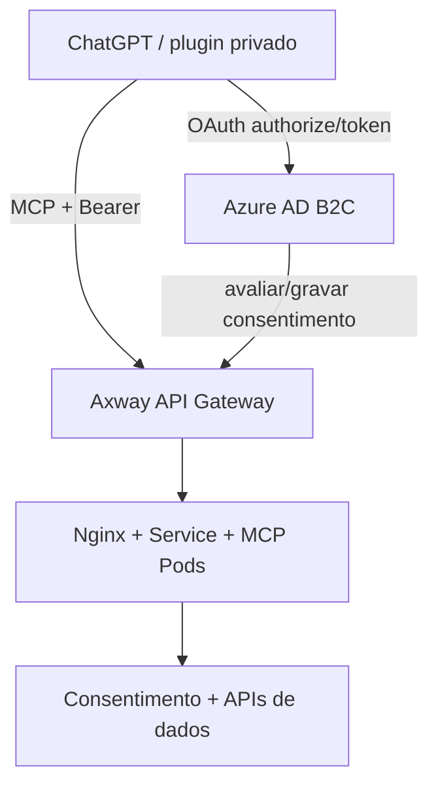
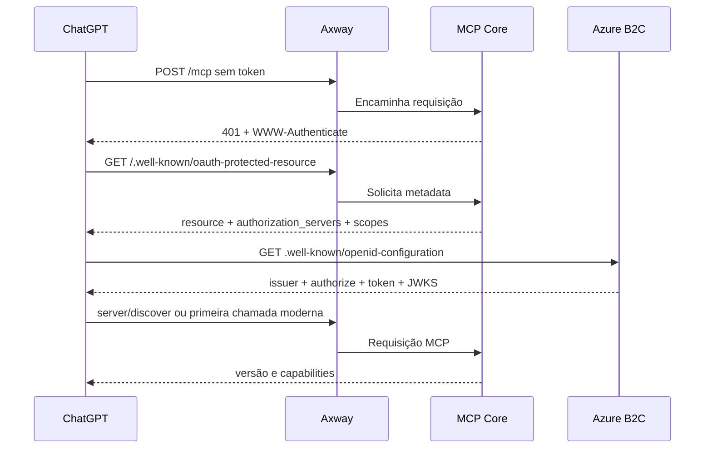
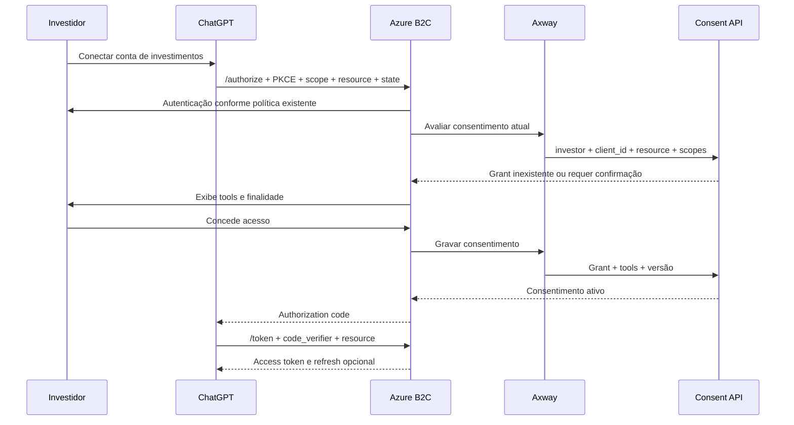
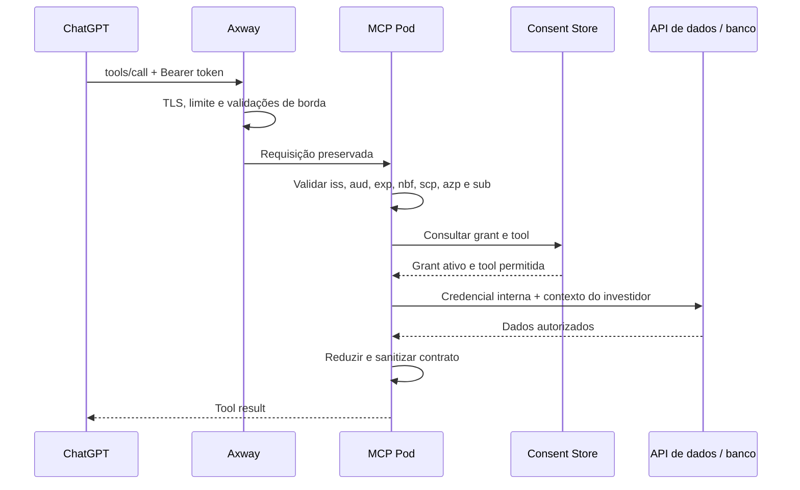
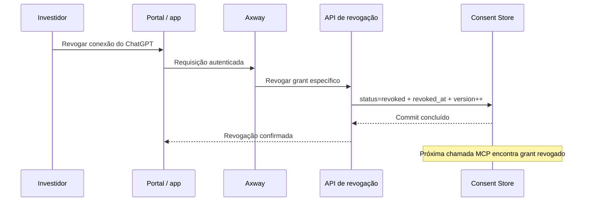
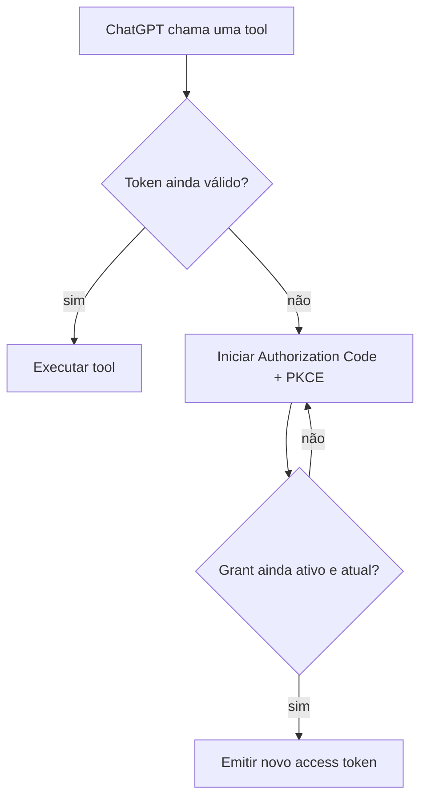

# Arquitetura técnica do MVP — MCP do Investidor

> **Status:** proposta consolidada para implementação do MVP  
> **Data da revisão:** 25 de agosto de 2026  
> **Público inicial:** desenvolvedores e time de negócio  
> **Plataforma prioritária:** ChatGPT  
> **Classificação:** documento técnico de arquitetura e segurança

---

## Índice

### Leitura executiva

1. [Objetivo](#1-objetivo)
2. [Resumo executivo](#2-resumo-executivo)
3. [Escopo e não escopo do MVP](#3-escopo-e-não-escopo-do-mvp)
4. [Decisões consolidadas](#4-decisões-consolidadas)
5. [Arquitetura de alto nível](#5-arquitetura-de-alto-nível)

### Jornadas essenciais

6. [Jornada de descoberta](#6-jornada-de-descoberta)
7. [Jornada da primeira conexão e consentimento](#7-jornada-da-primeira-conexão-e-consentimento)
8. [Jornada de execução de uma tool](#8-jornada-de-execução-de-uma-tool)
9. [Jornada de revogação](#9-jornada-de-revogação)
10. [Jornada de expiração e renovação do token](#10-jornada-de-expiração-e-renovação-do-token)
11. [Jornada de inclusão de uma nova tool](#11-jornada-de-inclusão-de-uma-nova-tool)

### Detalhamento técnico

12. [Autenticação, autorização e consentimento](#12-autenticação-autorização-e-consentimento)
13. [Scopes: significado e estratégia do MVP](#13-scopes-significado-e-estratégia-do-mvp)
14. [Compatibilidade do Azure B2C](#14-compatibilidade-do-azure-b2c)
15. [Tokens, duração e refresh](#15-tokens-duração-e-refresh)
16. [Stateless, revogação e escalabilidade](#16-stateless-revogação-e-escalabilidade)
17. [Responsabilidades dos componentes](#17-responsabilidades-dos-componentes)
18. [Contrato das tools](#18-contrato-das-tools)
19. [Acesso às fontes de dados](#19-acesso-às-fontes-de-dados)
20. [Requisitos da Axway e do Nginx](#20-requisitos-da-axway-e-do-nginx)
21. [Segurança e privacidade](#21-segurança-e-privacidade)
22. [Observabilidade e auditoria](#22-observabilidade-e-auditoria)

### Entrega e evolução

23. [Plano de implementação do MVP](#23-plano-de-implementação-do-mvp)
24. [Plano de testes](#24-plano-de-testes)
25. [Critérios de aceite](#25-critérios-de-aceite)
26. [Pendências não bloqueantes](#26-pendências-não-bloqueantes)
27. [Evolução após o MVP](#27-evolução-após-o-mvp)
28. [Riscos e mitigações](#28-riscos-e-mitigações)
29. [Registro resumido de decisões](#29-registro-resumido-de-decisões)
30. [Self-check de consistência](#30-self-check-de-consistência)
31. [Referências oficiais](#31-referências-oficiais)

---

## 1. Objetivo

Definir uma arquitetura implementável para o MVP de um servidor MCP que permita ao investidor conectar sua conta ao ChatGPT e consultar dados de investimentos com consentimento explícito, revogação imediata e isolamento entre investidores.

O documento busca reduzir incertezas sem criar componentes antecipados. As decisões que dependem de comportamento real do ChatGPT, da Axway ou do Azure B2C são tratadas como testes objetivos, e não como justificativa para overengineering.

---

## 2. Resumo executivo

O MVP adotará a seguinte estrutura:

- um único MCP remoto exposto em endereço HTTPS canônico;
- transporte Streamable HTTP;
- protocolo MCP `2026-07-28` em modo stateless;
- ChatGPT como primeira plataforma de integração;
- Azure AD B2C, com custom policies, como Authorization Server do MVP;
- Authorization Code com PKCE `S256`;
- cliente OAuth do ChatGPT pré-cadastrado no B2C;
- um scope B2C agregado de leitura para o conjunto inicial de tools;
- granularidade efetiva por tool mantida no banco de consentimento;
- consentimento válido até revogação no MVP;
- access token inicialmente configurado para 15 minutos;
- revogação consultada em toda chamada de tool;
- MCP Core sem sessão local, sem sticky session e sem `Mcp-Session-Id`;
- acesso a dados por APIs internas com credencial de serviço ou, se necessário, acesso controlado de leitura ao banco;
- dados retornados equivalentes aos campos da área do investidor, preferencialmente em contratos reduzidos.

O B2C possui os elementos básicos necessários, mas a documentação oficial não comprova integralmente o comportamento exigido pelo MCP para o parâmetro OAuth `resource` no token endpoint. Portanto, a arquitetura fica aprovada para o MVP de forma **condicionada a um spike curto de compatibilidade B2C × ChatGPT**. Se o spike falhar especificamente nesse contrato, somente então deve ser avaliada uma camada própria de Authorization Server/Broker. Essa camada não seria outro MCP.

---

## 3. Escopo e não escopo do MVP

### 3.1 Escopo

- conexão privada ou em modo draft com o ChatGPT;
- usuários limitados a desenvolvedores e time de negócio;
- três tools de leitura:
  - consulta de posições;
  - consulta de movimentações;
  - consulta de proventos;
- autenticação do investidor no B2C;
- consentimento único para todas as tools iniciais;
- armazenamento da lista de tools consentidas;
- revogação pelo portal/app;
- autorização conferida em cada chamada;
- execução stateless em múltiplos Pods no AKS;
- observabilidade e auditoria sem registrar dados financeiros completos.

### 3.2 Não escopo

- publicação pública nas lojas;
- suporte inicial simultâneo a Claude e Gemini;
- tools de escrita, ordens, transferências ou operações financeiras;
- Authorization Server próprio antes do resultado do spike com B2C;
- consentimento periódico obrigatório;
- dispositivo confiável;
- MFA obrigatório específico do MCP;
- cache distribuído de consentimento;
- roteamento por sessão ou sticky session;
- token exchange ou On-Behalf-Of;
- migração do B2C durante o MVP.

### 3.3 Princípio de execução

O MVP deve provar a jornada vertical completa:

`descoberta → autenticação → consentimento → token → tools/list → tools/call → revogação → bloqueio`

Qualquer componente que não seja necessário para provar essa jornada deve ser postergado.

---

## 4. Decisões consolidadas

| Tema | Decisão do MVP | Fundamento |
| --- | --- | --- |
| Plataforma inicial | ChatGPT | Há forte tendência de uso e a OpenAI oferece fluxo de plugin MCP com OAuth. |
| Endpoint externo | Um endpoint MCP canônico | Simplifica descoberta, audience, publicação e operação. |
| Transporte | Streamable HTTP | Transporte HTTP atual do MCP para servidores remotos. |
| Protocolo | MCP `2026-07-28` | Versão adotada pelo servidor. |
| Sessão | Stateless | A versão remove sessões de protocolo; melhora escala horizontal. |
| Autenticação | Azure AD B2C custom policy | Reutiliza a identidade existente e reduz tempo de entrega. |
| Fluxo OAuth | Authorization Code + PKCE `S256` | Exigido pela integração atual do ChatGPT e suportado pelo B2C. |
| Registro do cliente | Pré-cadastro manual no MVP | É mais simples que CIMD/DCR e é suportado pelo contrato MCP/OpenAI. |
| Consentimento inicial | Todas as tools atuais | Uma única experiência para o usuário do MVP. |
| Granularidade | Banco de consentimento por tool | O token fornece autorização grossa; o banco restringe cada tool. |
| Validade do consentimento | Até revogação | Menor complexidade; expiração poderá ser adicionada depois. |
| Access token | 15 minutos inicialmente | Reduz janela de exposição; pode ser alterado posteriormente. |
| Refresh token | Não bloqueia o primeiro spike; deve ser testado antes do piloto ampliado | A ausência simplifica o primeiro teste, mas reduz a experiência de conexão persistente. |
| Revogação | Próxima chamada após commit deve falhar | O grant é consultado em toda chamada. |
| MFA | Segue a configuração atual do usuário no B2C | Decisão aceita apenas para o MVP restrito. |
| Dados internos | APIs com identidade de serviço ou acesso direto de leitura | Dependência interna não bloqueia o contrato MCP. |
| Público | Desenvolvedores e negócio | Limita exposição durante validação. |
| B2C futuro | Será migrado | Não bloqueia a entrega inicial; deve haver isolamento para facilitar troca. |

---

## 5. Arquitetura de alto nível



### 5.1 Caminho de runtime

`ChatGPT → Axway → Nginx Ingress → Kubernetes Service → MCP Pod → Consentimento → API de dados ou banco`

### 5.2 Caminho de autenticação

`ChatGPT → Azure B2C → navegador do usuário → Azure B2C → ChatGPT`

Os endpoints públicos de autenticação e token permanecem no domínio do B2C ou em custom domain configurado no próprio B2C. A Axway não deve reescrever issuer, authorization endpoint, token endpoint ou JWKS.

### 5.3 Caminho de consentimento

`B2C custom policy → Axway → API interna de consentimento → banco de consentimento`

### 5.4 Caminho de revogação

`Portal/app → Axway → API de revogação → banco de consentimento`

---

## 6. Jornada de descoberta

### 6.1 Objetivo

Permitir que o ChatGPT descubra como autenticar, quais versões MCP são suportadas e quais tools estão disponíveis, sem exigir conhecimento técnico do investidor.



### 6.2 Protected Resource Metadata

O MCP deve expor pela Axway:

```http
GET https://mcp.investidor.com.br/.well-known/oauth-protected-resource
GET https://mcp.investidor.com.br/.well-known/oauth-protected-resource/mcp
```

As duas rotas podem retornar o mesmo documento. A primeira cobre a descoberta na raiz; a segunda cobre a construção baseada no path do recurso `https://mcp.investidor.com.br/mcp`. O `WWW-Authenticate` deve apontar explicitamente para uma delas, preferencialmente a rota raiz já controlada pela Axway.

Exemplo conceitual:

```json
{
  "resource": "https://mcp.investidor.com.br/mcp",
  "authorization_servers": [
    "https://<tenant>.b2clogin.com/<tenant>.onmicrosoft.com/<policy>/v2.0/"
  ],
  "scopes_supported": [
    "https://<tenant>.onmicrosoft.com/<mcp-api-app-id-uri>/investments.read"
  ],
  "resource_documentation": "https://<dominio-documentacao>/mcp"
}
```

Os valores definitivos devem ser copiados da configuração real do B2C. Dentro de cada ambiente, o `resource` deve ser canônico e idêntico em todas as réplicas; ambientes diferentes podem usar recursos distintos, por exemplo hosts de desenvolvimento, homologação e produção.

### 6.3 Challenge inicial

```http
HTTP/1.1 401 Unauthorized
WWW-Authenticate: Bearer resource_metadata="https://mcp.investidor.com.br/.well-known/oauth-protected-resource", scope="https://<tenant>.onmicrosoft.com/<app-id-uri>/investments.read"
```

### 6.4 Descoberta das tools

Depois da autenticação, o ChatGPT executa `tools/list`. A lista pode ser filtrada pelo grant do investidor, mas isso é somente experiência e redução de exposição. Segurança real deve ocorrer novamente em `tools/call`.

---

## 7. Jornada da primeira conexão e consentimento



### 7.1 Informações que a custom policy deve levar à API

- identificador estável do investidor, derivado de `iss` e `sub`/Object ID;
- `client_id`;
- `resource` recebido;
- scopes solicitados;
- versão do catálogo de tools;
- lista das tools apresentadas;
- versão do texto de consentimento;
- correlation ID;
- data/hora do evento.

O contrato da API já foi definido pela equipe. Os nomes acima representam responsabilidades sem substituir o contrato existente.

### 7.2 Regras

- o consentimento só pode ser persistido após confirmação explícita;
- a operação de gravação deve ser idempotente;
- cancelamento pelo usuário não pode criar grant ativo;
- um grant revogado não pode ser reativado silenciosamente por SSO;
- nova conexão depois de revogação deve mostrar o consentimento novamente;
- nenhuma credencial ou token deve ser exposto ao investidor para copiar e colar.

---

## 8. Jornada de execução de uma tool



### 8.1 Regra efetiva de autorização

Uma tool só pode ser executada quando todas as condições forem verdadeiras:

```text
token válido
AND issuer esperado
AND audience do MCP
AND client_id autorizado
AND scope requerido presente
AND grant ativo no banco
AND tool presente no grant
AND consentimento não expirado, quando essa função for habilitada
AND investidor possui autorização sobre os dados consultados
```

### 8.2 Identidade do investidor

- deve ser derivada do token validado;
- não pode vir de CPF, documento, conta ou código enviado como argumento pelo modelo;
- argumentos de tool devem conter somente filtros funcionais;
- qualquer conta/carteira informada deve ter sua titularidade revalidada no backend.

---

## 9. Jornada de revogação



### 9.1 Significado de revogação imediata

No MVP, “imediata” significa:

> toda chamada iniciada após o commit da revogação deve ser recusada.

O token B2C pode continuar criptograficamente válido até `exp`; mesmo assim, o MCP deve negar o acesso porque o grant no banco está revogado.

### 9.2 Stateless não substitui a consulta ao banco

Stateless significa que o Pod não depende de sessão local entre chamadas. O estado de autorização continua persistido externamente. A revogação imediata decorre da consulta ao banco em cada chamada, e não apenas do modo stateless.

### 9.3 Resposta após revogação

- token inválido ou expirado: HTTP `401`;
- token válido, mas grant/tool não autorizada: HTTP `403`;
- a camada MCP deve retornar erro sanitizado, sem informar se outro investidor ou conta existe;
- o comportamento do ChatGPT diante do `403` deve ser incluído no spike.

---

## 10. Jornada de expiração e renovação do token

### 10.1 Sem refresh token



O B2C pode ter sessão SSO ativa, evitando nova digitação de senha, mas isso não deve reativar automaticamente um grant revogado.

### 10.2 Com refresh token

- ChatGPT solicita `offline_access` quando aplicável;
- B2C emite refresh token;
- ChatGPT troca o refresh por novos tokens;
- o MCP continua verificando o banco em todas as chamadas;
- revogação no banco continua bloqueando imediatamente, mesmo que o B2C emita outro access token;
- a política de refresh deve ser testada com o cliente real antes de uso amplo.

### 10.3 Decisão incremental

É possível começar com access token de 15 minutos e alterar depois. No B2C, a duração está na configuração do `JwtIssuer`/policy. A alteração afeta tokens emitidos posteriormente; tokens já emitidos preservam o `exp` original.

Também é possível habilitar refresh posteriormente. Nesse caso, conexões existentes podem precisar de nova autorização para obter `offline_access` e um refresh token.

---

## 11. Jornada de inclusão de uma nova tool

No MVP, as três tools serão consentidas em conjunto. Uma nova tool não deve herdar autorização automaticamente.

### 11.1 Fluxo

1. publicar a nova definição no catálogo desabilitada para grants antigos;
2. incrementar a versão do catálogo/consentimento;
3. manter `tools/list` restrito ao conjunto já consentido;
4. provocar reautorização/reconexão do cliente;
5. exibir novamente o conjunto de tools e a finalidade;
6. persistir novo grant ou nova versão do grant;
7. somente então liberar a nova tool.

### 11.2 Limitação do scope agregado

Um único scope `investments.read` é adequado ao MVP fixo. Porém, se novas tools precisarem acionar automaticamente o step-up OAuth, o mesmo scope não informa ao cliente que há uma permissão adicional.

Na evolução, escolher uma destas estratégias:

- scopes por capacidade, por exemplo `positions.read`, `transactions.read` e `income.read`;
- novo scope para nova categoria de dados;
- fluxo explícito de reconexão baseado em `consent_version`.

Não é necessário resolver isso antes da implementação das três tools atuais.

---

## 12. Autenticação, autorização e consentimento

### 12.1 Conceitos distintos

| Conceito | Responsável | Pergunta respondida |
| --- | --- | --- |
| Autenticação | Azure B2C | Quem é o investidor? |
| Emissão do token | Azure B2C | Este cliente recebeu um token para o MCP? |
| Scope OAuth | B2C + MCP | Qual classe de permissão foi concedida? |
| Consentimento | Consent API/Store | Este investidor autorizou este cliente, recurso e conjunto de tools? |
| Autorização da tool | MCP Core | Esta tool específica pode ser executada agora? |
| Titularidade | API de negócio/dados | O investidor pode acessar estes dados? |

### 12.2 Chave lógica do consentimento

```text
investor_subject + client_id + resource + scopes + consent_version
```

O registro também deve conter a lista de tools permitidas. A identidade lógica recomendada para o investidor é a composição do issuer com o subject, evitando colisão durante a futura migração de identidade.

### 12.3 Estados esperados

- `active`;
- `revoked`;
- `expired`, quando expiração for ativada;
- `superseded`, quando uma versão de consentimento substituir outra.

Se o contrato já definido utilizar outros nomes, deve preservar essas semânticas.

### 12.4 Validade até revogação

É seguro implementar o MVP sem expiração automática desde que:

- exista `revoked_at`;
- o runtime consulte o status;
- exista auditoria;
- o portal permita revogar por cliente;
- mudanças materiais de tools exijam novo consentimento.

Para permitir extensão futura sem redesign, o modelo deve prever `expires_at` anulável. No MVP, `expires_at = null` significa válido até revogação. Posteriormente, uma política pode preencher o campo e o runtime passa a aplicar:

```text
status == active AND (expires_at IS NULL OR expires_at > now)
```

---

## 13. Scopes: significado e estratégia do MVP

### 13.1 O que é o scope

O scope discutido nesta arquitetura é o **scope OAuth cadastrado no Azure B2C** para a aplicação/API que representa o MCP.

O MCP não inventa um segundo tipo incompatível de scope. Ele:

1. anuncia o scope no Protected Resource Metadata e no `WWW-Authenticate`;
2. o ChatGPT solicita esse mesmo scope ao B2C;
3. o B2C emite o scope no claim `scp` do access token;
4. o MCP valida o claim em cada chamada;
5. o banco de consentimento aplica a granularidade por tool.

### 13.2 Scope recomendado para o MVP

Exemplo lógico:

```text
investments.read
```

Exemplo completo no B2C:

```text
https://<tenant>.onmicrosoft.com/<mcp-api-app-id-uri>/investments.read
```

### 13.3 Mapeamento inicial

| Tool | Scope B2C exigido | Permissão no banco |
| --- | --- | --- |
| `get_positions` | `investments.read` | `get_positions = allowed` |
| `get_transactions` | `investments.read` | `get_transactions = allowed` |
| `get_income` | `investments.read` | `get_income = allowed` |

Isso permite consentimento simples e controle granular interno. O scope sozinho não autoriza todas as tools: a tool também precisa estar presente no grant atual.

### 13.4 Scopes especiais

- `openid`: solicita identidade OIDC/ID token;
- `offline_access`: solicita refresh token;
- `investments.read`: autoriza o recurso MCP de leitura.

`openid` e `offline_access` não substituem o scope da API. O Protected Resource Metadata do MCP não deve anunciar `offline_access` como requisito da tool; refresh é uma decisão do Authorization Server e do cliente.

### 13.5 Validação obrigatória

O MCP deve validar, no mínimo:

- assinatura;
- `iss`;
- `aud`;
- `exp`;
- `nbf`;
- `scp`;
- `sub`;
- `azp` ou claim equivalente ao cliente;
- policy/`tfp`, conforme configuração.

---

## 14. Compatibilidade do Azure B2C

### 14.1 Resultado da análise oficial

| Requisito | Evidência no B2C | Status para o MVP |
| --- | --- | --- |
| Authorization Code | Documentado | Compatível |
| PKCE `S256` | Documentado | Compatível |
| Redirect URI exata | Documentado | Compatível |
| Access token JWT | Documentado | Compatível |
| Refresh token | Documentado | Compatível |
| Scope em `scp` | Documentado | Compatível |
| OIDC discovery | Documentado por policy | Compatível |
| JWKS/rotação de chaves | Documentado | Compatível |
| Custom policy | Já utilizada pela empresa | Compatível |
| Leitura de `client_id`, `scope` e `resource` no `/authorize` | Claim resolvers documentados | Compatível |
| Chamada REST durante a jornada | RESTful technical profile documentado | Compatível |
| MFA/TOTP | Documentado | Compatível, mas não obrigatório no MVP |
| `resource` no `/token` conforme RFC 8707 | Não comprovado pela documentação consultada | Exige spike |
| `resource` refletido diretamente em `aud` | B2C documenta `aud` como Application ID | Exige mapeamento/teste |
| Metadata anunciando `S256` no tenant/policy real | A capacidade é documentada; o metadata real não foi inspecionado | Exige spike |
| `iss` na authorization response RFC 9207 | Não comprovado para a policy real | Exige spike; ChatGPT possui callback alternativo quando ausente |

### 14.2 Conclusão

O B2C é adequado para iniciar o MVP, mas a compatibilidade final com ChatGPT não pode ser declarada somente com documentação. A decisão correta é testar o fluxo real antes de criar um broker.

### 14.3 Spike obrigatório

O spike deve validar:

1. ChatGPT lê o Protected Resource Metadata;
2. ChatGPT descobre o metadata OIDC da policy B2C;
3. o metadata contém `code_challenge_methods_supported` com `S256`;
4. o cliente pré-cadastrado é aceito;
5. a redirect URI indicada pelo ChatGPT é aceita pelo B2C;
6. `resource` chega ao `/authorize` e à custom policy;
7. `resource` enviado ao `/token` não provoca rejeição;
8. o access token possui `aud`, `scp`, `sub`, `azp`, `iss`, `exp` e `nbf` esperados;
9. existe mapeamento inequívoco entre o recurso canônico MCP e o Application ID usado em `aud`;
10. ChatGPT aceita o token e executa `tools/list`;
11. um `403` de grant revogado não cria loop infinito de reautorização.

### 14.4 Critério para Authorization Server/Broker próprio

Somente avaliar o broker se o B2C não conseguir cumprir um requisito de interoperabilidade que não possa ser resolvido por:

- app registration;
- custom policy;
- custom domain;
- configuração de metadata;
- mapeamento seguro entre resource URI e audience;
- cliente OAuth pré-cadastrado.

O broker, se necessário futuramente, faria tradução OAuth/MCP e delegaria autenticação ao B2C. Ele não seria um segundo MCP Server.

---

## 15. Tokens, duração e refresh

### 15.1 Baseline do MVP

- access token: 15 minutos;
- consentimento: sem expiração automática;
- refresh: opcional no primeiro spike;
- banco de consentimento: sempre consultado.

### 15.2 A duração pode ser alterada depois?

Sim. O B2C permite configurar access tokens entre 5 minutos e 24 horas. A custom policy permite alterar `token_lifetime_secs` no `JwtIssuer`.

Consequências da alteração:

- novos tokens usam a nova duração;
- tokens antigos mantêm o `exp` emitido;
- não requer mudança no protocolo MCP;
- não requer mudança no banco de consentimento;
- exige teste de regressão e publicação controlada da policy.

### 15.3 Refresh pode ser adicionado depois?

Sim. O B2C emite refresh token quando `offline_access` é solicitado. A ativação posterior pode exigir que conexões existentes façam nova autorização.

Para um MVP restrito, é aceitável provar primeiro o fluxo sem refresh. Antes de ampliar a usuários externos, o refresh deve ser decidido porque access token de 15 minutos sem refresh pode causar reconexões frequentes.

### 15.4 O que não deve ocorrer

- aumentar indefinidamente a duração para evitar implementar refresh;
- usar duração do token como único mecanismo de revogação;
- colocar access ou refresh token em query string;
- armazenar refresh token no MCP Core;
- registrar tokens em logs;
- aceitar token com audience de outra API.

---

## 16. Stateless, revogação e escalabilidade

### 16.1 Por que stateless

Na versão `2026-07-28`, o MCP removeu sessões de protocolo e o header `Mcp-Session-Id`. Cada request carrega versão e capabilities. Portanto:

- qualquer Pod pode atender qualquer chamada;
- não há afinidade de sessão;
- não há sticky session;
- falha de Pod não perde uma sessão de investidor;
- HPA pode aumentar ou reduzir réplicas livremente;
- consentimento e dados persistentes permanecem fora do Pod.

### 16.2 Estado permitido

Stateless não significa ausência de estado no sistema. São estados externos válidos:

- consentimentos no banco;
- auditoria;
- configuração de clientes;
- catálogos de tools;
- dados de investimentos;
- cache distribuído futuro.

### 16.3 Estratégia de revogação

No MVP, cada `tools/call` consulta o banco. Isso prioriza simplicidade e revogação imediata.

Se cache for introduzido depois:

- deve ser compartilhado ou invalidado por evento;
- não pode ser apenas cache local no Pod;
- a invalidação deve ocorrer após o commit;
- falha de leitura/autorização deve ser fail closed;
- deve existir SLO mensurável de propagação.

### 16.4 Escala no AKS

- Nginx distribui chamadas entre réplicas;
- Kubernetes Service fornece descoberta e balanceamento interno;
- HPA escala MCP Pods por CPU/memória e, quando disponível, métricas de RPS/latência;
- não existe dispatcher de investidor em memória;
- Axway aplica limites e proteção de borda;
- chamadas ao consentimento e às fontes de dados devem ter timeout, circuit breaker e bulkhead adequados.

---

## 17. Responsabilidades dos componentes

### 17.1 ChatGPT/plugin

- descobrir o recurso;
- iniciar OAuth;
- manter PKCE e `state`;
- armazenar tokens;
- chamar `tools/list` e `tools/call`;
- respeitar erros de autenticação/autorização;
- apresentar as tools ao usuário.

### 17.2 Axway

- endpoint público;
- TLS e, futuramente, mTLS quando aplicável;
- rate limiting;
- proteção WAF;
- preservação de headers OAuth/MCP;
- roteamento para o Nginx;
- bloqueio de acesso não permitido;
- correlation ID;
- limites de payload e timeout.

### 17.3 Nginx Ingress

- roteamento interno;
- balanceamento para Kubernetes Service;
- timeout compatível com Streamable HTTP;
- preservação dos headers necessários;
- nenhuma afinidade de sessão.

### 17.4 MCP Core

- implementar MCP `2026-07-28`;
- expor discovery e tools;
- validar token;
- resolver o investidor pelo token;
- consultar consentimento;
- aplicar autorização por tool;
- chamar fonte de dados;
- reduzir e sanitizar respostas;
- produzir auditoria sem payload sensível.

### 17.5 Azure B2C

- autenticar o investidor;
- aplicar MFA conforme política atual;
- executar custom policy;
- obter `client_id`, `scope` e `resource` da requisição;
- chamar Consent API;
- emitir e renovar tokens;
- publicar OIDC metadata e JWKS.

### 17.6 Consent API/Store

- avaliar grant existente;
- registrar consentimento;
- listar tools consentidas;
- revogar grant;
- fornecer decisão de autorização ao runtime;
- manter histórico e versão;
- funcionar como fonte de verdade.

### 17.7 Portal/app

- listar conexões ativas;
- mostrar cliente, resource, tools, data e status;
- solicitar revogação;
- impedir revogação de grant de outro investidor;
- exibir confirmação idempotente.

---

## 18. Contrato das tools

### 18.1 Tools iniciais

| Nome lógico | Objetivo | Efeito |
| --- | --- | --- |
| `get_positions` | Consultar posição atual do investidor | Leitura |
| `get_transactions` | Consultar movimentações dentro de filtros permitidos | Leitura |
| `get_income` | Consultar proventos | Leitura |

Os nomes definitivos podem variar, mas devem ser estáveis, claros e não ambíguos.

### 18.2 Metadados

Cada tool deve possuir:

- `name` estável;
- `title` amigável;
- descrição precisa;
- `inputSchema` restritivo;
- `outputSchema` quando possível;
- exemplos sem dados reais;
- anotação de leitura;
- descrição explícita de limites e finalidade.

Para o ChatGPT/OpenAI:

```json
{
  "readOnlyHint": true,
  "destructiveHint": false,
  "openWorldHint": false
}
```

### 18.3 Regras de entrada

- não receber CPF, documento ou `investor_id` como autoridade;
- datas com limites máximos;
- paginação limitada;
- ordenação determinística;
- enumerações fechadas;
- `additionalProperties: false` quando compatível;
- validação server-side independente do schema.

### 18.4 Regras de saída

- usar contratos reduzidos em relação à área do investidor;
- não retornar identificadores internos sem necessidade;
- não retornar secrets, tokens ou dados de infraestrutura;
- não repetir dados pessoais que não sejam necessários à pergunta;
- limitar volume;
- manter `structuredContent` coerente com `outputSchema`;
- sanitizar erros downstream.

### 18.5 Catálogo

`tools/list` deve:

- retornar ordem determinística;
- usar `cacheScope: "private"`;
- definir `ttlMs` conservador;
- não ser tratado como controle de segurança;
- poder ocultar tools não consentidas sem dispensar validação em `tools/call`.

---

## 19. Acesso às fontes de dados

### 19.1 Opções permitidas

**Opção A — APIs de dados com client ID/client secret**

- preserva contratos existentes;
- centraliza regras de acesso;
- reduz acoplamento ao schema físico;
- adiciona hop e dependência de disponibilidade.

**Opção B — acesso direto ao banco**

- pode acelerar o MVP em casos específicos;
- aumenta acoplamento, superfície de segurança e responsabilidade do MCP;
- exige credencial estritamente read-only e consultas controladas.

### 19.2 Recomendação

Preferir APIs existentes quando entregarem os dados necessários. O acesso direto ao banco deve ser exceção explícita, não atalho permanente.

Em ambas as opções:

- usar identidade de serviço separada do token externo;
- armazenar secrets em cofre e rotacioná-los;
- aplicar privilégio mínimo;
- limitar rede e egress;
- validar titularidade do investidor;
- não encaminhar o bearer token do ChatGPT/B2C indiscriminadamente.

O Azure B2C não implementa On-Behalf-Of para cadeia de APIs. Se o MCP chamar outra API com audience diferente, deve usar uma identidade interna ou outro mecanismo deliberado, e não presumir OBO.

---

## 20. Requisitos da Axway e do Nginx

### 20.1 Rotas públicas mínimas

| Método | Rota | Destino |
| --- | --- | --- |
| `POST` | `/mcp` | MCP Core |
| `GET` | `/.well-known/oauth-protected-resource` | MCP metadata |
| `GET` | `/.well-known/oauth-protected-resource/mcp` | Mesmo metadata para descoberta baseada no path |
| variável | rotas internas de consentimento | Consent API, com política específica |
| variável | rota de revogação | Revocation API, com token do portal |

### 20.2 Headers que não podem ser removidos

- `Authorization`;
- `WWW-Authenticate` na resposta;
- `Content-Type`;
- `Accept`;
- `Mcp-Protocol-Version`, quando utilizado pelo binding;
- `Mcp-Method`;
- `Mcp-Name`;
- correlation/trace headers aprovados.

### 20.3 Transporte

- aceitar JSON-RPC sobre `POST`;
- permitir resposta JSON;
- permitir SSE limitado à resposta da requisição quando utilizado;
- não exigir sticky session;
- não depender de `Mcp-Session-Id`;
- não armazenar em cache respostas financeiras;
- desabilitar buffering incompatível quando houver streaming;
- definir timeout maior que o timeout downstream máximo controlado.

### 20.4 Proteções

- rate limit por cliente e, após autenticação, por investidor;
- limite de concorrência;
- tamanho máximo de body e response;
- allowlist de métodos/rotas;
- validação de origem quando aplicável;
- TLS moderno;
- bloqueio de acesso externo direto ao Ingress;
- logs sem bearer token e sem payload financeiro.

---

## 21. Segurança e privacidade

### 21.1 Princípios

- zero trust entre camadas;
- autenticar e autorizar cada chamada;
- privilégio mínimo;
- separação entre token externo e identidade interna;
- fail closed;
- minimização de dados;
- defesa em profundidade;
- auditoria sem vazamento de conteúdo.

### 21.2 Validação do token

Axway pode fazer validação inicial, mas o MCP deve validar novamente ou receber claims por canal autenticado e assinado. Nunca confiar em headers de identidade livres sem mTLS/assinatura e controle de origem.

### 21.3 Consent API chamada pelo B2C

Deve usar autenticação. O B2C suporta `ClientCertificate`, `Bearer`, `Basic` e `ApiKeyHeader` em RESTful technical profiles; a documentação recomenda `ClientCertificate` entre as opções. Para o MVP, deve-se escolher o mecanismo que a Axway e a operação de certificados consigam suportar de forma confiável. Endpoint anônimo é proibido.

### 21.4 MFA

No MVP restrito, o fluxo respeitará a configuração atual de MFA do usuário no B2C. Isso significa que o MCP não garantirá MFA para todos os participantes.

Antes de público amplo, decidir entre:

- MFA obrigatório na conexão;
- step-up MFA;
- Conditional Access;
- restrição a usuários já inscritos.

### 21.5 Proteção contra vazamento

- tools exclusivamente read-only;
- contratos reduzidos;
- sem dados desnecessários na descrição das tools;
- sem tokens no modelo;
- sem stack trace;
- sem prompts completos em logs;
- respostas limitadas e paginadas;
- filtros máximos de período;
- validação de titularidade;
- testes de prompt injection e exfiltração cruzada.

### 21.6 Dados usados no MVP

Os campos serão equivalentes aos já exibidos na área do investidor, possivelmente com redução. Isso limita a criação de uma nova categoria de informação, mas não elimina a necessidade de revisar:

- finalidade do compartilhamento;
- minimização;
- retenção do provedor de IA;
- termos e aviso ao participante;
- tratamento de logs e traces.

---

## 22. Observabilidade e auditoria

### 22.1 Eventos mínimos

- descoberta solicitada;
- início e resultado de autenticação, sem credenciais;
- consentimento concedido;
- consentimento negado;
- grant revogado;
- `tools/list`;
- tool executada;
- tool negada;
- falha de token;
- falha downstream;
- alteração do catálogo de tools.

### 22.2 Campos técnicos

- timestamp UTC;
- correlation ID;
- trace ID;
- hash ou identificador técnico não reversível do investidor, quando possível;
- `client_id`;
- resource;
- tool name;
- resultado de autorização;
- status code;
- latência por camada;
- versão do protocolo;
- versão do consentimento.

### 22.3 Campos proibidos

- access token;
- refresh token;
- client secret;
- CPF em claro;
- posições completas;
- movimentações completas;
- proventos completos;
- prompt completo se contiver dados do investidor.

### 22.4 Métricas

- RPS por tool;
- P50/P95/P99;
- erros por classe;
- `401` e `403` por cliente;
- falhas da Consent API;
- falhas de fonte de dados;
- quantidade de grants ativos/revogados;
- tempo entre revogação e primeira negação observada;
- saturação de Pods e conexões downstream.

---

## 23. Plano de implementação do MVP

### Fase 1 — esqueleto MCP

1. criar endpoint Streamable HTTP;
2. implementar `server/discover` e capabilities;
3. implementar `tools/list` com tools mockadas;
4. implementar `tools/call` de uma tool mockada;
5. executar em dois Pods sem afinidade.

### Fase 2 — descoberta OAuth

1. criar Protected Resource Metadata;
2. configurar challenge `401`;
3. apontar `authorization_servers` para a policy B2C;
4. confirmar metadata OIDC e JWKS;
5. preservar headers na Axway.

### Fase 3 — ChatGPT + B2C

1. criar plugin privado/draft;
2. obter redirect URI exata do ChatGPT;
3. pré-cadastrar cliente no B2C;
4. habilitar Authorization Code + PKCE;
5. configurar scope `investments.read`;
6. executar o spike de `resource`/`aud`;
7. validar token no MCP.

### Fase 4 — consentimento

1. integrar custom policy com Consent API;
2. exibir lista das três tools;
3. persistir grant;
4. validar grant em cada chamada;
5. bloquear tool fora da lista.

### Fase 5 — dados reais controlados

1. integrar uma fonte de dados;
2. implementar `get_positions`;
3. aplicar contrato reduzido;
4. implementar movimentações;
5. implementar proventos;
6. validar titularidade e isolamento.

### Fase 6 — revogação

1. integrar portal/app à API de revogação;
2. revogar grant específico;
3. provar que a chamada seguinte falha;
4. testar nova conexão e novo consentimento.

### Fase 7 — hardening do piloto

1. rate limit;
2. auditoria;
3. alertas;
4. kill switch;
5. testes adversariais;
6. runbook de incidente;
7. decisão sobre refresh token.

---

## 24. Plano de testes

### 24.1 Compatibilidade

- ChatGPT consegue conectar pelo URL do MCP;
- PRM é descoberto;
- metadata OIDC é aceito;
- PKCE `S256` funciona;
- redirect URI funciona;
- `resource` não é perdido;
- audience é vinculada ao MCP;
- scope aparece no token;
- `tools/list` e `tools/call` funcionam.

### 24.2 Autorização

- token ausente retorna `401` com challenge correto;
- token expirado retorna `401`;
- issuer incorreto retorna `401`;
- audience incorreta retorna `401`;
- scope ausente retorna `403`;
- client não cadastrado é rejeitado;
- grant inexistente é rejeitado;
- grant revogado é rejeitado;
- tool não consentida é rejeitada;
- investidor A não acessa dados do investidor B.

### 24.3 Consentimento

- confirmação cria grant uma vez;
- retry não duplica grant;
- cancelamento não cria grant;
- grant ativo evita consentimento repetido;
- revogação exige novo consentimento;
- nova versão de catálogo não libera tool automaticamente.

### 24.4 Revogação

- revogar durante token válido;
- chamar tool imediatamente depois;
- confirmar `403` na próxima chamada;
- reiniciar Pods e confirmar persistência;
- executar chamadas concorrentes ao redor do commit;
- validar auditoria e ausência de cache local.

### 24.5 Stateless e escala

- alternar chamadas entre Pods;
- remover um Pod durante execução;
- escalar de uma para várias réplicas;
- confirmar ausência de session affinity;
- confirmar ausência de `Mcp-Session-Id`;
- validar retry apenas para operações idempotentes.

### 24.6 Segurança

- token de outra API;
- token de outro tenant;
- token adulterado;
- replay fora da validade;
- CPF/investor ID malicioso nos argumentos;
- intervalos de data excessivos;
- paginação abusiva;
- prompt injection tentando acessar outro investidor;
- exfiltração por mensagens de erro;
- headers de identidade forjados;
- bypass direto do Ingress.

### 24.7 Resiliência

- Consent API indisponível: negar acesso;
- banco indisponível: negar acesso;
- API de dados lenta: timeout controlado;
- Axway interrompe stream;
- resposta MCP excede limite;
- rotação de chave B2C/novo `kid`;
- alteração de policy/issuer.

---

## 25. Critérios de aceite

O MVP estará tecnicamente validado quando:

1. um desenvolvedor conectar o plugin privado no ChatGPT sem manipular tokens;
2. o ChatGPT descobrir o B2C pelo metadata do MCP;
3. Authorization Code + PKCE concluir com sucesso;
4. o consentimento das três tools for registrado;
5. o ChatGPT listar somente tools permitidas;
6. pelo menos uma consulta real retornar contrato reduzido correto;
7. todas as tools validarem token e grant;
8. um participante não conseguir acessar dados de outro;
9. a revogação bloquear a chamada seguinte;
10. duas ou mais réplicas atenderem chamadas sem sticky session;
11. logs não contiverem tokens nem payload financeiro completo;
12. o spike registrar objetivamente o comportamento de `resource`, `aud`, PKCE, issuer e redirect URI.

---

## 26. Pendências não bloqueantes

As pendências abaixo não impedem o início da implementação:

| Pendência | Momento de decisão |
| --- | --- |
| Endereço/manifesto definitivo da loja pública | Após validação do plugin privado |
| Claude e Gemini | Depois do fluxo ChatGPT estável |
| Scopes por capacidade/tool | Antes de adicionar novas categorias de tool |
| Refresh token definitivo | Antes de ampliar o piloto |
| Duração absoluta e rolling do refresh | Antes de público externo |
| Expiração automática do consentimento | Evolução funcional |
| MFA obrigatório/step-up | Antes de público amplo |
| Dispositivo confiável | Produto final, se necessário |
| Cache de consentimento | Quando métricas demonstrarem necessidade |
| mTLS específico do ChatGPT | Hardening/publicação, conforme suporte/configuração |
| Publicação em loja | Depois de segurança, privacidade e homologação |
| Migração do B2C | Roadmap independente do MVP |

---

## 27. Evolução após o MVP

### 27.1 Consentimento com expiração

- preencher `expires_at`;
- criar job ou cálculo de expiração;
- negar grants expirados;
- permitir renovação explícita;
- notificar o portal.

### 27.2 Mais tools

- classificar por domínio/capacidade;
- decidir scopes mais granulares;
- incrementar catálogo;
- solicitar novo consentimento;
- usar `tools/list` determinístico e privado.

### 27.3 Novas plataformas

Para Claude e Gemini:

- criar cliente separado;
- usar redirect URIs específicas;
- manter o mesmo MCP resource quando tecnicamente possível;
- criar grant separado por `client_id`;
- testar versão e transporte;
- nunca reutilizar secret entre plataformas.

### 27.4 Migração do B2C

O B2C será substituído futuramente. Para reduzir impacto:

- MCP depende de abstração de validação de token;
- consentimento usa identidade composta `issuer + subject`;
- metadata aponta para Authorization Server configurável;
- regras de tool ficam no domínio do MCP/Consent Store, não embutidas somente no B2C;
- clientes e redirect URIs ficam em configuração segura;
- nenhuma tool depende diretamente da tecnologia B2C.

### 27.5 Possível Authorization Server/Broker

Se a migração ou interoperabilidade exigir, o broker poderá:

- publicar metadata OAuth compatível com MCP;
- aceitar `resource` RFC 8707;
- registrar clientes por CIMD/pre-registration;
- delegar autenticação ao provedor corporativo;
- emitir token próprio para o MCP;
- consultar o Consent Store.

Essa evolução deve ser orientada por evidência, não adicionada preventivamente ao MVP.

---

## 28. Riscos e mitigações

| Risco | Impacto | Mitigação do MVP |
| --- | --- | --- |
| B2C não aceitar `resource` do ChatGPT no `/token` | Bloqueio de OAuth | Spike antes de desenvolver broker; testar ignore/mapeamento seguro. |
| `aud` ser Application ID e não URI canônica | Token não vinculado corretamente | Mapeamento único resource → app ID e validação explícita; documentar resultado. |
| Access token de 15 min causar reconexões | Experiência ruim | Habilitar refresh após primeiro spike. |
| Stateless ser confundido com revogação | Token revogado ainda acessa | Consultar grant em toda chamada. |
| Consent API indisponível | Acesso indevido ou indisponibilidade | Fail closed, timeout e monitoramento. |
| Acesso direto ao banco ampliar superfície | Vazamento/acoplamento | Credencial read-only, queries controladas; preferir API. |
| Dados financeiros aparecerem em logs | Incidente de privacidade | Redaction, logging estrutural sem payload. |
| Modelo enviar identificador de outro usuário | IDOR | Derivar identidade do token e validar titularidade. |
| Nova tool ser autorizada automaticamente | Ampliação silenciosa | Lista explícita de tools e versão de consentimento. |
| Axway remover `WWW-Authenticate` | Discovery falha | Teste de contrato no gateway. |
| Cliente ChatGPT usar versão diferente | Incompatibilidade | Teste real e, se necessário, perfil dual-era controlado. |
| Migração futura do B2C | Retrabalho | Isolar provider de identidade e usar `iss + sub`. |

---

## 29. Registro resumido de decisões

### ADR-MCP-001 — MCP Core stateless

- **Decisão:** usar protocolo `2026-07-28` sem sessão.
- **Motivo:** requisito do protocolo moderno e melhor escala horizontal.
- **Consequência:** todo contexto necessário deve estar no request, token ou estado externo.

### ADR-MCP-002 — B2C direto no MVP

- **Decisão:** usar Azure B2C como Authorization Server inicial.
- **Motivo:** identidade e custom policies já existentes; menor tempo de entrega.
- **Condição:** spike de compatibilidade com ChatGPT.
- **Consequência:** broker somente se houver falha comprovada.

### ADR-MCP-003 — Scope agregado e tool grant granular

- **Decisão:** um scope `investments.read` para o MVP e lista de tools no banco.
- **Motivo:** consentimento simples com defesa em profundidade.
- **Consequência:** expansão de tools precisará versionamento ou scopes adicionais.

### ADR-MCP-004 — Consentimento até revogação

- **Decisão:** sem expiração automática no MVP.
- **Motivo:** reduz complexidade para piloto restrito.
- **Consequência:** modelo prevê `expires_at` anulável para evolução.

### ADR-MCP-005 — Revogação no runtime

- **Decisão:** consultar grant em toda chamada.
- **Motivo:** access token JWT não é revogado imediatamente por atualização no banco.
- **Consequência:** dependência síncrona inicial do Consent Store.

### ADR-MCP-006 — ChatGPT primeiro

- **Decisão:** validar primeiro uma integração privada/draft com ChatGPT.
- **Motivo:** reduz matriz de interoperabilidade.
- **Consequência:** Claude e Gemini não bloqueiam o MVP.

### ADR-MCP-007 — Separação de credenciais downstream

- **Decisão:** usar identidade interna para dados, sem token passthrough automático.
- **Motivo:** audience, privilégio mínimo e ausência de OBO no B2C.
- **Consequência:** MCP deve propagar contexto do investidor por contrato interno confiável.

---

## 30. Self-check de consistência

### 30.1 Checklist executado

| Verificação | Resultado | Observação |
| --- | --- | --- |
| Arquitetura preserva Axway → Nginx → Service → Pods | Aprovado | Fluxos e responsabilidades estão consistentes. |
| MCP é stateless em todos os fluxos | Aprovado | Nenhuma regra depende de sessão local ou sticky session. |
| Revogação não depende apenas do JWT | Aprovado | Grant é consultado em cada chamada. |
| Consentimento e token foram separados conceitualmente | Aprovado | Consentimento pode durar mais que access token. |
| Scope foi identificado como scope OAuth do B2C | Aprovado | Mesmo valor é anunciado pelo MCP e emitido em `scp`. |
| Granularidade por tool permanece no banco | Aprovado | Todas as tools também exigem `investments.read`. |
| Nova tool não recebe acesso automaticamente | Aprovado | Exige nova versão de consentimento. |
| Access token de 15 min pode ser alterado | Aprovado | Mudança afeta novas emissões. |
| Expiração de consentimento pode ser adicionada | Aprovado | `expires_at` anulável evita redesign. |
| MFA está coerente com o escopo restrito | Aprovado com ressalva | Deve ser reavaliado antes de público amplo. |
| B2C foi declarado compatível apenas onde há evidência | Aprovado | `resource`/`aud` permanecem sujeitos a spike. |
| Broker não foi adicionado preventivamente | Aprovado | Existe critério objetivo para introdução. |
| Token externo não é passado automaticamente às APIs | Aprovado | Identidade interna é separada. |
| Identidade não é aceita por argumento da LLM | Aprovado | Derivada de token validado. |
| Axway preserva discovery e headers | Pendente de teste | Não bloqueia construção do esqueleto. |
| ChatGPT suporta versão exata no ambiente real | Pendente de teste | Servidor mantém `2026-07-28`; compatibilidade será validada. |
| Dados do MVP estão minimizados | Parcial | Contratos reduzidos ainda precisam ser concretizados. |
| Contrato da Consent API foi respeitado | Aprovado conceitualmente | Documento não altera o contrato já definido. |
| Migração futura do B2C está desacoplada | Aprovado | `iss + sub`, metadata e abstrações reduzem impacto. |

### 30.2 Inconsistências evitadas

- **Stateless não foi usado como sinônimo de ausência de banco.**
- **Revogação do grant não foi confundida com revogação imediata do JWT B2C.**
- **Scope MCP não foi tratado como mecanismo diferente do OAuth scope do B2C.**
- **Consentimento permanente não foi confundido com token permanente.**
- **Acesso a todas as tools não removeu a autorização granular por tool.**
- **Compatibilidade parcial do B2C não foi apresentada como conformidade integral com RFC 8707.**
- **O possível Authorization Server/Broker não foi descrito como outro MCP.**
- **SSE/streaming não foi confundido com sessão de investidor.**

### 30.3 Conclusão do self-check

A arquitetura está consistente para iniciar o MVP. O único gate externo relevante é o spike B2C × ChatGPT para validar `resource`, audience, metadata, redirect URI e token exchange. As demais pendências podem ser resolvidas incrementalmente sem reestruturar o MCP Core.

---

## 31. Referências oficiais

### Model Context Protocol

- [MCP 2026-07-28 — especificação](https://modelcontextprotocol.io/specification/2026-07-28)
- [MCP — autorização](https://modelcontextprotocol.io/specification/2026-07-28/basic/authorization)
- [MCP — descoberta do Authorization Server](https://modelcontextprotocol.io/specification/2026-07-28/basic/authorization/authorization-server-discovery)
- [MCP — transportes](https://modelcontextprotocol.io/specification/2026-07-28/basic/transports)
- [MCP — versionamento e compatibilidade](https://modelcontextprotocol.io/specification/2026-07-28/basic/versioning)
- [MCP — tools](https://modelcontextprotocol.io/specification/2026-07-28/server/tools)
- [MCP 2026-07-28 — principais mudanças](https://modelcontextprotocol.io/specification/2026-07-28/changelog)

### OpenAI Docs

- [Autenticação de plugins MCP](https://developers.openai.com/plugins/build/auth)
- [Construção de servidores MCP para plugins e integrações](https://developers.openai.com/api/docs/mcp)
- [Segurança e privacidade de plugins](https://developers.openai.com/plugins/guides/security-privacy)
- [Submissão de plugins](https://developers.openai.com/plugins/deploy/submission)

### Microsoft Azure AD B2C

- [Documentação do Azure AD B2C](https://learn.microsoft.com/en-us/azure/active-directory-b2c/)
- [Authorization Code Flow e PKCE](https://learn.microsoft.com/en-us/azure/active-directory-b2c/authorization-code-flow)
- [Access tokens e scopes](https://learn.microsoft.com/en-us/azure/active-directory-b2c/access-tokens)
- [Visão geral de tokens, claims, OIDC metadata e JWKS](https://learn.microsoft.com/en-us/azure/active-directory-b2c/tokens-overview)
- [Configuração de duração de tokens](https://learn.microsoft.com/en-us/azure/active-directory-b2c/configure-tokens)
- [Claim resolvers para custom policies](https://learn.microsoft.com/en-us/azure/active-directory-b2c/claim-resolver-overview)
- [RESTful technical profile](https://learn.microsoft.com/en-us/azure/active-directory-b2c/restful-technical-profile)
- [MFA no Azure AD B2C](https://learn.microsoft.com/en-us/azure/active-directory-b2c/multi-factor-authentication)
- [Conditional Access em custom policies](https://learn.microsoft.com/en-us/azure/active-directory-b2c/conditional-access-technical-profile)
- [FAQ e revogação de refresh tokens](https://learn.microsoft.com/en-us/azure/active-directory-b2c/faq)

---

## Apêndice A — Checklist do primeiro spike

- [ ] MCP publicado em HTTPS por Axway.
- [ ] `POST /mcp` acessível.
- [ ] PRM acessível sem autenticação.
- [ ] `401` preserva `WWW-Authenticate`.
- [ ] Policy B2C possui metadata OIDC acessível.
- [ ] Metadata anuncia PKCE `S256`.
- [ ] Cliente ChatGPT criado/cadastrado.
- [ ] Redirect URI exata cadastrada.
- [ ] Scope `investments.read` exposto no B2C.
- [ ] `resource` chega à custom policy.
- [ ] Consent API recebe `client_id`, `resource` e scopes.
- [ ] Token endpoint aceita a requisição do ChatGPT.
- [ ] Token contém claims esperados.
- [ ] MCP valida token.
- [ ] `tools/list` funciona.
- [ ] `tools/call` funciona.
- [ ] Revogação bloqueia a chamada seguinte.
- [ ] Chamadas funcionam alternando entre Pods.

## Apêndice B — Resultado esperado do MVP

Ao final, um participante autorizado deverá conseguir:

1. adicionar o plugin privado no ChatGPT;
2. selecionar “Conectar”;
3. autenticar-se no B2C;
4. visualizar e aceitar o acesso às três consultas;
5. consultar posição, movimentações e proventos no ChatGPT;
6. revogar a conexão no portal;
7. observar que novas chamadas deixam de funcionar imediatamente;
8. reconectar somente após novo consentimento explícito.
