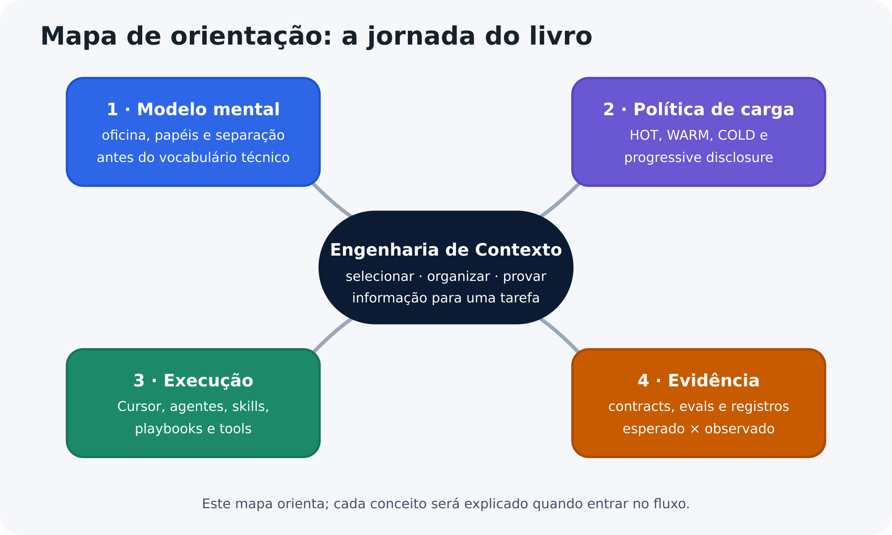
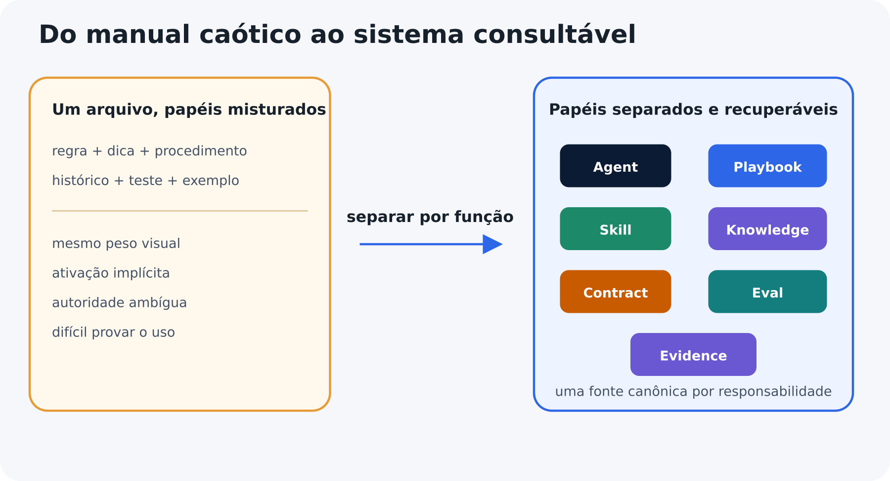
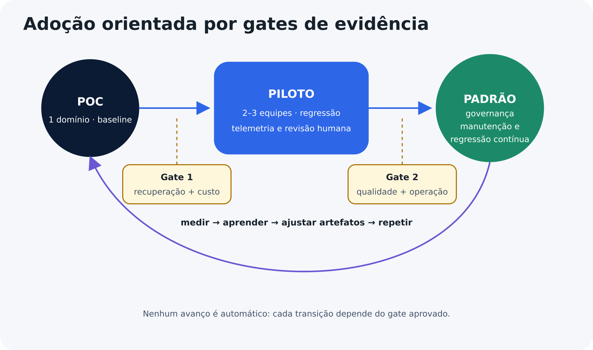

::: {.info title="Propósito da edição"}
Esta edição separa compreensão e execução em dois artefatos complementares. O livro principal preserva a progressão conceitual e as decisões; o workbook reúne prompts, schemas, templates, laboratórios e evidências reproduzíveis.
:::

## Créditos de revisão {.unnumbered}

- **Autor e revisor:** Hernandes Junio de Assis.
- **Revisor convidado:** Julio Henrique dos Santos.
- **Apoio complementar:** revisões assistidas por IA em múltiplas versões, sempre submetidas à decisão humana.

::: {.warning title="Exemplo mecânico fictício"}
O motor, os procedimentos, as medições e as especificações deste livro são exclusivamente didáticos. Não utilize o conteúdo para manutenção mecânica real.
:::

::: {.warning title="Limites de sistemas com IA"}
Modelos de linguagem possuem comportamento probabilístico. Organização de contexto, skills, regras, contratos e avaliações reduzem riscos, mas não garantem resultados perfeitos.
:::

\newpage

# Como ler este E-book

O livro foi desenhado para desenvolvedores que conhecem software, mas estão entrando no universo de agentes, context engineering e sistemas orientados por LLM.

## Um mapa antes da jornada

O mapa abaixo apresenta quatro movimentos sem exigir que você conheça previamente os artefatos. Os nomes são destinos; cada conceito será definido antes de ser usado para tomar uma decisão.

{ width=94% }

**Leia o mapa como uma sequência de aprendizagem.** Os quatro movimentos representados na figura serão percorridos nesta ordem:

1. construir um modelo mental com uma oficina fictícia;
2. organizar políticas para carregar o detalhe aplicável;
3. observar como um host monta contexto e executa recursos;
4. comparar expectativa com execução e preservar a evidência.

O conceito no centro do mapa não representa uma ferramenta específica. **Engenharia de contexto** é o trabalho de selecionar, organizar e manter informações que aumentam a chance de tomar decisões adequadas, executar a tarefa e verificar o resultado.

## Três rotas de leitura

Existem três rotas complementares:

**Rota essencial.** Leia o fluxo principal desde a oficina, passando pela transição para backend, até o exemplo assíncrono semi-completo, limitado ao que é necessário para compreender os conceitos apresentados.

**Rota de aprofundamento.** Leia também as caixas “Para curiosos” e “Deep Dive”, que ampliam a discussão sobre classificação híbrida, governança, conflitos, avaliação entre modelos e orçamento de contexto.

**Rota hands-on.** Use o workbook que acompanha esta edição. Nele estão os artefatos completos, prompts, schemas, execuções e laboratórios; no livro principal permanecem conceitos, decisões e microexemplos.

Os marcadores possuem funções estáveis:

| Marcador | Função |
|---|---|
| Exemplo | Demonstra uma aplicação reduzida. |
| Cuidado | Expõe risco ou interpretação incorreta. |
| Dica | Resume uma decisão prática. |
| Evidência | Mostra como provar uma conclusão. |
| Para curiosos | Aprofundamento opcional. |

O fluxo principal contém o necessário para compreender e aplicar o método. Conteúdo normativo, stop conditions e critérios de evidência nunca são escondidos em aprofundamentos opcionais.

# Introdução - o problema não é falta de documentação

Times de desenvolvimento acumulam instruções em **`README`**, arquivos de **agentes**, **wikis**, **comentários**, **tickets**, **ADRs**, **contratos**, **exemplos** e **prompts**. Quando um agente de IA recebe uma tarefa, essa informação precisa ser descoberta, selecionada, carregada, interpretada e aplicada.

Adicionar mais conteúdo não resolve automaticamente o problema. Um documento pode ser completo e ainda falhar porque:

- mistura obrigação com explicação;
- esconde regras em exemplos;
- não informa quando um procedimento deve ser ativado;
- possui fontes divergentes;
- carrega detalhes irrelevantes em todas as tarefas;
- não permite provar qual informação foi utilizada;
- não possui testes de recuperabilidade;

**Context engineering** é o trabalho de selecionar, organizar e manter o conjunto de informações necessário para aumentar a chance de uma tarefa ser executada corretamente. O objetivo não é produzir o menor prompt possível, mas fornecer o contexto mínimo suficiente para decidir, executar e verificar.

::: {.tip title="Minimal não significa curto"}
Um agente com poucas linhas pode ser vago. Um agente um pouco maior pode ser mais eficiente se concentrar responsabilidade, invariantes, roteamento, critérios de parada e evidência final.
:::

Esta edição começa longe do backend de propósito. Antes de olhar pastas, schemas ou APIs, vamos observar uma oficina em que todo conhecimento foi colocado no mesmo manual.

{ width=95% }

A figura antecipa o percurso que começa a seguir: partir do manual único, compreender por que ele se torna difícil de consultar e, a partir desse problema, organizar o conhecimento em partes com responsabilidades mais claras.

\newpage

# Parte I - A oficina desorganizada

## O manual que parecia completo

Uma oficina decidiu registrar em um único documento tudo que seus mecânicos precisavam saber sobre montagem e diagnóstico de motores.

O manual continha:

- a responsabilidade do mecânico;
- explicações sobre peças;
- procedimentos de desmontagem e montagem;
- regras de segurança;
- valores de referência;
- histórias de serviços antigos;
- formulários de inspeção;
- testes finais;
- dicas transmitidas por profissionais experientes.

Em uma primeira leitura, a solução parecia excelente. Tudo estava no mesmo lugar e ninguém precisava procurar em várias fontes.

O problema surgiu durante um serviço urgente. O mecânico precisava descobrir rapidamente:

1. qual motor estava diante dele;
2. qual instrução era obrigatória;
3. qual procedimento se aplicava àquele modelo;
4. quando deveria interromper;
5. como comprovar que o serviço havia terminado corretamente.

::: {.tip title="O problema não era falta de informação"}

O manual continha o conhecimento necessário. A dificuldade estava em identificar, entre tudo que estava disponível, o que realmente deveria orientar aquela tarefa.

:::

As informações estavam misturadas. Uma observação histórica aparecia ao lado de uma regra de segurança, uma dica informal tinha o mesmo destaque de uma especificação aprovada e um procedimento de outro modelo parecia semelhante o suficiente para induzir uma decisão incorreta.

O documento fictício abaixo é deliberadamente ruim. Leia como se você precisasse executar um serviço urgente e observe quantas responsabilidades precisa separar mentalmente.

```markdown
<!-- ANTI-PATTERN: responsabilidades misturadas no mesmo arquivo -->

Você é um mecânico sênior responsável por montar e diagnosticar motores.

O cabeçote fecha a parte superior do motor e ajuda a formar a câmara
de combustão. Nunca invente valores de torque e não continue se o
modelo exato do motor não estiver identificado.

Para instalar o cabeçote, limpe as superfícies, verifique a planicidade,
confirme a junta correta, consulte a sequência de aperto, aplique a
especificação correspondente e registre o resultado.

Para verificar a planicidade, posicione a régua de precisão nos sentidos
longitudinal, transversal e diagonal. Utilize o instrumento apropriado
e compare o maior desvio com a fonte aprovada.

O motor fictício Aurora X1 utiliza a tabela TQ-AUR-X1. Outros motores
podem utilizar materiais, parafusos e sequências diferentes. Nunca
reutilize um parafuso identificado como de uso único.

Se o motor apresentar baixa compressão depois da montagem, verifique
vedação, válvulas, junta, sincronismo e condições do cilindro.

Use o formulário de montagem para registrar o motor, as peças, o
instrumento utilizado, a sequência e o responsável pela inspeção.

Os primeiros cabeçotes eram frequentemente construídos com materiais
diferentes dos utilizados em motores modernos. Mudanças de material
podem alterar expansão térmica e métodos de inspeção.

Depois da montagem, execute os testes de vedação e compressão. Não
considere o serviço concluído apenas porque o motor ligou.

Se o resultado estiver fora da especificação, não tente compensar
aumentando o torque. Interrompa e execute o diagnóstico.
```

Todas as frases podem ser úteis, mas não possuem a mesma função.

| Trecho | Função percebida |
|---|---|
| “Você é um mecânico sênior...” | Define papel. |
| “O cabeçote fecha...” | Explica o domínio. |
| “Nunca invente valores...” | Impõe uma regra. |
| “Para instalar o cabeçote...” | Coordena um procedimento. |
| “Para verificar a planicidade...” | Descreve capacidade especializada. |
| “Os primeiros cabeçotes...” | Registra contexto histórico. |
| “Use o formulário...” | Indica recurso de saída. |
| “Não considere concluído...” | Define teste e critério de conclusão. |

O primeiro aprendizado é simples: **proximidade textual não significa responsabilidade igual**.

## O custo do manual monolítico

O manual único cria quatro dificuldades:

- **Decisão:** o mecânico precisa ler explicações extensas antes de encontrar o próximo passo.
- **Autoridade:** uma história antiga pode parecer tão obrigatória quanto uma regra atual.
- **Aplicabilidade:** um procedimento correto para determinado motor pode ser perigoso em outro.
- **Evidência:** mesmo quando o serviço funciona, outra pessoa pode não conseguir reconstruir qual fonte, medição ou decisão foi utilizada.

Essas dificuldades têm uma origem comum: reunir o conhecimento em um único lugar não garante que ele esteja organizado de forma útil para uma tarefa concreta.

::: {.warning title="Conteúdo completo pode continuar inutilizável"}

O problema não é apenas a ausência de conhecimento, mas a dificuldade de localizar a informação correta, reconhecer sua autoridade e aplicá-la na situação adequada.

:::

## O cartão operacional do chefe da oficina

“Cartão operacional” não é um termo universal de oficinas. Neste exemplo, ele representa uma ficha curta que o chefe consulta para coordenar qualquer serviço. No cenário técnico, seu equivalente é o **Agent Card**: o conteúdo HOT que concentra missão, invariantes, roteamento, condições de parada e evidência mínima.

O primeiro refactor não cria várias pastas, mas separa aquilo que o mecânico precisa ter disponível em praticamente todos os serviços.

O cartão operacional contém:

- **responsabilidade:** coordenar montagem e diagnóstico;
- **identificação:** confirmar motor e componente antes de agir;
- **segurança:** não inventar especificações;
- **encaminhamento:** usar a ordem de serviço correspondente;
- **especialização:** chamar quem possui uma habilidade específica;
- **parada:** interromper quando fonte, ferramenta ou condição estiver ausente;
- **conclusão:** finalizar somente depois de testes e registros.

::: {.info title="Por que o cartão permanece curto"}

O cartão concentra o que precisa estar disponível de forma recorrente, mas não substitui procedimentos, conhecimento especializado ou referências consultadas apenas quando aplicáveis.

:::

### O que não deve entrar no cartão

Não pertencem ao cartão operacional:

- catálogo completo de motores;
- todas as sequências de montagem;
- histórico de incidentes;
- formulários de todas as inspeções;
- explicações extensas sobre materiais;
- medições específicas de um componente.

Se todos esses detalhes forem incorporados ao cartão operacional, o refactor apenas recriará o manual monolítico com outro nome.

## A ordem de serviço

O cartão informa que um procedimento precisa ser escolhido, enquanto a ordem de serviço coordena uma atividade específica. Para instalar um cabeçote, por exemplo, ela poderia organizar o trabalho desta forma:

```markdown
# Instalação de cabeçote

## Pré-condições

- motor identificado;
- peça compatível;
- manual aplicável disponível;
- instrumentos verificados;
- superfície preparada.

## Procedimento

1. Inspecionar as superfícies.
2. Medir a planicidade.
3. Validar junta e parafusos.
4. Consultar sequência e valores aplicáveis.
5. Executar a instalação.
6. Registrar medições e componentes.
7. Realizar os testes finais.

## Condições de parada

- especificação ausente;
- medição fora da tolerância;
- componente incompatível;
- instrumento sem verificação;
- evidência insuficiente.
```

A ordem de serviço não precisa explicar profundamente a função de cada componente; seu papel é coordenar pessoas, fontes, instrumentos e verificações necessários para atingir um resultado.

## A capacidade especializada

Durante a instalação, algumas atividades exigem conhecimento, instrumento e método próprios. **Medir planicidade** é uma delas e pode ser necessário em diferentes serviços, como diagnóstico, montagem, retífica ou inspeção.

Uma capacidade especializada possui:

- sinal claro de aplicabilidade;
- escopo delimitado;
- método conhecido;
- entradas necessárias;
- resultado verificável;
- critérios de falha;
- registro do que foi executado.

Nem todo procedimento, porém, constitui uma capacidade independente. **Instalar o cabeçote** coordena várias ações, fontes e verificações para atingir um objetivo, enquanto **medir planicidade** representa uma capacidade delimitada e reutilizável que pode participar de diferentes ordens de serviço.

## O manual consultivo

O manual deixa de concentrar responsabilidades diferentes e passa a reunir o conhecimento necessário para compreender componentes, materiais e situações de uso, sem assumir o papel de coordenar o serviço ou impor regras por si só.

Ele pode explicar:

- função dos componentes;
- diferenças entre materiais;
- tipos de falha;
- instrumentos de medição;
- sinais de desgaste;
- compatibilidade entre peças;
- histórico de determinado modelo.

Esse conteúdo apoia a decisão, mas não substitui a ordem de serviço nem deve ocultar uma obrigação crítica em um parágrafo explicativo.

Regras e explicações precisam permanecer distinguíveis porque produzem efeitos diferentes: quando uma regra muda, sua fonte e autoridade devem continuar reconhecíveis; quando muda uma explicação consultiva, isso não implica necessariamente uma mudança de obrigação. Separar essas responsabilidades reduz o risco de tratar conhecimento ilustrativo como regra obrigatória.

## O teste e o laudo

Uma oficina organizada não considera o trabalho concluído apenas porque o motor ligou.

O teste verifica se o resultado atende aos critérios esperados, enquanto o laudo registra:

- identificação do motor;
- ordem de serviço utilizada;
- fontes consultadas;
- instrumentos e medições;
- peças aplicadas;
- testes executados;
- resultado;
- exceções e riscos residuais.

Encontrar a instrução correta não prova que ela foi aplicada, assim como executar o procedimento não demonstra, por si só, que o resultado atende aos critérios esperados.

A sequência passa por cinco momentos: escolher a ordem correta, consultar o manual aplicável, executar a capacidade necessária, realizar os testes e registrar o laudo.

::: {.evidence title="O laudo preserva a evidência da execução"}

O registro deve permitir que outra pessoa compreenda o que foi feito, quais fontes foram utilizadas, quais testes foram executados, quais resultados foram obtidos e por que o serviço foi considerado concluído.

:::

## Exemplo guiado — uma jornada completa pela oficina

O cenário a seguir reúne os elementos apresentados até aqui em um único serviço fictício. A ideia não é memorizar cada etapa, mas observar como **cartão operacional, ordem de serviço, manual, capacidades especializadas, testes e laudo** entram em momentos diferentes da execução.

> **Cenário:** um veículo chega com perda de potência depois de um reparo recente. O cliente relata aquecimento e consumo de líquido de arrefecimento, mas a oficina ainda não sabe se a causa está no cabeçote, na vedação, na circulação ou em outro componente.

### 1. Recepção e identificação

A primeira atividade não é desmontar. A oficina começa registrando:

- identificação do veículo e do motor;
- serviço anterior conhecido;
- sintomas relatados;
- momento em que a falha aparece;
- alertas observados;
- autorização inicial.

**Ponto de decisão:** se a identificação do motor estiver incompleta, o cartão operacional determina a interrupção da seleção do procedimento. Uma ordem aparentemente semelhante não deve ser escolhida apenas por conveniência.

---

### 2. Escolha da ordem de serviço

O chefe seleciona uma ordem de **diagnóstico inicial**, não uma ordem de instalação, porque o sintoma ainda não demonstra qual é a causa.

A ordem escolhida orienta:

1. confirmar os sintomas;
2. executar inspeções não invasivas;
3. registrar medições iniciais;
4. comparar resultados com a fonte aplicável;
5. decidir se existe fundamento para desmontagem;
6. solicitar autorização adicional quando necessária.

::: {.warning title="Atalho perigoso"}

Uma oficina desorganizada poderia pular diretamente para “trocar a junta”. A oficina organizada mantém separadas hipótese, teste e conclusão.

:::

### 3. Consulta ao manual

Com a ordem definida, o mecânico consulta apenas as seções relacionadas ao motor identificado e aos testes previstos. O manual ajuda a interpretar as medições, reconhecer padrões de falha e compreender as limitações de cada teste.

Uma medição isolada pode admitir diferentes interpretações: **o manual sustenta a leitura, enquanto a ordem de serviço determina quando essa informação participa da decisão.**

---

### 4. Uso de capacidades especializadas

A ordem exige duas capacidades que não estão disponíveis com o mesmo profissional:

- teste do sistema de arrefecimento;
- medição de vedação dos cilindros.

Cada especialista recebe as entradas necessárias, executa um método conhecido e devolve um resultado verificável. O chefe não precisa copiar todo o método para dentro da ordem de serviço.

**Até aqui, cada elemento preservou sua responsabilidade:**

`cartão → orienta` · `ordem → coordena` · `manual → explica` · `capacidade → executa`

---

### 5. Decisão intermediária

Os resultados apontam para perda de vedação, mas existe uma inconsistência entre duas medições. A condição de parada impede que a desmontagem prossiga automaticamente.

A oficina então:

- repete a medição com instrumento verificado;
- registra o valor anterior e o novo;
- consulta a nota aplicável ao modelo;
- confirma a hipótese somente depois da convergência.

::: {.tip title="Parar também é uma decisão"}

Interromper o fluxo não representa fracasso quando o fundamento ainda é insuficiente. A condição de parada evita que uma hipótese seja tratada prematuramente como conclusão.

:::

### 6. Execução e conclusão

Depois da autorização, outra ordem coordena desmontagem, inspeção, preparação, montagem e testes finais. As capacidades especializadas são utilizadas nos momentos correspondentes.

O veículo não é liberado apenas porque o motor voltou a funcionar. A oficina verifica os critérios definidos e produz um laudo com medições, componentes, fontes consultadas e resultado.

::: {.evidence title="O ciclo precisa ser reconstruível"}

Ao final, outra pessoa deve conseguir compreender o objetivo, as decisões tomadas, as fontes utilizadas, os testes executados e o motivo pelo qual o serviço foi considerado concluído.

:::

## O mesmo serviço em uma oficina desorganizada

Agora imagine o mesmo serviço sem a separação de responsabilidades construída no exemplo anterior.

O primeiro mecânico encontra um relato antigo sobre um motor semelhante e conclui que a junta é a causa mais provável. O segundo lembra de uma recomendação informal e sugere outro teste, enquanto o chefe possui uma atualização mais recente que permaneceu em uma folha separada.

O especialista executa uma medição correta, mas não registra a condição do instrumento. Ao final, o motor funciona, porém ninguém consegue reconstruir por que determinada sequência foi escolhida, quais informações sustentaram a decisão ou se todos os critérios necessários foram realmente verificados.

O problema não está na falta de experiência das pessoas envolvidas. Cada uma possui uma parte útil do conhecimento, mas a oficina não consegue combinar essas informações com autoridade, aplicabilidade e evidência suficientes para responder com segurança:

- qual informação possui força obrigatória;
- qual informação é apenas histórica ou consultiva;
- qual procedimento se aplica à situação;
- qual especialista deve participar;
- qual resultado permite avançar;
- qual registro demonstra a conclusão.

O serviço pode até terminar com um resultado aparentemente correto, mas o processo permanece difícil de verificar, explicar e repetir.

## Cinco falhas que a separação precisa evitar

Separar responsabilidades não resolve o problema se os novos elementos continuarem ambíguos, sobrepostos ou sem evidência. Cinco falhas ajudam a reconhecer quando isso está acontecendo.

1. **Instrução órfã**  
   Uma folha diz “verifique a vedação”, mas não informa em qual serviço, para qual motor ou com qual resultado esperado.  
   **Correção:** conecte a instrução a uma ordem, à fonte aplicável e ao registro esperado.

2. **Ordem que tenta ensinar tudo**  
   A ordem copia capítulos inteiros do manual e descreve todos os instrumentos, misturando coordenação com conhecimento consultivo.  
   **Correção:** mantenha na ordem apenas o necessário para coordenar o serviço e consulte o detalhe quando a etapa exigir.

3. **Especialista sem limite**  
   O profissional domina uma medição, mas passa a decidir sozinho se o veículo pode ser liberado.  
   **Correção:** delimite a capacidade e devolva o resultado à coordenação responsável pela decisão.

4. **Dica tratada como obrigação**  
   Uma solução utilizada no passado passa a ser aplicada como regra geral, sem verificar se continua válida para aquele serviço.  
   **Correção:** confirme origem, aplicabilidade e autoridade antes de transformar experiência em determinação.

5. **Laudo sem lastro**  
   O documento declara “aprovado” sem relacionar a conclusão aos testes, medições e critérios utilizados.  
   **Correção:** registre evidências que permitam reconstruir e conferir o resultado.

## Como saber se a oficina está realmente organizada

Um conjunto de armários bem etiquetados não basta. A organização só demonstra seu valor quando melhora a forma como o trabalho é decidido, executado e verificado.

Perguntas práticas ajudam a observar esse efeito:

- O mecânico identifica rapidamente a ordem aplicável?
- Uma busca por um sintoma conduz à fonte correta?
- Ordens inadequadas permanecem fora da seleção?
- O profissional reconhece quando deve parar?
- Capacidades especializadas devolvem resultados verificáveis?
- O teste final distingue “motor ligou” de “serviço aprovado”?
- O laudo permite que outra pessoa reconstrua a execução?

::: {.evidence title="Organização deve mudar o trabalho observado"}

Se os armários ficaram mais organizados, mas as pessoas continuam escolhendo instruções inadequadas, ignorando condições de parada ou produzindo conclusões sem evidência, a oficina apenas reorganizou o caos.

:::

## Como evoluir o acervo sem voltar ao caos

Cada novo conteúdo precisa responder a uma pergunta principal antes de ser incorporado ao acervo.

| Pergunta | Destino mais provável |
|---|---|
| Muda uma decisão permanente do responsável? | Cartão do chefe. |
| Coordena uma sequência para atingir um objetivo? | Ordem de serviço. |
| Ensina uma atividade delimitada e reutilizável? | Capacidade especializada. |
| Explica o domínio ou sustenta uma análise? | Manual consultivo. |
| Define como verificar ou registrar um resultado? | Teste e laudo. |

::: {.tip title="Sinal de responsabilidades misturadas"}

Quando uma informação parece pertencer a vários lugares ao mesmo tempo, ela pode estar reunindo responsabilidades diferentes e deve ser examinada antes de ser duplicada.

:::

Além de classificar o conteúdo novo, a oficina precisa revisar periodicamente aquilo que já existe e procurar sinais de degradação:

- ordens sem responsável;
- capacidades que deixaram de ser utilizadas;
- manuais sem fonte reconhecível;
- versões concorrentes da mesma informação;
- registros que não sustentam a conclusão;
- conteúdo duplicado;
- instruções que não informam quando se aplicam.

## O modelo mental completo da oficina

Antes de deixar a metáfora, podemos reunir as cinco responsabilidades construídas até aqui:

| Elemento | Responsabilidade |
|---|---|
| Cartão do chefe | Papel, decisões permanentes, encaminhamento e condições de parada. |
| Ordem de serviço | Coordenação de uma sequência para atingir um objetivo. |
| Capacidade especializada | Execução de uma atividade delimitada, reutilizável e verificável. |
| Manual consultivo | Conhecimento utilizado para compreender o domínio e apoiar decisões. |
| Teste e laudo | Verificação dos critérios e registro do resultado. |

Até aqui, não foi necessário discutir repositórios, APIs, schemas ou modelos de linguagem. A oficina serviu para construir uma estrutura de responsabilidades que o leitor possa reconhecer antes de encontrar seus equivalentes técnicos.

## Os limites da metáfora

A oficina ajuda a enxergar essas responsabilidades, mas não representa toda a complexidade de um sistema de software com IA.

No cenário técnico:

- um agente pode depender de um modelo com comportamento probabilístico;
- a descoberta de informações pode envolver busca lexical ou semântica;
- uma capacidade pode executar código ou chamar uma API;
- uma mesma tarefa pode atravessar vários serviços e fontes;
- parte da execução pode terminar apenas depois de segundos ou minutos;
- eventos e falhas podem precisar de correlação automática;
- acesso, privacidade, latência e custo também precisam ser controlados.

::: {.info title="Busca lexical e busca semântica"}

**Busca lexical** procura correspondências entre os termos consultados e os termos presentes no conteúdo. Se a consulta contém “falha de autenticação”, documentos com essas palavras tendem a receber maior relevância.

**Busca semântica** procura conteúdos relacionados pelo significado, mesmo quando as mesmas palavras não aparecem. Uma consulta por “falha de login”, por exemplo, pode recuperar conteúdo sobre “erro de autenticação” se os conceitos forem considerados semanticamente próximos.

As duas abordagens podem ser combinadas: sistemas de recuperação frequentemente usam sinais lexicais e semânticos para melhorar a qualidade dos resultados.

:::

A metáfora construiu o modelo mental; a próxima parte dará nomes técnicos às responsabilidades, mostrará como elas podem ser organizadas e acrescentará os mecanismos necessários para operá-las em um sistema real.

\newpage

# Parte II - A ponte para engenharia de contexto

A oficina construiu primeiro um modelo de responsabilidades sem depender do vocabulário técnico. A partir daqui, essas mesmas funções serão traduzidas para estruturas usadas em sistemas com agentes, preservando a lógica aprendida sem assumir uma equivalência literal entre a metáfora e a implementação.

## Da oficina para o repositório

Agora os cinco elementos recebem nomes técnicos.

| Oficina | Engenharia de contexto | Responsabilidade |
|---|---|---|
| Cartão do chefe | Agent | Define papel, invariantes, roteamento, parada e conclusão. |
| Ordem de serviço | Playbook | Coordena etapas para atingir um objetivo. |
| Capacidade especializada | Skill | Encapsula uma capacidade reutilizável com sinais claros de aplicabilidade. |
| Manual consultivo | Knowledge | Apoia compreensão e decisão com conhecimento consultivo. |
| Teste e laudo | Eval e Evidence | Compara o esperado com o observado e preserva o registro da execução. |

O mapeamento não afirma que uma oficina funciona como software. Ele preserva relações que agora receberão implementação técnica: coordenação, capacidade, conhecimento, verificação e evidência.

## Contexto não é apenas prompt

Em um sistema com agentes, contexto inclui tudo que o modelo pode utilizar durante uma decisão:

- instruções do sistema;
- conversa;
- descrição de skills e tools;
- arquivos recuperados;
- resultados de APIs;
- memória;
- plano atual;
- estado da execução;
- mensagens de erro;
- evidências já produzidas.

**Context engineering** é a disciplina de selecionar, organizar e manter esse conjunto de informações para aumentar a chance de decisões, execuções e verificações adequadas.[^anthropic-context]

O objetivo é maximizar utilidade, não simplesmente diminuir texto. Conteúdo irrelevante aumenta ruído, enquanto conteúdo necessário ausente deixa decisões sem fundamento.

\Needspace{15\baselineskip}

Ao organizar contexto, duas cargas precisam ser observadas porque representam problemas diferentes.

::: {.info title="Duas cargas, dois problemas diferentes"}

**Carga para o leitor** é o esforço necessário para compreender e relacionar as informações apresentadas.

**Carga para o runtime** é a quantidade de contexto que o sistema precisa carregar e processar durante uma execução, como tokens, descrições de tools, arquivos recuperados e resultados intermediários.

:::

Reduzir uma carga não reduz automaticamente a outra. Um conteúdo pode ser fácil de compreender e ainda enviar contexto demais ao modelo; da mesma forma, uma explicação conceitualmente difícil pode ocupar poucos tokens.

Por isso, engenharia de contexto precisa equilibrar as duas dimensões: **facilitar a compreensão sem carregar na execução mais informação do que a tarefa necessita.**

## Quando carregar: HOT, WARM e COLD

Na oficina, alguns elementos permaneciam disponíveis em praticamente todo serviço, enquanto outros eram consultados apenas quando a situação indicava sua aplicabilidade. **HOT, WARM e COLD** dão nome a essa política de carregamento: classificam **quando um conteúdo tende a entrar no contexto**, não sua importância, autoridade ou qualidade.

### HOT

**Definição:** conteúdo disponível desde o início ou necessário em uma parcela ampla das decisões daquele agente.

**Problema resolvido:** evita que o agente precise redescobrir missão, limites e caminhos de navegação a cada tarefa.

Exemplos:

- **Missão:** delimita o resultado que o agente coordena.
- **Invariante crítica:** estabelece uma condição que deve permanecer verdadeira nas execuções relevantes, como “não afirmar conclusão sem evidência”.
- **Mapa de capacidades:** informa, de forma resumida, quais skills e playbooks existem e quais sinais indicam sua aplicabilidade.
- **Condição de parada:** informa quando solicitar dados, autorização ou ajuda.
- **Definition of Done:** descreve o resultado mínimo verificável.

**Critério de decisão:** se retirar o conteúdo fizer o agente perder orientação em uma parcela ampla das tarefas, ele é candidato a HOT. A classificação deve ser confirmada por testes; importância isolada não basta.

**Contraexemplo:** o manual completo de uma integração pode ser importante, mas não precisa permanecer carregado durante uma tarefa que apenas renomeia uma classe.

### WARM

**Definição:** conteúdo recuperado sob demanda quando a tarefa apresenta um sinal observável de aplicabilidade.

**Problema resolvido:** mantém o contexto inicial enxuto sem obrigar o agente a trabalhar sem a instrução especializada necessária.

Exemplos:

- playbook de operação assíncrona, recuperado quando o processamento continua depois da resposta HTTP;
- skill de validação OpenAPI, aplicável quando um contrato é criado ou alterado;
- documentação de SignalR, recuperada quando a tarefa envolve atualização em tempo real;
- catálogo de falhas, consultado quando o erro observado pertence àquele componente.

**Critério de decisão:** o conteúdo possui sinais claros de aplicabilidade, entradas conhecidas e custo razoável de recuperação.

**Erro comum:** classificar um arquivo como WARM sem declarar como reconhecer sua aplicabilidade. Nesse caso, “recuperar quando necessário” passa a depender de adivinhação.

### COLD

**Definição:** conteúdo recuperado principalmente em exceções, investigações, auditorias ou aprofundamentos.

**Problema resolvido:** preserva conhecimento valioso sem competir continuamente com a tarefa comum.

Exemplos:

- **ADR** (*Architecture Decision Record*) substituída, recuperada para compreender uma decisão histórica;
- **Post-mortem** — análise realizada após um incidente para registrar causas e aprendizados;
- **Comparação** extensa entre alternativas;
- **Evidence Record** arquivado para auditoria ou regressão.

**Critério de decisão:** baixa frequência de uso, alto nível de detalhe ou aplicação restrita a situações específicas.

**Contraexemplo:** uma norma regulatória pode ser consultada raramente e continuar obrigatória quando aplicável. Ser COLD não significa ser opcional.

### Temperatura não define autoridade

HOT, WARM e COLD respondem principalmente **quando carregar determinado conteúdo para determinado consumidor**. Outra dimensão responde **quanto esse conteúdo obriga quando aplicável**.

Neste livro, **NORMATIVE** identifica conteúdo que deve ser obedecido dentro de sua aplicabilidade declarada. Por isso, temperatura e autoridade precisam permanecer independentes.

::: {.info title="COLD também pode ser NORMATIVE"}

Uma regra de recuperação de desastre pode ser consultada apenas uma vez por ano e ainda precisar ser obedecida quando aplicável. Nesse caso, ela pode ser **COLD e NORMATIVE** ao mesmo tempo.

:::

A temperatura também depende do consumidor. Um catálogo de falhas pode ser WARM para um agente de diagnóstico e COLD para outro que apenas corrige documentação. Por isso, HOT/WARM/COLD não é uma propriedade permanente do arquivo: a classificação precisa ser revista quando o padrão de uso mudar.

## Progressive disclosure

Separar o conteúdo em arquivos resolve parte do problema, mas cria outro: se o agente recebe todo o acervo, aumenta o ruído; se recebe apenas uma orientação genérica, pode não descobrir o detalhe necessário para executar a tarefa.

**Progressive disclosure** organiza essa descoberta em etapas. O agente começa com informação suficiente para reconhecer a aplicabilidade de um recurso e recupera detalhes adicionais somente quando a tarefa exige.

```text
orientação inicial
        ↓
sinal de aplicabilidade
        ↓
recurso correspondente
        ↓
detalhe necessário
        ↓
execução e evidência
```

Exemplo:

1. o Agent Card informa que existe um playbook para operações longas;
2. a tarefa indica que o relatório pode levar minutos;
3. o agente recupera o playbook assíncrono;
4. o playbook aponta para a Rule e o Contract aplicáveis;
5. a Skill valida o contrato;
6. a execução registra fontes e resultados.

Se a tarefa for síncrona, o playbook assíncrono não precisa ser recuperado. Se a aplicabilidade estiver ambígua, o agente deve pedir a informação necessária ou interromper conforme sua condição de parada.

Esse mecanismo complementa HOT/WARM/COLD: a temperatura ajuda a decidir **quando um conteúdo tende a ser carregado**, enquanto progressive disclosure organiza **como chegar ao próximo nível de detalhe sem carregar o acervo inteiro desde o início**.

Na especificação Agent Skills, esse princípio aparece em três níveis: os metadados `name` e `description` ficam disponíveis inicialmente, o conteúdo completo do `SKILL.md` é carregado quando a skill é ativada e recursos adicionais são acessados conforme a necessidade.[^agentskills-spec]

HOT/WARM/COLD não faz parte da especificação Agent Skills. Neste livro, a taxonomia é utilizada como modelo didático para raciocinar sobre políticas de carregamento.

### O que progressive disclosure não garante

Separar arquivos pode reduzir o volume de contexto quando evita **overfetch** — recuperar mais conteúdo do que a tarefa necessita — e duplicação. Esse benefício, porém, não é automático: mais fragmentação também pode aumentar leituras, latência, falhas de recuperação e retrabalho.

Por isso, a eficiência deve ser avaliada pela tarefa completa, considerando não apenas o modelo, mas também recuperação, tools, infraestrutura e trabalho adicional necessário para chegar a um resultado válido.

```text
Custo da tarefa válida
    = modelo
    + recuperação
    + tools
    + infraestrutura
    + retrabalho
```

::: {.warning title="Segregação não garante economia"}

Dividir o conteúdo só produz ganho quando o recurso correto é encontrado e o detalhe recuperado é suficiente para concluir a tarefa sem leituras desnecessárias.

:::

Outro limite está no próprio contexto enviado ao modelo. Estudos sobre ***long context*** observaram degradação em alguns cenários quando informações relevantes apareciam em posições intermediárias do contexto.[^lost-middle] Isso justifica testar tamanho, posição da informação relevante e nível de ruído, mas não estabelece um limite universal para contextos longos.

O comportamento depende do modelo, da tarefa e do protocolo de avaliação. Portanto, **progressive disclosure deve ser tratado como uma estratégia a ser medida, não como garantia de menor custo ou melhor resposta**.

## A árvore mínima

Depois da ponte conceitual, a estrutura inicial pode permanecer pequena. Como esta edição usa o Cursor como host de referência, a organização abaixo mantém os artefatos relacionados ao agente dentro de uma fronteira comum, sem pressupor que todos sejam mecanismos nativos do host.

**Uma forma mínima de materializar essa organização em um repositório é a seguinte:**

```text
repository/
├── .cursor/
│   ├── README.md
│   ├── rules/
│   ├── agents/
│   ├── skills/
│   │   ├── validate-api-contract/
│   │   │   ├── SKILL.md
│   │   │   └── contracts/
│   │   │       └── report-request.contract.yaml
│   │   └── another-skill/
│   │       └── SKILL.md
│   ├── playbooks/
│   ├── knowledge/
│   ├── contracts/
│   ├── evals/
│   │   └── fixtures/
│   ├── evidence/
│   ├── hook-scripts/
│   ├── hooks.json
│   └── mcp.json
├── docs/
├── src/
├── tests/
└── README.md
```

A árvore deve ser lida em **duas dimensões independentes**: primeiro, pelo mecanismo que faz cada elemento participar da execução; depois, pelo escopo de responsabilidade de cada artefato.

**Mecanismo de execução.** `rules/`, `agents/`, `skills/`, `hooks.json` e `mcp.json` participam de funcionalidades reconhecidas pelo Cursor, cada um conforme seu próprio mecanismo de descoberta ou configuração.

Já `README.md`, `playbooks/`, `knowledge/`, `contracts/`, `evals/`, `evidence/` e `hook-scripts/` representam convenções de organização utilizadas neste livro. Esses elementos não ganham comportamento apenas por existirem dentro de `.cursor/`; precisam ser ligados a uma Rule, Agent, Skill, script, harness ou outro mecanismo capaz de descobri-los, recuperá-los ou executá-los.

O caso dos hooks torna essa diferença visível: `hooks.json` configura o mecanismo reconhecido pelo Cursor, enquanto `hook-scripts/` é a convenção adotada neste livro para organizar os scripts chamados por essa configuração.

**Ownership e escopo.** Nem todo artefato de um mesmo tipo precisa ocupar uma pasta global. Quando um recurso pertence exclusivamente a uma capacidade, mantê-lo próximo dessa capacidade torna sua responsabilidade explícita e reduz dependências desnecessárias da estrutura externa.

Por isso, o Contract utilizado apenas pela skill `validate-api-contract` permanece dentro do diretório da própria skill:

```text
validate-api-contract/
├── SKILL.md
└── contracts/
    └── report-request.contract.yaml
```

A especificação Agent Skills permite que uma skill contenha arquivos e diretórios adicionais além do `SKILL.md`, possibilitando que recursos necessários àquela capacidade sejam mantidos e recuperados a partir de seu próprio pacote.[^agentskills-spec]

Nesse caso, o `SKILL.md` pode referenciar o Contract por um caminho relativo, preservando a relação entre a capacidade e o recurso que ela utiliza.

A pasta `.cursor/contracts/`, por outro lado, é reservada **nesta organização** para Contracts que possuam múltiplos consumidores reais, como diferentes skills, agents ou fluxos. Esses artefatos deixam de pertencer exclusivamente a uma capacidade e passam a funcionar como fontes canônicas compartilhadas.

Portanto, a localização comunica também uma decisão de escopo:

```text
recurso exclusivo de uma capacidade
→ permanece junto ao proprietário

recurso realmente compartilhado
→ pode subir para uma fonte canônica comum
```

Essa organização é uma decisão arquitetural deste livro, não uma exigência da especificação Agent Skills.

A localização comum dentro de `.cursor/` reduz fricção de navegação e facilita a manutenção, mas não altera a natureza de cada elemento: **estar na mesma árvore não significa possuir o mesmo mecanismo de execução, o mesmo ownership ou o mesmo ciclo de carregamento**.

::: {.warning title="Fonte canônica não significa contexto permanente"}

Manter uma única fonte reduz duplicação e divergência, mas não significa carregar todo o seu conteúdo em cada execução. Cada artefato deve entrar no contexto apenas quando necessário.

:::
\newpage

# Parte III - Contexto executável no Cursor

Esta parte responde à pergunta que permanecia entre **organizar arquivos** e **obter comportamento**:

> **Quem interpreta cada artefato e por qual mecanismo ele participa da execução?**

O Cursor é o host de referência desta edição. A organização conceitual construída até aqui continua útil em outros ambientes, mas sua implementação depende de mecanismos equivalentes de descoberta, carregamento, execução e registro.

::: {.info title="O que muda nesta parte"}

Até aqui, o foco esteve principalmente em **como organizar o contexto**.

A partir deste ponto, o foco passa a ser **como esse contexto participa de uma execução real**.

:::

## O que é nativo e o que é convenção

Nem todo arquivo presente no repositório participa da execução pelo mesmo mecanismo. Para deixar essa diferença explícita, o livro utiliza três marcadores que indicam **de onde vem o mecanismo que dá efeito ao artefato**.

### Três marcadores

| Marcador | O que significa | Exemplos |
| --- | --- | --- |
| `CURSOR NATIVE` | O Cursor reconhece e interpreta o mecanismo. | Project Rules, subagents, Agent Skills, Hooks e MCP. |
| `OPEN SPEC` | O formato é definido por uma especificação aberta. | `SKILL.md` conforme Agent Skills. |
| `BOOK ONTOLOGY` | A estrutura é uma convenção deste livro e precisa ser conectada explicitamente à execução. | Playbooks, Knowledge, Contracts, Evals e Evidence. |

Os marcadores representam dimensões diferentes e podem se sobrepor.

```text
Agent Skill
├── OPEN SPEC
│   └── formato SKILL.md
└── CURSOR NATIVE
    └── descoberta e uso pelo Cursor

Playbook
└── BOOK ONTOLOGY
    └── precisa de um consumidor explícito
```

Portanto, o marcador não responde apenas **“que tipo de arquivo é este?”**. Ele ajuda a responder:

> **Quem conhece esse artefato e por qual mecanismo ele entra na execução?**

Os caminhos e mecanismos nativos utilizados neste capítulo seguem a documentação vigente do Cursor para Rules, Subagents, Agent Skills, MCP e Hooks.[^cursor-runtime]

### Host e runtime

Dois termos ajudam a interpretar essa relação:

| Termo | Papel |
| --- | --- |
| **Host** | Aplicação em que o agente opera, como o Cursor. |
| **Runtime** | Mecanismos que sustentam a execução: montagem de contexto, modelo, tools, estado e controles. |

Um artefato pode existir no repositório sem que o runtime o carregue, recupere ou utilize.

Essa distinção leva a uma regra importante:

```text
arquivo existe
≠
arquivo participou da execução
```

E mesmo participação não demonstra, sozinha, aplicação correta:

```text
artefato encontrado
        ↓
artefato consumido
        ↓
comportamento observado
        ↓
verificação
```

### Da transição à evidência

Para cada ligação apresentada neste capítulo, procure três elementos:

1. **transição:** o que deveria acontecer;
2. **consumidor:** quem realiza ou interpreta essa passagem;
3. **evidência:** o que permite verificar que ela ocorreu.

A tabela aplica esse critério às principais transições do exemplo:

| Transição | Consumidor | Sinal observável |
| --- | --- | --- |
| Pedido → Project Rule | Cursor | Rule aplicável e evidência disponível de utilização de seu conteúdo. |
| Pedido → subagent | Agent pai ou operador | Delegação registrada, subagent utilizado e resultado devolvido. |
| Pedido → Skill | Cursor Agent | Skill descoberta ou invocada e `SKILL.md` utilizado. |
| Skill → Playbook/Knowledge | Instrução que referencia o recurso | Caminho recuperado e conteúdo utilizado. |
| Agent → tool externa | Cliente MCP do host | Tool, entrada, saída, status e correlação observáveis. |
| Evento → guardrail | Mecanismo de Hooks do Cursor | Evento, comando executado, decisão e status retornado. |

A leitura esperada não é:

```text
arquivo presente
→ mecanismo funcionando
```

Mas:

```text
artefato
→ consumidor
→ participação observável
→ efeito verificável
```

::: {.tip title="Regra prática"}

**Existência não prova participação. Participação não prova aplicação correta.**

Sempre que possível, verifique separadamente:

- o artefato estava disponível;
- o mecanismo realmente o utilizou;
- o resultado respeitou o comportamento esperado.

:::


## Da tarefa à evidência em quatro movimentos

O catálogo completo de artefatos é útil, mas não precisa ser aprendido de uma vez. Na rota essencial, acompanhe quatro movimentos que preservam a relação entre intenção, execução e prova:

1. **Decidir:** o Agent identifica a missão, as invariantes e a condição de parada.
2. **Recuperar:** o Playbook coordena o fluxo e a Skill traz a capacidade aplicável; Knowledge oferece fundamentação quando necessário.
3. **Restringir:** Rule e Contract tornam obrigações e condições observáveis; Assertions registram expectativas derivadas dessas fontes.
4. **Verificar:** a Eval executa um cenário previamente definido e o Evidence Record preserva o esperado, o observado, os verificadores, o veredito e as limitações.

```text
pedido
→ decisão e roteamento
→ contexto aplicável
→ execução sob restrições
→ comparação com expectativas
→ evidência e decisão
```

\Needspace{8\baselineskip}

::: {.tip title="Rota essencial"}
Este capítulo explica os papéis e acompanha um microfluxo completo. Arquivos copiáveis, prompts, schemas e execuções ficam no workbook.
:::

## O catálogo essencial de artefatos

| Artefato | Pergunta que responde | Conteúdo mínimo | Erro que evita |
|---|---|---|---|
| Agent | Quem decide e quando deve parar? | Missão, invariantes, roteamento, stop conditions e evidência mínima. | Um agente genérico tentando executar qualquer responsabilidade. |
| Playbook | Como coordenar uma jornada recorrente? | Pré-condições, passos, decisões, fallbacks e saídas. | Procedimento longo misturado à identidade do Agent. |
| Skill | Qual capacidade especializada deve ser ativada? | Gatilhos, entradas, fluxo, guardrails, recursos e Definition of Done. | Copiar instruções especializadas para todo contexto. |
| Knowledge | Qual fundamento apoia a decisão? | Conceitos, limites, fontes e exemplos consultivos. | Tratar explicação como obrigação operacional. |
| Rule | O que é obrigatório, proibido ou exige fallback? | Escopo, obrigação, proibição, fallback e evidência. | Regra crítica escondida em prosa ou exemplo. |
| Contract | Que condições observáveis conectam componentes? | Entradas, saídas, pré-condições, pós-condições e efeitos proibidos. | Interfaces aparentemente compatíveis, mas semanticamente divergentes. |
| Assertion | Qual expectativa estável será verificada? | Fonte, escopo, expected e mecanismo de prova. | Inventar o critério depois de observar o resultado. |
| Eval | Em qual cenário e com quais verificadores comparar? | Massa, execução, checks e regra de veredito. | Confundir uma demonstração convincente com avaliação reproduzível. |
| Evidence Record | O que ocorreu e o que ainda não foi provado? | Expected, observed, checks, verdict, lineage e limitações. | Transformar evidência em narrativa persuasiva. |

Temperatura, autoridade e tipo continuam separados. Um Contract pode ser COLD e NORMATIVE; uma explicação HOT pode ser apenas ADVISORY. **HOT/WARM/COLD responde quando carregar, não quanto o conteúdo obriga.**

### Do backend caótico à separação

O anti-pattern abaixo mistura identidade, procedimento, política, explicação e teste. O problema não é apenas o tamanho: nenhuma parte possui ownership, ativação ou mecanismo de prova claro.

```markdown
<!-- ANTI-PATTERN -->
# Backend Agent

Sempre implemente APIs, mensageria, persistência e SignalR.
Use 202, salve o job, publique eventos, aplique retry e gere testes.
SignalR funciona assim: [... explicação longa ...]
Se o teste passar, considere concluído.
```

A separação mínima transforma esse bloco em relações verificáveis:

```text
Agent → roteia a tarefa e preserva invariantes
Playbook → coordena a operação assíncrona
Skill → valida o contrato de API
Knowledge → explica limites do SignalR
Rule → exige a política aprovada no estudo
Contract → descreve estados e transições observáveis
Eval → executa cenários definidos antes da resposta
Evidence → registra resultado e limitações
```

## Frontmatter: contrato do consumidor antes da ontologia do livro

Frontmatter melhora identidade, catálogo e interoperabilidade quando um consumidor reconhece seus campos. Ele **não garante**, isoladamente, descoberta, roteamento ou cache.

Uma Agent Skill interoperável começa pelo contrato da especificação aberta:

```markdown
---
name: validate-api-contract
description: Valida contratos HTTP assíncronos quando a tarefa altera aceitação, consulta de status ou transições de job.
---

# Validar contrato de API

## Quando usar

Use quando uma alteração puder mudar status, headers, estados ou efeitos observáveis.
```

Campos adicionais só devem ser usados quando o host, um catálogo ou outro componente do projeto realmente os interpretar. A mesma cautela vale para Rules e Playbooks: metadados de governança podem ser úteis sem possuir efeito nativo no Cursor.

::: {.warning title="Existência não prova participação"}
Um arquivo presente no repositório pode não ter entrado no contexto. Mesmo quando participou, isso não demonstra aplicação correta. Quando o host não expuser lineage suficiente, registre `INCONCLUSIVE` em vez de deduzir o caminho a partir de uma resposta correta.
:::

## Microfluxo: Contract → Assertion → Eval → Evidence

Considere o recorte didático de uma API que aceita um relatório assíncrono. O status HTTP `202 Accepted` informa que a requisição foi aceita para processamento; ele não comprova conclusão e, isoladamente, não prova a durabilidade do job.[^rfc-202]

O Contract adiciona as condições específicas da arquitetura de referência:

```yaml
operation: POST /reports
preconditions:
  - request_is_authorized
postconditions:
  - response_status_is_202
  - job_is_queryable_by_returned_location
forbiddenEffects:
  - report_marked_completed_before_processing
```

A Assertion é derivada antes da execução:

```yaml
assertionId: ASYNC-ACCEPT-001
source: report-request.contract.yaml
expected:
  status: 202
  locationHeader: required
  initialState: accepted
```

A Eval fornece a entrada, executa o cenário e combina verificadores compatíveis com cada critério. Igualdade, schema, status e transições devem preferir verificadores determinísticos. Critérios semânticos podem exigir rubrica e julgamento probabilístico versionado.

O Evidence Record não repete a intenção; ele registra o que foi observado:

```json
{
  "evidenceId": "EV-ASYNC-001",
  "assertionId": "ASYNC-ACCEPT-001",
  "expected": {"status": 202, "locationHeader": "required"},
  "observed": {"status": 202, "locationHeader": "/reports/jobs/42"},
  "checks": [
    {"id": "status", "mechanism": "exact", "result": "PASS"},
    {"id": "location", "mechanism": "schema", "result": "PASS"}
  ],
  "verdict": "PASS",
  "limitations": ["O lineage de arquivos consultados não foi exposto pelo host."]
}
```

O `PASS` demonstra somente o escopo verificado. Ele não prova que todos os artefatos foram recuperados, que outros modelos agirão do mesmo modo ou que a arquitetura é adequada para qualquer domínio.

::: {.example title="Checkpoint técnico"}
Sem abrir o workbook, tente responder: de qual fonte nasceu a Assertion, quem executou a Eval e qual limitação impede transformar o resultado funcional em prova de lineage? Se uma dessas relações não estiver clara, releia o microfluxo antes de continuar.
:::

## Recuperação, aplicação e resultado são camadas diferentes

Uma avaliação útil separa ao menos três perguntas:

1. **Recuperação ou roteamento:** o conteúdo aplicável foi disponibilizado?
2. **Aplicação:** as obrigações e restrições recuperadas influenciaram corretamente a execução?
3. **Resultado:** a saída satisfaz as condições observáveis do Contract e das Assertions?

```text
resultado correto + lineage ausente
→ resultado funcional PASS
→ recuperação INCONCLUSIVE

artefato recuperado + regra violada
→ recuperação PASS
→ aplicação FAIL
```

Essa separação evita dois falsos positivos comuns: considerar uma resposta correta como prova de recuperação e considerar a simples presença de palavras como prova de aplicação.

::: {.curious title="APROFUNDAMENTO — verificadores determinísticos e semânticos"}
Use verificadores determinísticos para propriedades que podem ser calculadas sem interpretação: schema, igualdade, presença obrigatória, ordem, estado e status. Reserve LLM-as-a-Judge para critérios realmente semânticos; versione modelo, prompt e rubrica, preserve amostras e mantenha revisão humana compatível com o risco. O avaliador probabilístico não se torna verdade objetiva por receber o nome de judge.
:::

## Da compreensão para a execução

O workbook contém o experimento completo no Cursor, os testes mínimos de cada artefato, o Eval Spec integral, o prompt do Auditor de Contexto, o estudo assíncrono, templates e Evidence Records preenchidos. O laboratório `lab/` permanece como corpus executável e fonte canônica dos arquivos completos.

Antes de ir ao workbook, preserve esta cadeia:

```text
fonte aprovada
→ expectativa derivada
→ cenário definido
→ execução observada
→ verificadores
→ veredito com limitações
```

# Parte IV - Estudo de caso: operação assíncrona

A Parte III apresentou Agent, Playbook, Skill, Knowledge, Rule, Contract, Eval e Evidence Record separadamente para deixar claras suas responsabilidades. Agora vamos observar **como essas peças cooperam quando uma única tarefa exige várias delas ao mesmo tempo**.

A geração assíncrona de relatório será usada como cenário de integração. O objetivo não é ensinar arquitetura assíncrona em profundidade, mas acompanhar como os artefatos de Context Engineering participam de um mesmo fluxo, desde o pedido inicial até a avaliação e o registro da evidência.

Este capítulo reúne, portanto, os conceitos anteriores em um exemplo **semi-completo**. Ele cobre apenas as partes necessárias para demonstrar essa cooperação sem transformar o estudo de caso em uma arquitetura integral de produção.

| Incluído no exemplo | Omitido deliberadamente |
| --- | --- |
| Contract HTTP e idempotência básica | Autenticação e autorização detalhadas |
| Job, estados e persistência | Dimensionamento e topologia de infraestrutura |
| SignalR e reconciliação por API | Deploy, disaster recovery e retenção |
| Edge cases, testes e Evidence Records | Políticas corporativas completas de segurança e privacidade |

O recorte acompanha uma única tarefa do início ao fim:

```text
requisito
→ aceitação da solicitação
→ criação e processamento do job
→ persistência da conclusão
→ notificação e reconciliação
→ avaliação
→ Evidence Record
```

Ao longo desse caminho, o foco será observar **qual artefato participa de cada decisão, por que ele se torna aplicável e qual evidência permite verificar seu efeito**.

::: {.info title="Por que o exemplo é semi-completo"}

As camadas omitidas continuam importantes. Elas foram retiradas para que o leitor consiga observar com clareza a integração entre os artefatos de Context Engineering sem transformar o capítulo em uma especificação completa de backend distribuído.

:::

## O requisito

Uma API inicia a geração de um relatório consolidado. O processamento pode durar minutos. O front-end precisa acompanhar o processamento e atualizar a tela quando o relatório ficar pronto, mesmo que a conexão em tempo real seja temporariamente perdida.

O desafio pode ser resumido em três necessidades:

```text
aceitar o trabalho
        ↓
processar de forma durável
        ↓
permitir atualização e recuperação do estado
```

Esse único requisito mobiliza responsabilidades diferentes dos artefatos apresentados anteriormente:

| Responsabilidade | Artefato ou mecanismo principal |
| --- | --- |
| Definir aceitação, estado consultável e comportamento observável da API | Contract |
| Coordenar a sequência da operação assíncrona | Playbook |
| Executar validações especializadas do contrato | Skill |
| Preservar obrigações como persistir antes de notificar | Rule |
| Interpretar o papel e os limites do SignalR | Knowledge |
| Atualizar o cliente conectado | Canal SignalR |
| Permitir recuperação após desconexão | Estado durável + consulta por API |
| Verificar expectativas e preservar o resultado | Eval + Evidence Record |

::: {.info title="Uma tarefa, responsabilidades diferentes"}

A tabela não afirma que todos esses elementos utilizam o mesmo mecanismo nem que precisam ser carregados ao mesmo tempo.

Ela mostra como **uma única tarefa atravessa responsabilidades diferentes**, cada uma assumida pelo artefato ou mecanismo mais adequado.

:::

## Contrato de aceitação

O Contract apresentado anteriormente separou condições de **aceitação** e **conclusão**. Neste estudo de caso, vamos observar esses dois momentos separadamente para entender o que precisa ser verificável em cada etapa da mesma operação.

O primeiro recorte governa o início do fluxo: o cliente envia a solicitação e a API confirma que o trabalho foi aceito para processamento. `202 Accepted` não significa que o relatório ficou pronto.

Neste estudo, a aceitação só é considerada válida quando já existe um job durável e uma referência que permita acompanhar seu estado posteriormente.

Esse recorte protege três decisões:

- repetir a mesma solicitação não deve criar trabalho lógico duplicado;
- a API não deve responder `202` antes de existir um job recuperável;
- o cliente deve receber uma referência que permita consultar o processamento depois da resposta inicial.

```http
POST /reports
Idempotency-Key: 2ca9...

HTTP/1.1 202 Accepted
Location: /reports/jobs/01J...
X-Correlation-Id: corr-9812

{
  "jobId": "01J...",
  "status": "queued",
  "statusUrl": "/reports/jobs/01J..."
}
```

### Condições verificáveis da aceitação

- a entrada é validada antes da criação do job;
- repetir a solicitação com o mesmo identificador idempotente não cria trabalho lógico duplicado;
- a resposta `202` contém `jobId` e `statusUrl`;
- o job existe em armazenamento durável antes da resposta;
- `correlationId` permite relacionar a aceitação às etapas posteriores da mesma execução.

Essas condições podem originar Assertions específicas. O Contract define **o que deve ser verdade**; a Eval determinará posteriormente **como cada condição será verificada**.

## Contrato de progresso e conclusão

O segundo recorte acompanha o que acontece depois da aceitação. Ele define as condições necessárias para que o processamento evolua até um estado final e para que o front-end consiga combinar atualização em tempo real com reconciliação pelo estado persistido.

O evento SignalR reduz a latência percebida, mas não comprova sozinho que a operação terminou. Neste estudo, a Rule `.cursor/rules/persistir-antes-de-notificar.mdc` preserva a ordem:

```text
persistir estado final
        ↓
confirmar transação
        ↓
publicar notificação
```

Depois disso, o cliente pode utilizar a notificação para atualizar rapidamente a interface ou consultar `statusUrl` para reconciliar o estado.

Um evento de conclusão pode assumir esta forma:

```json
{
  "eventType": "report.completed",
  "jobId": "01J...",
  "version": 7,
  "occurredAt": "2026-08-02T14:30:00Z",
  "status": "completed",
  "resultUrl": "/reports/jobs/01J.../result"
}
```

O campo `version` representa, neste exemplo, uma versão crescente do estado do job. Ele permite ao consumidor reconhecer eventos atrasados e evitar que uma atualização antiga sobrescreva um estado mais recente.

### Condições verificáveis da conclusão

Para considerar a conclusão confiável, o Contract precisa tornar observáveis as seguintes propriedades:

- o estado `completed` é persistido antes da publicação do evento;
- a confirmação da persistência ocorre antes da notificação de conclusão;
- o evento possui versão crescente ou outro mecanismo capaz de identificar atualizações obsoletas;
- eventos duplicados não produzem efeitos lógicos duplicados no front-end;
- uma atualização atrasada não faz a interface regredir para um estado anterior;
- falha na entrega da notificação não reverte o resultado já persistido;
- a consulta por `statusUrl` retorna o estado durável correspondente ao job;
- `jobId` e `correlationId` permitem relacionar processamento, persistência, notificação e consulta.

Essas condições ainda não constituem Evidence. Elas definem **o que esperamos observar** e podem ser decompostas em Assertions verificadas por mecanismos determinísticos ou semânticos, conforme a natureza de cada critério.

## Estados e transições

O Contract também precisa deixar explícitos os estados relevantes e as transições permitidas. Sem essa definição, termos como `queued`, `running`, `completed` ou `failed` podem ser interpretados de maneiras diferentes por API, worker, front-end e testes.

Neste estudo, o fluxo simplificado é:

```text
queued
  ├──→ running
  │      ├──→ completed
  │      ├──→ failed
  │      └──→ cancelled
  └──→ cancelled
```

`completed`, `failed` e `cancelled` são estados finais neste modelo.

Algumas invariantes protegem essas transições:

- uma operação em estado final não retorna silenciosamente para `running`;
- cancelamento concorrente possui resultado definido;
- retry da mesma execução não cria um segundo trabalho logicamente distinto;
- eventos duplicados não duplicam efeitos no consumidor;
- eventos com versão anterior ao estado já conhecido não fazem a interface regredir;
- timeout ou falha transitória de infraestrutura não deve ser automaticamente classificado como falha do domínio.

Essas invariantes conectam o modelo de estados aos artefatos já apresentados:

```text
Contract
→ define estados e condições observáveis

Rule
→ preserva obrigações e proibições

Playbook
→ coordena a sequência operacional

Assertions
→ nomeiam propriedades que serão verificadas

Eval
→ aplica os verificadores

Evidence Record
→ preserva os resultados observados
```

O objetivo não é transformar o Contract em implementação. Ele deve fornecer informação suficiente para que API, worker, front-end e avaliação compartilhem **o mesmo significado para aceitação, progresso, conclusão e recuperação**.

## Edge cases obrigatórios neste recorte

O fluxo principal mostra o caminho esperado, mas uma operação assíncrona confiável também precisa definir o comportamento nos desvios previsíveis. Neste estudo, os edge cases abaixo exercitam principalmente idempotência, durabilidade, ordenação, reconciliação e concorrência:

| Caso | Resultado esperado |
| --- | --- |
| Cliente repete o `POST` com a mesma chave de idempotência | A mesma operação lógica é preservada; nenhum trabalho duplicado é criado. |
| Worker cai durante o processamento | O job volta a ser elegível para processamento ou termina em falha controlada, conforme a política definida. |
| Commit conclui e SignalR falha | O estado final permanece consultável; a falha da notificação não reverte a conclusão persistida. |
| Evento chega duas vezes | O front-end mantém uma única representação lógica do estado. |
| Evento antigo chega depois de um mais recente | A versão mais nova prevalece e a interface não regride. |
| Usuário reconecta | A tela consulta `statusUrl` e reconcilia o estado atual. |
| Cancelamento disputa com conclusão | A política de transição determina um único estado final válido. |

Autenticação e autorização detalhadas permanecem fora do recorte deste estudo. Em uma arquitetura de produção, consultas a jobs de outros usuários, vazamento de existência de recursos e políticas de acesso também precisam de cenários específicos.

Esses casos não são apenas exemplos de teste. Cada um deve poder ser relacionado a uma condição do Contract, Rule, Assertion ou política aplicável antes de participar de uma Eval.

## Massa progressiva de testes

Em vez de começar diretamente por cenários ponta a ponta, organize a massa em camadas que aumentam progressivamente o número de componentes envolvidos:

- **Camada 1 — Contract:** payload mínimo válido, campos obrigatórios ausentes, formato inválido e chave de idempotência repetida;
- **Camada 2 — máquina de estados:** transições válidas e proibidas, retry após falha transitória, cancelamento concorrente e versão fora de ordem;
- **Camada 3 — integração:** fila, persistência ou hub indisponível, evento duplicado e reinício do worker;
- **Camada 4 — ponta a ponta:** cliente conectado recebe conclusão, cliente desconectado recupera o estado pela API, múltiplas instâncias da interface convergem e a telemetria correlaciona solicitação, job, commit e publicação.

A progressão ajuda a localizar falhas. Se uma condição já falha no Contract ou na máquina de estados, um teste ponta a ponta pode confirmar o problema, mas tende a fornecer uma origem menos precisa.

## Captura operacional observada

Depois da execução, o Eval Runner precisa preservar os fatos que serão comparados com as Assertions. O YAML abaixo representa uma **captura operacional bruta** desse momento.

Ele ainda não é um Evidence Record: contém o observado, mas não realiza a comparação com expectativas versionadas nem produz um veredito.

```yaml
operation: report-generation-async
jobId: 01J...
correlationId: corr-9812
contract: CONTRACT-REPORT-001

stateTransitions:
  - queued
  - running
  - completed

durableState:
  status: completed
  version: 7
  persistedSequence: 451

notification:
  channel: signalr
  outcome: delivered
  publishedSequence: 452

fallbackCheck:
  statusUrl: /reports/jobs/01J.../status
  statusApi: consistent

tests:
  - id: TEST-E2E-REPORT-007
    result: PASS
```

A captura permite observar, por exemplo:

```text
persistedSequence: 451
        ↓
publishedSequence: 452
```

Esses valores podem ser utilizados por `causalOrderCheck` para verificar a Assertion que exige persistência e confirmação antes da notificação.

O registro não precisa conter raciocínio interno do modelo. Ele preserva somente fatos observáveis necessários para avaliação e auditoria.

## Fechando o ciclo do caso

Até aqui, o estudo acompanhou duas linhas que agora precisam se encontrar:

```text
EXPECTATIVA

requisito
→ Rule / Contract
→ Assertions
→ Eval Spec

EXECUÇÃO

Agent
→ artefatos aplicáveis
→ sistema e tools
→ captura operacional

        ↓

comparação
→ Evidence Record
```

Para manter o exemplo reproduzível, o corpus utilizado neste estudo segue os mesmos paths definidos nas seções anteriores:

```text
.cursor/
├── rules/
│   └── persistir-antes-de-notificar.mdc
├── agents/
│   └── backend-development.md
├── skills/
│   └── validate-api-contract/
│       ├── SKILL.md
│       └── contracts/
│           └── report-request.contract.yaml
├── playbooks/
│   └── operacao-assincrona.md
├── knowledge/
│   └── signalr-operacoes-assincronas.md
└── evals/
    └── eval-async-report.yaml
```

Essa estrutura também preserva o ownership definido anteriormente: o Contract utilizado exclusivamente por `validate-api-contract` permanece dentro da própria Skill.

### Eval Spec do caso

A Eval Spec precisa existir **antes da execução**. Ela deriva das Assertions aprovadas e define quais artefatos são esperados no cenário, quais propriedades precisam ser satisfeitas e quais verificadores produzirão os resultados.

```yaml
schemaVersion: 1.0.0
id: EVAL-ASYNC-REPORT-001
version: 1.0.0
name: concluir-relatorio-reconciliar-tela

agentUnderEvaluation:
  name: backend-development
  path: .cursor/agents/backend-development.md

query: >
  O relatório pode terminar depois que o cliente se desconectar.
  Proponha o contrato HTTP e o fluxo assíncrono necessários para
  atualizar a tela com segurança e permitir que o resultado
  continue consultável posteriormente.

expected:
  shouldUse:
    - .cursor/playbooks/operacao-assincrona.md
    - .cursor/skills/validate-api-contract/SKILL.md
    - .cursor/skills/validate-api-contract/contracts/report-request.contract.yaml
    - .cursor/rules/persistir-antes-de-notificar.mdc

  mustSatisfy:
    - ASSERT-REPORT-001
    - ASSERT-REPORT-002
    - ASSERT-REPORT-003

evaluationMethod: hybrid

verification:
  artifactParticipation:
    verifier: retrievalTrace

  assertions:
    ASSERT-REPORT-001:
      verifier: causalOrderCheck

    ASSERT-REPORT-002:
      verifier: statusApiCheck

    ASSERT-REPORT-003:
      verifier: approvedLlmJudge
      rubricId: RUBRIC-ASYNC-CLAIMS-001
      rubricVersion: 1.0.0
```

`shouldUse` registra uma expectativa de participação; não afirma antecipadamente que esses artefatos serão observados durante a execução.

`mustSatisfy` aponta para Assertions já aprovadas. A Eval não redefine seu significado depois de observar a resposta.

O Eval Runner executa `.cursor/agents/backend-development.md`, captura a participação observável dos artefatos, resposta, tools, testes, traces e o estado operacional. Os verificadores processam esses dados e produzem resultados que serão consolidados pelo Evidence Record.

### Evidence Record do caso

Com esperado e observado disponíveis, o Evidence Recorder preserva a instância final da avaliação:

```json
{
  "schemaVersion": "1.0.0",
  "evidenceId": "EV-ASYNC-REPORT-001",
  "requestId": "REQ-ASYNC-REPORT-001",
  "correlationId": "corr-9812",
  "eval": {
    "id": "EVAL-ASYNC-REPORT-001",
    "version": "1.0.0"
  },
  "expected": {
    "artifacts": [
      ".cursor/playbooks/operacao-assincrona.md",
      ".cursor/skills/validate-api-contract/SKILL.md",
      ".cursor/skills/validate-api-contract/contracts/report-request.contract.yaml",
      ".cursor/rules/persistir-antes-de-notificar.mdc"
    ],
    "assertions": [
      "ASSERT-REPORT-001",
      "ASSERT-REPORT-002",
      "ASSERT-REPORT-003"
    ]
  },
  "observed": {
    "artifacts": [
      {
        "path": ".cursor/playbooks/operacao-assincrona.md",
        "evidence": "retrieval-trace",
        "result": "PASS"
      },
      {
        "path": ".cursor/skills/validate-api-contract/SKILL.md",
        "evidence": "retrieval-trace",
        "result": "PASS"
      },
      {
        "path": ".cursor/skills/validate-api-contract/contracts/report-request.contract.yaml",
        "evidence": "retrieval-trace",
        "result": "PASS"
      },
      {
        "path": ".cursor/rules/persistir-antes-de-notificar.mdc",
        "evidence": "retrieval-trace",
        "result": "PASS"
      }
    ],
    "assertions": [
      {
        "id": "ASSERT-REPORT-001",
        "verifier": "causalOrderCheck",
        "result": "PASS"
      },
      {
        "id": "ASSERT-REPORT-002",
        "verifier": "statusApiCheck",
        "result": "PASS"
      },
      {
        "id": "ASSERT-REPORT-003",
        "verifier": "approvedLlmJudge",
        "result": "PASS"
      }
    ],
    "runtime": {
      "durableStatus": "completed",
      "persistedSequence": 451,
      "notificationPublishedSequence": 452,
      "statusApi": "consistent"
    }
  },
  "verdict": {
    "functional": "PASS",
    "lineage": "PASS",
    "overall": "PASS"
  },
  "tests": [
    {
      "id": "TEST-E2E-REPORT-007",
      "result": "PASS"
    }
  ],
  "residualRisks": []
}
```

O Evidence Record não inventa fatos que não estavam disponíveis durante a execução. Neste exemplo, a ordem causal pode ser sustentada porque a captura operacional registra:

```text
persistência: 451
notificação: 452
```

e a participação dos artefatos é registrada apenas porque existe evidência correspondente em `retrieval-trace`.

O ciclo completo do estudo pode então ser reconstruído:

```text
requisito
        ↓
Rule + Contract
        ↓
Assertions
        ↓
Eval Spec
        ↓
Agent + artefatos aplicáveis
        ↓
execução
        ↓
captura operacional
        ↓
verificadores
        ↓
Evidence Record
```

O caso não está fechado apenas porque a resposta parece correta. Ele está fechado quando existe evidência suficiente para sustentar os critérios exigidos pela Eval.

Se um comportamento funcional estiver comprovado, mas a telemetria não permitir confirmar a participação de determinado artefato, preserve as duas dimensões:

```text
Resultado funcional: PASS
Lineage do artefato: INCONCLUSIVE
```

A falta de observabilidade de um elo não deve ser convertida automaticamente em `FAIL`. Da mesma forma, uma resposta funcionalmente correta não deve ser utilizada como prova retroativa de que aquele artefato participou da execução.

\newpage

# Parte V - Governança e operação do contexto

A Parte IV mostrou como os artefatos de Context Engineering cooperam dentro de uma única execução. O próximo problema aparece quando essa organização precisa deixar de ser um exemplo isolado e passar a ser mantida, avaliada e ampliada por um time.

Um caso funcionando ainda não constitui um padrão organizacional. Antes de expandir a prática, precisamos responder duas perguntas diferentes:

1. **Como cada artefato deve ser classificado e governado?**
2. **Que evidência demonstra que a prática está pronta para ampliar seu uso?**

Esta parte trata dessas duas dimensões. Primeiro, organiza a classificação dos artefatos por eixos independentes. Depois, apresenta gates para avançar de POC para piloto e prática compartilhada sem escalar uma estrutura antes que recuperação, aplicação, custo e manutenção estejam suficientemente observáveis.

As duas dimensões não devem ser confundidas:

```text
classificação
→ descreve como o contexto está organizado

gates
→ decidem se existe evidência suficiente para ampliar seu uso
```

## Classificação híbrida

Até aqui, HOT/WARM/COLD respondeu principalmente a uma pergunta:

> **Quando este conteúdo precisa entrar no contexto?**

Essa classificação, porém, não informa sozinha como o conteúdo é encontrado, qual autoridade possui ou qual responsabilidade desempenha. Para essas perguntas, utilizamos outros eixos.

Chamar esses eixos de **ortogonais** significa que o valor atribuído em um deles não determina automaticamente os demais.

Por exemplo:

```text
COLD
≠ pouco importante

HOT
≠ necessariamente normativo

Rule
≠ necessariamente HOT

Knowledge
≠ necessariamente apenas consultivo em frequência
```

Os quatro eixos principais utilizados neste livro são:

| Eixo | Pergunta | Valores possíveis |
| --- | --- | --- |
| Temperatura | Quando carregar? | HOT, WARM, COLD |
| Modo de acesso | Como chegar ao conteúdo necessário? | NAVIGATION, LOOKUP, DEEPDIVE |
| Autoridade | Quanto o conteúdo obriga? | NORMATIVE, ADVISORY, ILLUSTRATIVE |
| Tipo | Qual responsabilidade desempenha? | Agent, Playbook, Skill, Knowledge, Rule, Contract, Eval, Evidence |

Cada eixo descreve uma propriedade diferente:

- **Temperatura** indica em que momento o conteúdo tende a ser necessário;
- **Modo de acesso** descreve como o leitor, Agent ou mecanismo de recuperação chega ao nível de detalhe necessário;
- **Autoridade** indica a força que o conteúdo possui quando aplicável;
- **Tipo** identifica a responsabilidade desempenhada pelo artefato.

No eixo de acesso:

- **NAVIGATION** orienta para onde seguir, como índices, mapas e referências para outros recursos;
- **LOOKUP** permite recuperar uma informação específica sem consumir um material extenso;
- **DEEPDIVE** leva a conteúdo detalhado utilizado quando a tarefa exige investigação ou aprofundamento.

Essas classificações podem coexistir sem exigir uma estrutura de pastas diferente para cada combinação.

Por exemplo, o Knowledge utilizado no estudo de caso pode ser classificado como:

```yaml
id: KNOWLEDGE-SIGNALR-001
name: signalr-operacoes-assincronas
type: knowledge
temperature: warm
access: lookup
authority: advisory
owner: backend-platform
```

A leitura dessa combinação é:

```text
type: knowledge
→ apoia compreensão e decisão

temperature: warm
→ é recuperado quando existe sinal de aplicabilidade

access: lookup
→ normalmente é consultado de forma direcionada

authority: advisory
→ informa a decisão sem criar sozinho uma obrigação normativa
```

O mesmo princípio permite combinações diferentes. Um material COLD pode ser NORMATIVE quando aplicável; uma Rule pode ser WARM; um conteúdo HOT pode ser apenas ADVISORY.

::: {.warning title="Classificação do livro não substitui o contrato do host"}

Os eixos desta seção pertencem à ontologia de governança do livro. Eles não devem ser inseridos indiscriminadamente no frontmatter de qualquer artefato como se todos os hosts interpretassem os mesmos campos.

Quando um formato possui contrato próprio — como Cursor Project Rules ou Agent Skills — preserve primeiro o schema reconhecido pelo consumidor. As classificações adicionais devem permanecer onde o formato permitir extensão ou em um mecanismo de catálogo definido pelo projeto.

:::

Por isso, classificação semântica e mecanismo técnico continuam sendo dimensões diferentes:

```text
ontologia do livro
→ descreve significado, temperatura, acesso e autoridade

host ou especificação
→ determina quais metadados possuem efeito operacional
```

O modelo híbrido evita conclusões incorretas como “todo conteúdo COLD é pouco importante”, “todo conteúdo HOT é normativo” ou “todo artefato do mesmo tipo precisa ser recuperado da mesma maneira”.

::: {.curious title="Para curiosos — mais eixos"}

Grandes bases podem acrescentar domínio, sensibilidade, versão, proprietário, estado de aprovação ou prazo de validade. Só adicione um eixo quando ele sustentar uma decisão mensurável de recuperação, governança, segurança ou auditoria.

:::
## Fonte de autoridade e resolução de conflitos

Quando dois artefatos divergem, o Agent não deve escolher automaticamente o texto mais recente, o arquivo mais detalhado ou aquele que apareceu primeiro no contexto. O conflito precisa ser resolvido pela **autoridade da fonte, aplicabilidade e vigência**.

Uma ordem inicial de autoridade pode ser:

1. lei, regulação e política corporativa aplicável;
2. Rule normativa aprovada;
3. Contract derivado de requisitos e Rules aprovados;
4. Playbook vigente;
5. Knowledge consultivo;
6. exemplos ilustrativos.

Essa ordem é uma política de governança do projeto, não uma hierarquia universal. O ponto principal é que **o tipo do artefato não cria autoridade por si só**. Um Contract, por exemplo, torna condições verificáveis, mas não deve contradizer a Rule ou o requisito dos quais foi derivado.

Quando dois artefatos de autoridade equivalente divergirem:

- confirme se ambos são aplicáveis ao mesmo cenário;
- verifique versão, estado de aprovação e revisão;
- identifique a fonte responsável por cada obrigação;
- registre o conflito;
- interrompa a decisão quando a divergência puder alterar materialmente o resultado e não houver critério aprovado para resolvê-la.

O fluxo de resolução pode ser resumido assim:

```text
conflito detectado
        ↓
mesmo escopo e aplicabilidade?
        ↓
qual fonte possui autoridade?
        ↓
qual versão está vigente?
        ↓
existe decisão determinística?
   ├── sim → aplicar e registrar
   └── não → interromper e escalar
```

Um conflito entre Rule e Contract merece atenção especial. Como o Contract deve representar condições derivadas de fontes aprovadas, uma divergência entre os dois normalmente indica **drift ou erro de derivação**, e não uma escolha que o Agent deva resolver silenciosamente.

## Metadados mínimos

Depois de definir como conflitos são resolvidos, os artefatos governados precisam fornecer metadados suficientes para determinar identidade, responsabilidade, vigência, aplicabilidade e relacionamentos.

Por exemplo, o Playbook do estudo pode utilizar:

```yaml
id: PLAYBOOK-ASYNC-001
name: operacao-assincrona
type: playbook
description: Coordena jobs duráveis com reconciliação por API e notificação.
owner: backend-platform
status: approved
version: 2.1.0
reviewed_at: 2026-07-15
review_after: 2026-10-15
applicability_signals:
  - processamento excede o tempo síncrono esperado
  - conclusão precisa permanecer reconciliável pela API
related:
  - .cursor/rules/persistir-antes-de-notificar.mdc
  - .cursor/skills/validate-api-contract/contracts/report-request.contract.yaml
```

Nesse exemplo:

- `id` fornece identidade estável para governança;
- `name` permanece em `kebab-case`;
- `owner` identifica quem responde pela manutenção;
- `status` e `version` permitem determinar a versão vigente;
- `reviewed_at` e `review_after` ajudam a identificar conteúdo que precisa ser revisto;
- `applicability_signals` registra situações nas quais o Playbook deve ser considerado;
- `related` preserva relações com artefatos dos quais o procedimento depende.

Esses campos pertencem à **BOOK ONTOLOGY**. Eles só produzem efeitos de descoberta, validação ou governança quando algum catálogo, Agent, Skill, script ou harness os interpreta.

Sem proprietário, vigência, aplicabilidade e relacionamentos, uma base pode parecer organizada visualmente e ainda permanecer operacionalmente ambígua.

## Convenções de escrita e delimitadores

Depois de classificar e governar os artefatos, ainda resta uma dimensão prática: **como escrever seu conteúdo de forma consistente e reconhecível**.

Esta seção estabelece convenções para estruturar documentos Markdown, representar conteúdo literal, utilizar placeholders e delimitadores semânticos e combinar esses elementos dentro de um artefato completo. O objetivo não é criar uma nova sintaxe, mas reduzir ambiguidades para pessoas, parsers e modelos.

As convenções serão apresentadas em quatro níveis:

1. estrutura de títulos, listas, tabelas e checklists;
2. representação de código e conteúdo literal;
3. uso de placeholders e delimitadores semânticos;
4. combinação das convenções em um artefato completo.

As práticas seguintes priorizam estrutura reconhecível e consistência semântica. Elas não constituem uma linguagem própria nem garantem obediência do modelo; servem para tornar artefatos mais previsíveis para pessoas, parsers e modelos.

A documentação oficial da Anthropic recomenda instruções claras, etapas sequenciais quando ordem ou completude importam, exemplos bem delimitados e tags XML para separar tipos de conteúdo em prompts complexos.[^anthropic-prompting] Essas práticas podem ser úteis além de um único modelo, mas devem ser verificadas nos modelos, hosts e clientes realmente utilizados pelo time.

::: {.info title="A convenção depende do formato do artefato"}

Na convenção adotada neste livro, artefatos escritos em Markdown utilizam um único `#` para o título principal, seções `##`, subdivisões `###` somente quando necessárias, bullets para itens independentes e numeração quando a sequência importar.

Payloads JSON, Contracts YAML, mensagens HTTP e máquinas de estado utilizam a hierarquia nativa do próprio formato. Inserir marcação Markdown dentro dessas estruturas pode invalidar o conteúdo ou alterar sua interpretação pelo parser.

Exemplos deliberadamente incorretos podem desrespeitar essas convenções quando o desvio fizer parte do aprendizado; nesses casos, permanecem identificados como `ANTI-PATTERN`.

:::

### Títulos, listas, tabelas e checklists

A hierarquia visual deve refletir a hierarquia semântica do conteúdo. Títulos representam unidades de leitura; listas representam conjuntos ou sequências; tabelas ajudam na comparação; checklists registram condições que precisam ser acompanhadas.

| Elemento | Uso recomendado | Observação |
| --- | --- | --- |
| `# Título` | Título principal do artefato Markdown. | Na convenção deste livro, use apenas um título de primeiro nível por arquivo. |
| `## Seção` | Responsabilidade ou etapa principal. | Deve sustentar uma unidade real de leitura. |
| `### Subdivisão` | Recorte necessário dentro de uma seção. | Não crie subtítulo para uma única frase sem função estrutural. |
| `- item` | Itens independentes, opções ou propriedades. | A ordem não deve alterar o significado. |
| `1. etapa` | Sequência obrigatória ou progressiva. | Use quando trocar a ordem puder mudar o resultado. |
| `→ relação` | Consequência, transição ou relação explicativa simples. | É uma convenção visual do livro, não um operador nativo de Markdown. |
| `**rótulo**` | Destacar rótulo, termo ou decisão curta. | Negrito não atribui autoridade normativa. |
| `` `literal` `` | Nome de arquivo, campo, comando ou valor curto. | Use código inline para elementos literais incorporados ao texto. |
| Código cercado | Arquivo, prompt, Contract ou conteúdo literal com várias linhas. | Use três crases e informe a linguagem quando conhecida. |
| YAML | Frontmatter, configuração e Contracts legíveis. | Preserve indentação e estrutura válidas para o parser utilizado. |
| `- [ ]` e `- [x]` | Checklist pendente e concluído. | O marcador registra o estado declarado do item; não comprova execução. |
| `{{variavel}}` | Placeholder que será substituído. | É convenção do projeto; deixe claro quem realiza a substituição. |
| `<context>...</context>` | Delimitar grupos semânticos em prompts estruturados. | Use nomes descritivos e mantenha abertura e fechamento consistentes. |
| `<!-- comentário -->` | Anotação editorial, técnica ou de auditoria. | Pode ficar invisível no HTML, mas permanece no arquivo bruto. |
| Tabela | Comparação, catálogo ou mapeamento. | Evite excesso de colunas e conteúdo muito longo em cada célula. |

::: {.tip title="Markdown não define autoridade"}

Título, negrito, tabela ou caixa visual podem melhorar a leitura, mas não transformam uma recomendação em conteúdo NORMATIVE.

Autoridade deriva da fonte e da política de governança aplicável. Quando o formato permitir, catálogos ou metadados adicionais podem torná-la explícita, mas a aparência Markdown não cria autoridade.

:::

O exemplo abaixo combina títulos, listas, relações e checklist:

```markdown
# Validar contrato de API

## Quando usar

- Alteração de endpoint.
- Mudança de status code ou schema.

## Fluxo obrigatório

1. Identificar a operação.
2. Comparar entrada, saída e erros.
3. Executar o validador.
4. Registrar a evidência.

→ O relatório relaciona cada incompatibilidade ao Contract analisado.

## Checklist

- [ ] Consumidores identificados.
- [ ] Compatibilidade avaliada.
- [x] Schema sintaticamente válido.
```

O hífen representa itens cuja posição não define uma sequência obrigatória. A numeração indica que existe uma ordem relevante. O checklist registra o estado declarado de cada item, mas somente testes, resultados observáveis ou Evidence Records podem sustentar a conclusão de que uma ação realmente ocorreu.

### Código inline e código cercado

Use uma crase para elementos curtos, como `` `jobId` ``, `` `SKILL.md` `` ou `` `dotnet test` ``.

Para conteúdos literais com várias linhas, use três crases na abertura e no fechamento e informe a linguagem quando conhecida. Isso separa visualmente explicação e conteúdo literal e permite que renderizadores apliquem realce de sintaxe.

O exemplo abaixo utiliza quatro crases externas apenas para mostrar literalmente um bloco que utiliza três crases:

````markdown
```yaml
id: PLAYBOOK-ASYNC-001
name: operacao-assincrona
type: playbook
```
````

Linguagens frequentes:

- `markdown` para artefatos, prompts e exemplos de documentação;
- `yaml` para frontmatter, configuração e Contracts;
- `json` para payloads, schemas e Evidence Records;
- `bash` ou `powershell` para comandos executáveis;
- `csharp` para exemplos .NET;
- `text` quando nenhum realce específico for apropriado;
- `mermaid` somente quando o renderer utilizado suportar o diagrama.

### Chaves, placeholders e tags

Chaves simples fazem parte da sintaxe de objetos JSON, como `{ "status": "completed" }`.

Chaves duplas, como `{{request_id}}`, não possuem significado universal. Neste e-book, elas representam um valor que o operador, template engine ou harness deverá substituir antes da utilização.

Tags como `<context>`, `<instructions>`, `<input>` e `<example>` utilizam notação XML para delimitar semanticamente partes de prompts estruturados. Elas não precisam constituir um documento XML completo com schema, mas devem utilizar nomes claros e manter uma hierarquia consistente.

A delimitação também precisa preservar a diferença entre **instrução** e **dado fornecido ao modelo**. Conteúdo externo ou não confiável não deve ser misturado silenciosamente com instruções que controlam o comportamento da execução.

```markdown
# Prompt estruturado

## Instruções

<instructions>
Analise somente os documentos fornecidos.
</instructions>

## Contexto

<context>
  <rule>Persistir o resultado antes de notificar.</rule>
  <operation>{{operation_name}}</operation>
</context>

## Entrada

<input>
{{operation_payload}}
</input>

## Regras de delimitação

- Mantenha instruções separadas de dados externos.
- Feche todas as tags abertas.
```

::: {.warning title="Tags não são fronteiras de segurança"}

Tags ajudam a estruturar o prompt, mas não tornam conteúdo externo confiável, não neutralizam prompt injection e não substituem autorização de tools ou validação de resultados.

Dados externos continuam exigindo tratamento compatível com sua origem, nível de confiança e impacto sobre a execução.

:::

### Exemplo integrado de um artefato

O exemplo abaixo reúne as convenções anteriores em um Playbook. O frontmatter permanece no início do arquivo; comentários editoriais aparecem depois dele para não interferir em parsers que esperam `---` como primeiro elemento.

````markdown
---
id: PLAYBOOK-ASYNC-001
name: operacao-assincrona
type: playbook
description: Coordena uma operação durável com reconciliação por API e notificação.
temperature: warm
applicability_signals:
  - processamento excede o tempo síncrono esperado
  - conclusão precisa permanecer reconciliável pela API
---

<!-- ILLUSTRATIVE: exemplo didático -->

# Operação assíncrona

## Quando usar

- A execução excede o tempo síncrono esperado.
- O resultado precisa permanecer reconciliável pela API.

## Parâmetros

- `{{request_id}}`: substituído pelo harness antes da execução.

## Fluxo

1. Validar `{{request_id}}`.
2. Criar o job durável.
3. Processar e persistir o resultado.
4. Confirmar a transação.
5. Notificar o front-end.

→ Nesta arquitetura, SignalR reduz a latência percebida; a API preserva o estado durável consultável.

## Entrada literal

```yaml
requestId: "{{request_id}}"
notify: true
```

## Checklist

- [ ] Resultado persistido.
- [ ] Transação confirmada.
- [ ] Evento correlacionado pelo `jobId`.
- [ ] Estado final permanece consultável.
````

O exemplo obedece às mesmas convenções que a seção acabou de apresentar: o `name` utiliza `kebab-case`, o frontmatter permanece no início do arquivo, o placeholder identifica quem realiza a substituição e o conteúdo YAML com várias linhas está protegido por um bloco cercado.

::: {.info title="Pontuação e consistência"}

Use pontuação de forma coerente com a função do texto. Instruções completas podem terminar com ponto; itens que completam uma mesma frase podem utilizar ponto e vírgula nos elementos intermediários e ponto no último.

Não existe motivo para terminar mecanicamente toda linha com a mesma pontuação na expectativa de aumentar a obediência do modelo. Clareza, consistência semântica, exemplos, Contracts e Evals fornecem mecanismos mais úteis para orientar e verificar comportamento.

:::

## Orçamento de contexto

O objetivo não é usar o menor número absoluto de tokens. É fornecer **contexto suficiente, relevante e verificável para concluir a tarefa com qualidade aceitável**, evitando tanto excesso quanto ausência de informação necessária.

Para acompanhar o consumo, primeiro separe o contexto enviado ao modelo da saída produzida:

$$
C_{entrada} = C_{hot} + C_{recuperado} + C_{historico} + C_{ferramentas}
$$

$$
C_{interacao} = C_{entrada} + C_{saida}
$$

Neste modelo:

- $C_{hot}$ representa instruções e orientações disponíveis desde o início;
- $C_{recuperado}$ representa conteúdo carregado sob demanda;
- $C_{historico}$ representa mensagens ou estado conversacional incluídos na requisição;
- $C_{ferramentas}$ representa definições de tools e resultados incorporados ao contexto;
- $C_{saida}$ representa os tokens produzidos pelo modelo.

A decomposição é uma aproximação operacional. O custo efetivo depende do modelo, do provedor, de mecanismos de cache e da forma como o host monta cada requisição.

Não avalie eficiência apenas pelo número de tokens. Acompanhe também:

- recuperação de conteúdo relevante;
- aplicação correta das instruções e restrições recuperadas;
- conteúdo irrelevante carregado;
- latência até a primeira ação útil;
- custo por tarefa concluída;
- retrabalho após testes, evals ou avaliação humana.

::: {.warning title="Menos tokens não é automaticamente melhor"}

Remover contexto crítico pode reduzir o custo de uma chamada e, ao mesmo tempo, aumentar erro, repetição e retrabalho.

A unidade econômica mais útil não é simplesmente **token por requisição**, mas o custo necessário para concluir uma tarefa dentro do nível de qualidade esperado.

:::

## Ciclo de vida dos artefatos

O contexto também precisa ser mantido ao longo do tempo. Um artefato aprovado hoje pode se tornar incorreto, redundante ou incompatível com outros elementos depois de mudanças no sistema.

Um ciclo simples é:

```text
propor
→ revisar
→ aprovar
→ publicar
→ observar
→ avaliar
→ ajustar
→ arquivar
```

Cada mudança relevante deve responder:

- qual problema observável motivou a alteração;
- qual fonte aprovada sustenta o comportamento esperado;
- quais artefatos, Assertions e Evals podem ser impactados;
- qual comportamento esperado precisa permanecer preservado;
- quais evidências permitirão comparar antes e depois;
- como reverter a mudança se ocorrer regressão.

A alteração do artefato não deve redefinir silenciosamente o critério usado para avaliá-lo. Quando uma expectativa aprovada precisar mudar, preserve a execução anterior, versione a nova expectativa e execute novamente os cenários relacionados.

```text
expected anterior
        ↓
baseline observada
        ↓
alteração do artefato
        ↓
nova execução
        ↓
comparação

se o expected também mudou:
versionar expected
→ executar novamente
→ preservar os dois históricos
```

## Refatoração orientada por recuperabilidade

Uma reorganização pode deixar os arquivos visualmente melhores e, ao mesmo tempo, dificultar sua descoberta ou aplicação. Por isso, refatorar contexto exige comparar comportamento antes e depois da mudança.

O procedimento recomendado é:

1. identifique os artefatos que serão alterados e suas fontes aprovadas;
2. preserve as Assertions, consultas e Evals que formarão a baseline;
3. registre conceitos, termos relacionados e sinais de aplicabilidade relevantes;
4. prepare consultas positivas, ambíguas e, quando a ausência for observável e importante, cenários negativos;
5. execute a baseline antes da reorganização;
6. realize a refatoração;
7. execute novamente o mesmo conjunto de cenários;
8. avalie os mecanismos de recuperação realmente existentes;
9. avalie a aplicação do conteúdo recuperado;
10. compare os resultados e ajuste somente quando houver evidência de regressão ou oportunidade mensurável de melhoria.

Não trate recuperação lexical e semântica como etapas obrigatórias em toda arquitetura.

```text
se existe busca lexical
→ avalie recuperação lexical

se existe busca semântica
→ avalie recuperação semântica

sempre que aplicável
→ avalie se o contexto disponível foi utilizado corretamente
```

Por exemplo, um sistema baseado apenas em roteamento determinístico não precisa inventar uma métrica de busca semântica para cumprir esta metodologia. O método deve avaliar o mecanismo que realmente participa da execução.

A comparação antes e depois permite distinguir três problemas diferentes:

```text
artefato correto, mas não encontrado
→ problema de recuperação ou roteamento

artefato encontrado, mas aplicado incorretamente
→ problema de aplicação

critério impossível de verificar
→ problema de observabilidade
```

Essa abordagem favorece tanto verificações automatizadas quanto inspeção manual dos artefatos e resultados produzidos.

## Pequeno loop de implementação e testes

Ciclos curtos ajudam a evitar mudanças grandes demais antes de existir feedback. O limite de iterações é uma **política operacional**, não uma propriedade dos agentes ou dos modelos.

Neste livro, cinco tentativas podem ser usadas como exemplo de limite para um loop controlado:

```text
1. Selecionar uma pequena fatia da mudança.
2. Identificar Contract, Rule ou Assertion aplicável, quando houver.
3. Implementar a menor alteração coerente.
4. Executar testes focados e Evals relacionados.
5. Capturar resultados observáveis.
6. Diagnosticar a falha com base nesses resultados.
7. Corrigir somente o que a evidência sustenta.
8. Repetir até o limite configurado.
9. Se o problema persistir, interromper e registrar a decisão externa necessária.
```

O número cinco serve apenas como exemplo de orçamento de tentativas:

```text
max_iterations = 5
```

Um time pode definir outro limite conforme custo, risco, duração dos testes e autonomia permitida ao agente.

Durante essas iterações, capturar logs, resultados de testes, traces e estados não significa necessariamente produzir um Evidence Record completo a cada tentativa. O Evidence Record formal pertence ao processo de avaliação definido anteriormente, quando `expected`, `observed`, verificadores e veredito precisam ser preservados.

Pare antes do limite quando:

- a próxima ação exigir credencial, autoridade ou decisão externa;
- a mesma falha se repetir sem produzir nova informação;
- fontes aplicáveis apresentarem contradição não resolvida;
- a correção ampliar materialmente o escopo aprovado;
- o teste não conseguir distinguir sucesso, falha e falso positivo;
- faltar observabilidade suficiente para diagnosticar o próximo passo.

A condição de parada também faz parte da confiabilidade do loop. Continuar modificando o sistema sem nova evidência não aumenta necessariamente a probabilidade de correção.

## Adoção orientada por gates

Classificar, versionar, medir e testar artefatos ainda não significa que a prática esteja pronta para ser ampliada em toda a organização. A adoção precisa aumentar de escopo conforme aumenta a evidência de que o sistema pode ser operado e mantido.

Neste modelo, **POC, Piloto e Padrão são estágios de adoção**. **Gate 1 e Gate 2 são decisões entre esses estágios**, não novas fases do projeto.

```text
POC
 ↓
Gate 1
 ↓
Piloto
 ↓
Gate 2
 ↓
Padrão
```

Cada gate responde a uma pergunta diferente dos eixos de classificação apresentados anteriormente:

```text
classificação
→ como o contexto está organizado?

gate
→ existe evidência suficiente para ampliar seu uso?
```

Leia a figura da esquerda para a direita. Os estágios mostram onde a prática está sendo utilizada; os gates verificam se existe evidência suficiente para permitir a passagem ao próximo nível de adoção.

{ width=95% }

Se um gate não for satisfeito, o trabalho permanece no estágio atual. O próximo passo pode ser corrigir a lacuna, melhorar observabilidade, executar novos Evals ou registrar a decisão de interromper a evolução.

O gate não deve ser aprovado porque a POC “parece funcionar”. A decisão precisa utilizar critérios definidos antes da avaliação e evidências compatíveis com o aumento de risco, número de consumidores e responsabilidade operacional do próximo estágio.

### POC

O objetivo da POC é demonstrar que o método pode ser executado e avaliado dentro de um domínio delimitado. O foco ainda não é provar escala organizacional, mas verificar se a cadeia mínima funciona de ponta a ponta.

Uma POC representativa pode incluir:

- um Agent curto, com responsabilidades e condições de parada explícitas;
- um Playbook para um fluxo recorrente;
- uma Skill com comportamento verificável;
- uma Rule crítica;
- um Contract relacionado ao cenário;
- um conjunto pequeno de Assertions e Evals;
- um formato de Evidence Record;
- observabilidade suficiente para distinguir comportamento funcional e lineage quando necessário.

Antes das alterações que serão avaliadas, produza uma baseline compatível com os mecanismos realmente existentes. Ela pode incluir recuperação ou roteamento, aplicação, qualidade do resultado, consumo de contexto, latência e esforço de manutenção.

A POC responde principalmente:

> **Conseguimos executar, observar e avaliar o método em um cenário controlado?**

Ela não precisa demonstrar ainda que a prática funciona para outras equipes, domínios ou volumes.

### Gate 1

O Gate 1 decide se o aprendizado obtido na POC possui evidência suficiente para ser testado em um escopo maior.

Avance somente quando:

- existirem casos representativos e, quando relevantes e observáveis, cenários negativos;
- fontes aprovadas, Assertions e Evals possuírem rastreabilidade suficiente;
- falhas puderem ser diferenciadas entre recuperação ou roteamento, aplicação, execução e observabilidade;
- custo e latência forem mensuráveis quando relevantes ao caso;
- existir responsabilidade explícita pela manutenção do corpus;
- os critérios utilizados pelo gate tiverem sido definidos antes da decisão.

Um `PASS` isolado em uma Eval não é suficiente para atravessar o gate. A decisão considera o conjunto de evidências necessárias para o aumento de escopo.

### Piloto

O objetivo do Piloto é verificar se o comportamento observado na POC se mantém quando aumentam a variedade de tarefas, consumidores e condições de execução.

O Piloto deve introduzir diversidade suficiente para testar generalização sem transformar imediatamente a prática em padrão organizacional. Conforme o contexto, isso pode significar envolver outras equipes, novos tipos de tarefa, diferentes operadores ou outros ambientes de execução.

Durante o Piloto:

- mantenha Evals e baselines versionadas;
- meça sucesso, falha e retrabalho;
- inspecione falsos positivos e falsos negativos relevantes;
- observe comportamento fora do cenário original;
- compare variações entre operadores, hosts ou modelos quando essas variações realmente fizerem parte do escopo;
- avalie se nomenclatura, navegação e sinais de aplicabilidade continuam compreensíveis;
- registre o esforço necessário para manter os artefatos consistentes.

O Piloto responde:

> **O método continua confiável quando sai das condições controladas da POC?**

### Gate 2

O Gate 2 decide se o método demonstrou estabilidade suficiente para se tornar uma prática compartilhada e governada.

Avance somente quando:

- a qualidade permanecer dentro dos limites previamente definidos fora do caso original;
- falsos positivos e falsos negativos críticos permanecerem dentro dos limites aceitos para o domínio;
- regressões puderem ser detectadas por Evals versionadas;
- a manutenção não depender de conhecimento implícito concentrado em uma única pessoa;
- controles de segurança e acesso aplicáveis estiverem integrados ao processo;
- ownership, revisão, rollback, depreciação e migração estiverem definidos;
- custo e esforço operacional forem compatíveis com o benefício esperado.

Os limites utilizados pelo Gate 2 devem ser estabelecidos antes da decisão. Expressões como “qualidade boa” ou “poucos erros” não constituem critérios verificáveis sem uma definição prévia do que é aceitável.

### Padrão controlado

O objetivo do estágio de Padrão é operar a prática de maneira compartilhada sem perder a capacidade de modificá-la com segurança.

Isso exige, conforme o escopo:

- curadoria;
- ownership;
- versionamento;
- revisão periódica;
- telemetria relevante;
- regressão automatizada ou reproduzível;
- política de mudança;
- depreciação;
- rollback;
- migração.

“Padrão” não significa congelado. Significa que mudanças passam por um processo controlado, possuem responsáveis e podem ser avaliadas contra expectativas preservadas.

```text
POC
→ provar execução e observabilidade

Gate 1
→ decidir se vale ampliar o experimento

Piloto
→ testar variedade e generalização

Gate 2
→ decidir se existe estabilidade para compartilhar

Padrão
→ operar e evoluir sob governança
```

\Needspace{18\baselineskip}

::: {.tip title="Gate não é veredito de Eval"}

Uma Eval responde se determinado comportamento observado satisfaz critérios previamente definidos.

Um Gate responde uma pergunta diferente: **o conjunto de evidências disponíveis é suficiente para aumentar o escopo de adoção?**

Por isso, vários Evidence Records podem sustentar uma única decisão de gate, e uma Eval com `PASS` não implica automaticamente `advance`.

:::

::: {.example title="Registro mínimo de uma decisão de gate"}

```yaml
gateId: GATE-1
criteriaVersion: 1.0.0
scope: "Relatórios assíncronos"

evidenceIds:
  - EV-RECOVERY-0042
  - EV-APPLICATION-0042

decision: "advance | remain | stop"
decidedBy: "papel ou grupo responsável"
decidedAt: "AAAA-MM-DD"

limitations:
  - "Risco ou evidência ainda ausente."

nextReviewAt: "AAAA-MM-DD"
```

:::

O operador preenche `evidenceIds` somente com Evidence Records já produzidos pelo processo de avaliação. `criteriaVersion` identifica quais critérios estavam vigentes no momento da decisão.

A pessoa ou grupo identificado em `decidedBy` utiliza essas evidências para registrar uma das três decisões:

```text
advance
→ evidência suficiente para aumentar o escopo

remain
→ permanecer no estágio atual enquanto lacunas são tratadas

stop
→ interromper a evolução naquele escopo
```

A decisão de gate não modifica retroativamente os Evidence Records que a sustentaram.


## Antipadrões recorrentes

Depois de acompanhar classificação, manutenção, refatoração e adoção, alguns erros recorrentes podem ser identificados pelo efeito que produzem sobre recuperação, aplicação e governança.

| Antipadrão | Por que falha | Correção |
| --- | --- | --- |
| Agent com centenas de linhas | Dilui prioridades e mistura responsabilidades diferentes. | Manter identidade, invariantes, roteamento e condições de parada; recuperar detalhes quando aplicáveis. |
| Tudo vira Skill | Confunde conhecimento, restrições e coordenação com capacidade especializada executável. | Classificar cada artefato pela responsabilidade que desempenha. |
| Pastas sem mecanismo de descoberta | Organização compreensível para humanos não garante recuperação pelo Agent ou host. | Definir navegação, roteamento, sinais de aplicabilidade ou metadados quando interpretados pelo consumidor e verificar o comportamento com Evals. |
| HOT/WARM/COLD usado como importância | Temperatura passa a representar julgamento subjetivo em vez de política de carga. | Classificar pela necessidade de carregamento e tratar autoridade em eixo separado. |
| Canal transitório tratado como fonte canônica | Perda ou atraso de mensagens pode deixar consumidores sem mecanismo confiável de reconciliação. | Definir uma fonte de estado compatível com as garantias do sistema; no estudo de caso, estado durável + consulta por API. |
| Avaliar apenas presença de termos | Encontrar palavras esperadas não demonstra participação correta nem aplicação do conteúdo. | Utilizar verificadores compatíveis com recuperação, aplicação e resultado realmente observáveis. |
| Evidence Record como texto persuasivo | Mistura fato, interpretação e justificativa e dificulta reconstrução do veredito. | Preservar expected, observed, verificadores, resultados, limitações e verdict de forma estruturada. |
| Aprovar gate porque a demonstração “parece funcionar” | Substitui critérios prévios por julgamento retrospectivo. | Definir critérios antes da decisão e sustentá-la com Evidence Records compatíveis. |

Os antipadrões não devem ser tratados como uma lista de proibições universais. Eles representam sinais de que responsabilidades diferentes podem estar sendo misturadas ou que uma decisão importante deixou de ser verificável.

## Critérios de sucesso

Uma estrutura de Context Engineering não é bem-sucedida apenas porque possui Agents, Skills, Rules, Playbooks e pastas organizadas. Ela precisa produzir efeitos observáveis sobre execução, manutenção e qualidade.

Sinais de que a estrutura está cumprindo seu papel incluem:

- pessoas e Agents encontram os artefatos aplicáveis com menos ambiguidade;
- menos conteúdo irrelevante entra no contexto sem perda de informação necessária;
- obrigações críticas são recuperadas e aplicadas nos cenários em que realmente são exigidas;
- respostas e implementações permanecem compatíveis com Rules, Contracts e outras fontes aprovadas;
- falhas produzem evidência suficiente para distinguir recuperação, aplicação, execução e falta de observabilidade;
- regressões podem ser detectadas por Assertions e Evals preservadas;
- custo total por tarefa concluída permanece sustentável para o domínio;
- mudanças nos artefatos podem ser avaliadas contra baselines anteriores;
- ownership e ciclo de revisão são explícitos;
- a equipe consegue evoluir a base sem depender de conhecimento implícito concentrado em uma única pessoa.

Nem todos esses sinais precisam utilizar a mesma métrica. O critério importante é que o time consiga relacionar:

```text
mudança
→ comportamento esperado
→ comportamento observado
→ evidência
→ decisão
```

Quando essa cadeia pode ser reconstruída, governança deixa de significar apenas organização de arquivos e passa a significar **capacidade de evoluir o contexto sem perder controle sobre seu comportamento**.

A parte de governança termina nesse ponto: os conceitos já possuem classificação, política de autoridade, convenções de escrita, orçamento, ciclo de vida, estratégia de refatoração, loops controlados e gates de adoção.

O workbook transforma esses princípios em **templates e laboratórios reutilizáveis**, permitindo criar, executar e avaliar os artefatos sem interromper a rota conceitual deste livro.

\newpage


# Workbook e laboratórios

Os templates extensos, prompts, YAML, JSON, execuções guiadas e checkpoints foram separados do fluxo de leitura e estão no **Workbook de Context Engineering V5**, incluído neste pacote.

Essa divisão não reduz o método. Ela cria duas rotas complementares:

- o livro principal ensina o modelo mental, os papéis, as decisões e os limites;
- o workbook conduz a implementação, a avaliação e o registro de evidências.

Use o workbook quando precisar copiar um artefato, executar um laboratório ou reproduzir uma Eval. Use a pasta `lab/` como fonte canônica dos arquivos completos; os blocos do workbook explicam como consumi-los.

## Checklist do curador

\small

### Estrutura

- [ ] Cada artefato possui uma função principal reconhecível.
- [ ] Conteúdo normativo não está escondido em exemplo.
- [ ] O agent card continua curto e estável.
- [ ] Playbooks coordenam; skills executam capacidades delimitadas.

### Recuperação

- [ ] Títulos e descrições usam a linguagem real dos usuários.
- [ ] Sinônimos relevantes aparecem nos metadados ou evals.
- [ ] Consultas negativas evitam recuperação excessiva.
- [ ] O conteúdo recuperado é registrado para auditoria.

### Aplicação

- [ ] Evals verificam uso correto, não apenas localização.
- [ ] Contracts possuem resultados observáveis.
- [ ] Rules possuem obrigação, proibição, fallback e evidência.
- [ ] A execução deixa Evidence Records suficientes.

### Operação

- [ ] Proprietário, versão e revisão estão definidos.
- [ ] Conflitos possuem política de resolução.
- [ ] Métricas consideram qualidade, latência e custo total.
- [ ] Existe caminho de rollback para mudanças relevantes.

\normalsize

\newpage

# Glossário essencial

\footnotesize

| Termo | Definição operacional |
|---|---|
| Agent | Coordenador com missão, invariantes, roteamento e condições de parada. |
| Agent Card | Conteúdo curto carregado como orientação principal do agente. |
| Playbook | Procedimento coordenado para uma classe de situações. |
| Skill | Capacidade ativável, delimitada e verificável. |
| Knowledge | Conteúdo consultivo que sustenta entendimento e decisão. |
| Rule | Obrigação, proibição ou fallback com força normativa definida. |
| Domain Rule | Obrigação canônica do domínio, independente do mecanismo de injeção do host. |
| Cursor Project Rule | Arquivo nativo `.cursor/rules/*.mdc` que aplica ou referencia instruções em escopo definido. |
| Contract | Fronteira verificável de entradas, saídas e condições. |
| Eval | Caso de avaliação com critérios observáveis. |
| Assertion | Expectativa identificada e rastreável que deve ser aplicada ou evitada. |
| Agente sob avaliação | Agente que consome o contexto refatorado e executa o caso do eval. |
| Eval Runner | Componente que executa casos e captura fontes, respostas, tools, traces e testes. |
| Autor do Eval | Responsável por derivar e versionar casos e assertions a partir de fontes aprovadas. |
| Evidence Recorder | Componente que organiza fatos coletados em um Evidence Record. |
| Evidence Record | Registro estruturado que conecta contexto, decisão, execução e resultado. |
| Critério determinístico | Condição decidida por regra reproduzível, como schema, igualdade, status, campo obrigatório ou ordem registrada em trace. |
| Critério semântico | Condição que exige interpretar equivalência de sentido, adequação ou contradição, inclusive quando aparece por paráfrase. |
| Critério híbrido | Critério que combina checks determinísticos com avaliação semântica apenas na parte que exige interpretação. |
| Frontmatter | Metadados YAML no topo do artefato, usados por mecanismos de descoberta, governança ou roteamento que os interpretem. |
| Host | Aplicação que executa o agente e disponibiliza regras, skills, tools e contexto. |
| Runtime | Mecanismos em execução que selecionam contexto, chamam modelo e tools, registram estado e aplicam guardrails. |
| Corpus | Conjunto versionado de artefatos disponível para uma avaliação ou execução. |
| `id` | Identificador técnico estável para referência e auditoria. |
| `name` | Nome de catálogo ou leitura; em Agent Skills, possui regras formais próprias. |
| HOT | Conteúdo mínimo carregado por padrão. |
| WARM | Conteúdo recuperado por intenção ou condição frequente. |
| COLD | Conteúdo profundo ou raro, carregado sob demanda explícita. |
| Progressive disclosure | Entrega gradual de detalhe conforme a necessidade. |
| NAVIGATION | Conteúdo que aponta caminhos e relações. |
| LOOKUP | Conteúdo recuperado por consulta direcionada. |
| DEEP DIVE | Conteúdo de aprofundamento especializado. |
| NORMATIVE | Conteúdo obrigatório dentro da aplicabilidade declarada. |
| ADVISORY | Recomendação que admite julgamento contextual. |
| ILLUSTRATIVE | Exemplo sem força normativa própria. |
| Recuperabilidade | Capacidade de encontrar o conteúdo correto para uma necessidade. |
| Idempotência | Propriedade que evita efeitos lógicos duplicados em repetições equivalentes. |
| SignalR | Tecnologia de comunicação em tempo real entre servidor e clientes .NET. |
| Fonte de verdade | Estado autoritativo usado para resolver divergências. |

\normalsize

# Conclusão

Engenharia de contexto não é produzir mais arquivos. É construir um sistema no qual orientação, capacidade, conhecimento, obrigação, contrato, avaliação e evidência tenham funções distintas e conexões verificáveis.

A oficina ensinou o modelo mental sem exigir jargão técnico. A transição mostrou que HOT/WARM/COLD é uma política de carregamento, não uma escala de importância. O backend demonstrou que a separação só se torna confiável quando encontra contracts, rules, evals e Evidence Records.

O objetivo final não é uma árvore de pastas elegante. É uma equipe — humana e assistida por IA — capaz de encontrar o contexto certo, executar dentro dos limites corretos e provar o resultado com custo sustentável.

Para colocar o método em prática, preserve sete decisões:

1. **Comece pela responsabilidade.** Não escolha a pasta antes de entender a função do conteúdo.
2. **Mantenha a orientação central pequena e decisiva.** Papel, invariantes, roteamento, parada e conclusão merecem prioridade.
3. **Separe coordenação de capacidade.** Playbooks organizam jornadas; skills executam atividades delimitadas.
4. **Trate temperatura como carregamento.** HOT, WARM e COLD não substituem autoridade, tipo ou forma de acesso.
5. **Formalize o que precisa ser verificado.** Rules e contracts precisam produzir condições observáveis.
6. **Teste recuperação e aplicação.** Encontrar a fonte correta é necessário, mas não suficiente.
7. **Registre fatos auditáveis.** Evidence Records devem conectar fontes, ações, testes, resultados e riscos.

Comece pequeno, meça o comportamento real e expanda apenas o que demonstrar utilidade. A organização mais valiosa é aquela que permanece compreensível para pessoas, recuperável por agentes e verificável pela engenharia.

\newpage

# Referências e leituras recomendadas

## Especificações e guias

- Cursor. **Rules**. <https://cursor.com/docs/rules>.
- Cursor. **Subagents**. <https://cursor.com/docs/subagents>.
- Cursor. **Agent Skills**. <https://cursor.com/docs/skills>.
- Cursor. **Model Context Protocol**. <https://cursor.com/docs/mcp>.
- Cursor. **Hooks**. <https://cursor.com/docs/hooks>.
- Cursor. **Codebase search**. <https://cursor.com/docs/agent/tools/search>.
- Agent Skills. **Overview**. <https://agentskills.io/home>.
- Agent Skills. **Specification**. <https://agentskills.io/specification>.
- Agent Skills. **How to add skills support to your agent**. <https://agentskills.io/client-implementation/adding-skills-support>.
- Agent Skills. **Optimizing skill descriptions**. <https://agentskills.io/skill-creation/optimizing-descriptions>.
- Model Context Protocol. **Tools**. <https://modelcontextprotocol.io/specification/2026-07-28/server/tools>.
- Model Context Protocol. **Resources**. <https://modelcontextprotocol.io/specification/2026-07-28/server/resources>.
- Anthropic. **Effective context engineering for AI agents**. <https://www.anthropic.com/engineering/effective-context-engineering-for-ai-agents>.
- Anthropic. **Prompting best practices**. <https://platform.claude.com/docs/en/build-with-claude/prompt-engineering/claude-prompting-best-practices>. Acesso em 3 ago. 2026.

## Fundamentos de aprendizagem e contexto

- Gentner, D.; Loewenstein, J.; Thompson, L. **Learning and Transfer: A General Role for Analogical Encoding**. Journal of Educational Psychology, 2003. <https://groups.psych.northwestern.edu/gentner/papers/GentnerLoewensteinThompson03.pdf>.
- Liu, N. F. et al. **Lost in the Middle: How Language Models Use Long Contexts**. TACL, 2024. <https://aclanthology.org/2024.tacl-1.9/>.
- Sweller, J. **Cognitive Load During Problem Solving: Effects on Learning**. Cognitive Science, 1988. <https://doi.org/10.1207/s15516709cog1202_4>.
- Mayer, R. E.; Moreno, R. **Nine Ways to Reduce Cognitive Load in Multimedia Learning**. Educational Psychologist, 2003. <https://doi.org/10.1207/S15326985EP3801_6>.
- Zeng, Z. et al. **LLMBar: An Open-Source Benchmark for Instruction-Following**. 2023. <https://arxiv.org/abs/2310.07641>.

## Tecnologias do estudo de caso

- IETF. **RFC 9110 — HTTP Semantics**, seção 15.3.3 (`202 Accepted`). <https://www.rfc-editor.org/rfc/rfc9110.html#name-202-accepted>.

- Microsoft. **ASP.NET Core SignalR overview**. <https://learn.microsoft.com/aspnet/core/signalr/introduction>.
- Microsoft. **Background tasks with hosted services in ASP.NET Core**. <https://learn.microsoft.com/aspnet/core/fundamentals/host/hosted-services>.
- Microsoft. **Azure Service Bus messaging overview**. <https://learn.microsoft.com/azure/service-bus-messaging/service-bus-messaging-overview>.

\enlargethispage{3\baselineskip}

::: {.info title="Nota sobre autoria e referências"}
Este material organiza conceitos públicos, práticas de engenharia e uma proposta editorial própria. As referências permitem aprofundamento e atribuem as bases utilizadas; os exemplos, templates e decisões de organização foram adaptados ao objetivo didático deste E-book.
:::

[^anthropic-context]: A noção de contexto como recurso limitado e selecionado é consistente com práticas contemporâneas de context engineering para agentes.

[^anthropic-prompting]: A referência da Anthropic recomenda clareza, passos numerados quando a ordem importa, exemplos estruturados e tags XML para separar instruções, contexto e entradas. A formatação deve apoiar a intenção e permanecer consistente; ela não substitui testes de comportamento.

[^agentskills-spec]: A anatomia `SKILL.md`, `scripts/`, `references/` e `assets/`, os campos obrigatórios `name` e `description` e as restrições de nomenclatura seguem a especificação pública Agent Skills; neste E-book, a mesma anatomia também é usada como convenção organizacional para pacotes que não são skills.


[^lost-middle]: Pesquisas sobre contexto longo mostram que disponibilidade no prompt não garante uso uniforme da informação, especialmente em posições intermediárias.

[^cursor-runtime]: O Cursor reconhece mecanismos próprios para instruções persistentes, subagents, Agent Skills, tools MCP e hooks. Playbooks, knowledge, contracts, evals e evidence são convenções desta edição e precisam de roteamento explícito.

[^rfc-202]: RFC 9110, seção 15.3.3, define `202 Accepted` como aceitação para processamento ainda não concluído e recomenda indicar um monitor de status quando aplicável.
