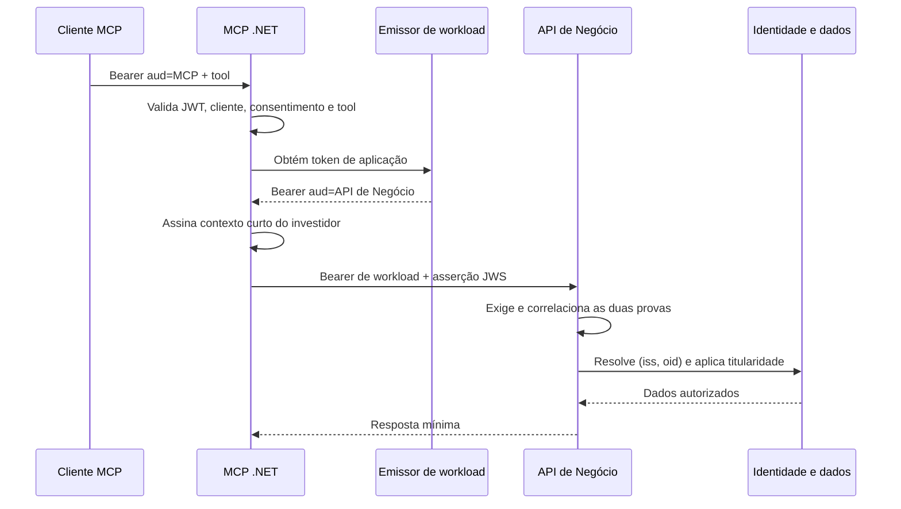
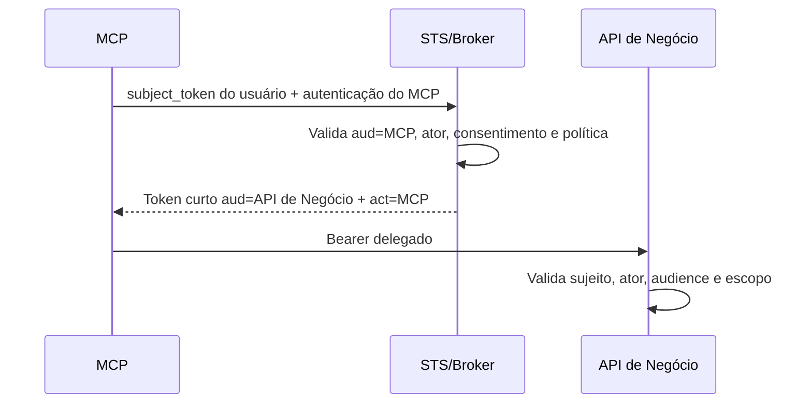

# Segurança do MCP Stateless 2026-07-28 com Azure AD B2C

> **Status:** proposta de arquitetura e plano de implementação  
> **Escopo:** MCP Stateless em .NET, Azure AD B2C, Axway, AKS e API de Negócio  
> **Decisão temporal:** propagação do token do MCP permitida somente em desenvolvimento e homologação; proibida em produção

## 1. Decisão executiva

O token recebido pelo MCP tem audiência exclusiva do MCP. Por isso, a API de Negócio não deve aceitá-lo em produção, mesmo que consiga ler o mesmo `oid` e consultar o mesmo investidor. A assinatura prova quem emitiu o token; o `aud` limita onde ele pode ser usado. Compartilhar o `oid` não altera essa fronteira.

A solução recomendada para produção é a **dupla prova**:

1. o MCP chama a API de Negócio com um access token de aplicação cujo `aud` é a própria API de Negócio;
2. junto da chamada, o MCP envia uma asserção de contexto de usuário, curta e assinada assimetricamente, gerada somente depois de validar o token B2C original, o consentimento e a tool;
3. a API de Negócio atende a consulta somente quando as duas provas são válidas e coerentes entre si.

Assim, a credencial de aplicação prova **qual workload chamou**, enquanto a asserção prova **em nome de qual investidor e para qual operação** a chamada foi criada. O vazamento isolado da credencial de aplicação não deve permitir consultar investidores.

> [!IMPORTANT]
> Não repasse um `client_id` em header e não o trate como identidade do investidor. Em OAuth, `client_id` e normalmente `azp` identificam uma **aplicação**; `oid` ou `sub` identificam o **usuário**. Se hoje existe uma claim customizada chamada `client_id` contendo um identificador de investidor, ela deve ser renomeada e formalizada para evitar uma colisão semântica perigosa.

### Escolha recomendada por ambiente

| Ambiente | Autenticação MCP → API de Negócio | Contexto do investidor | Situação |
|---|---|---|---|
| Desenvolvimento/homologação | Token B2C com `aud=MCP`, temporariamente aceito pela API + assinatura de requisição | `oid` validado do token | Exceção controlada e não conforme ao MCP |
| Produção — recomendada | Credencial de workload com `aud=API de Negócio` | Asserção JWS curta, assinada pelo MCP | Dupla prova; não é OBO |
| Produção — delegação OAuth formal | Token emitido por STS/broker para `aud=API de Negócio` | Sujeito e ator no token delegado | RFC 8693 ou IdP com OBO/token exchange |

## 2. O ponto que precisa ser corrigido no modelo atual

### `client_id`, `azp`, `oid` e `aud` não são equivalentes

| Valor | Representa | Uso correto | Não deve ser usado para |
|---|---|---|---|
| `client_id` | Cadastro do cliente OAuth | Identificar Cursor, ChatGPT, Claude ou uma aplicação confidencial | Identificar o investidor |
| `azp` | Parte autorizada à qual o token foi emitido, se o emissor a fornecer | Allowlist e vínculo do consentimento ao cliente | Substituir `oid` |
| `oid` | Objeto do usuário no diretório | Resolver a identidade do investidor, sempre qualificada pelo emissor | Autorizar sozinho uma operação |
| `sub` | Sujeito do token | Alternativa quando o contrato real do emissor assim definir | Ser presumido igual entre clientes/policies |
| `aud` | Recurso destinatário do token | Determinar qual API pode aceitar o token | Conceder acesso a todas as tools |
| `scp`/`roles` | Permissões do token | Aplicar permissão coarse-grained ou de aplicação | Substituir consentimento e titularidade |

O identificador de segurança do usuário deve ser composto, no mínimo, por:

```text
(issuer normalizado, tenant/policy aplicável, oid)
```

O `oid` sozinho não cria um namespace global. Também não basta que duas APIs consultem o mesmo Microsoft Graph: essa coincidência permite resolver o mesmo usuário, mas não autoriza a segunda API a aceitar um token destinado à primeira.

> [!CAUTION]
> Antes de implementar, decodifique tokens reais de cada fluxo e aprove um contrato de claims. A documentação do B2C mostra que, no fluxo `client_credentials` específico do B2C, as permissões concedidas podem aparecer em `scp`; não presuma automaticamente `roles`. A aplicação deve validar o token realmente emitido no tenant.

## 3. Por que `client_credentials` sozinho não resolve

O fluxo `client_credentials` produz uma identidade de aplicação sem usuário. Ele é apropriado para o MCP autenticar-se na API de Negócio, mas não contém, por natureza, o investidor da chamada original. Colocar o `oid` em um header simples apenas transfere um dado manipulável; não cria delegação nem comprova que ele veio de um token B2C válido.

O risco “se a credencial vazar, todos os investidores ficam expostos” só é verdadeiro se a API conceder poder amplo ao token de aplicação. O desenho deve impedir isso:

- o token de workload sozinho não acessa dados de investidor;
- o MCP recebe somente uma permissão estreita, por exemplo `investor.read.delegated-context`;
- a rota aceita apenas operações predefinidas, nunca um `investorId` arbitrário;
- a identidade vem da asserção assinada, não de parâmetro ou header avulso;
- a API valida novamente titularidade, consentimento e limites da operação;
- a rota preferencialmente não é publicada no gateway externo.

## 4. Arquitetura de produção recomendada: dupla prova



### 4.1 Prova 1 — token de workload

O MCP obtém um access token cujo destinatário é a API de Negócio:

```json
{
  "iss": "<emissor-confiável>",
  "aud": "<app-id-real-da-api-de-negocio>",
  "sub": "<service-principal-do-mcp>",
  "azp": "<client-id-do-mcp>",
  "scp": "investor.read.delegated-context",
  "exp": 1780000000
}
```

As claims exatas devem seguir o token real. Opções para obter essa credencial, em ordem de preferência operacional:

1. **Microsoft Entra Workload Identity/identidade gerenciada ou certificado**, se a API de Negócio puder confiar nesse emissor. Evita segredo estático no pod.
2. **Client credentials com certificado ou federação de workload**, quando suportado pelo emissor escolhido.
3. **Client credentials do Azure AD B2C com segredo**, somente após aceite de risco: a Microsoft ainda o documenta como *public preview* e o segredo exige Key Vault, rotação e proteção forte.

Se o token de workload vier do Microsoft Entra ID e o token do usuário vier do B2C, a API terá dois emissores em seu ecossistema, mas a rota MCP deve aceitar apenas o esquema de workload destinado a ela. Não selecione o esquema apenas por uma claim não validada; faça a seleção por issuer confiável e valide todos os parâmetros.

### 4.2 Prova 2 — asserção assinada de contexto

Depois de validar o token do usuário e autorizar a tool, o MCP cria um JWS de uso interno:

```json
{
  "typ": "mcp-user-context+jwt",
  "iss": "https://mcp.investidor.com.br",
  "aud": "<identificador-da-api-de-negocio>",
  "sub": "<identidade-interna-ou-oid>",
  "user_iss": "<issuer-b2c-normalizado>",
  "user_oid": "<oid-extraído-do-token-validado>",
  "client_id": "<azp/client-do-token-original-validado>",
  "operation": "read:posicao",
  "consent_id": "<id-opaco>",
  "consent_version": 7,
  "act": { "sub": "<identidade-do-workload-mcp>" },
  "htm": "POST",
  "htu": "https://api-interna/positions/query",
  "request_sha256": "<hash-do-corpo-canônico>",
  "jti": "<uuid-aleatório>",
  "iat": 1780000000,
  "nbf": 1780000000,
  "exp": 1780000030
}
```

Regras obrigatórias:

- assinatura assimétrica, preferencialmente ECDSA P-256 ou RSA com algoritmo aprovado pela organização;
- chave privada somente no MCP, em Key Vault/HSM ou mecanismo equivalente; a API recebe apenas a chave pública/JWKS;
- `typ` exclusivo para impedir confusão com access token OAuth;
- validade de 30 a 60 segundos, sem refresh;
- `jti` de uso único, armazenado atomicamente em cache distribuído até o `exp`;
- `aud` exclusivo da API de Negócio e `iss` exclusivo do MCP;
- `act.sub` deve corresponder à identidade validada no token de workload;
- `operation` deve corresponder à rota e ao método chamados;
- `htm`, `htu` e `request_sha256` devem vincular a asserção ao método, destino e conteúdo exatos da chamada;
- o `oid` nunca pode vir dos argumentos da tool;
- o `client_id` original é contexto e vínculo de consentimento, não identidade do investidor.

> [!NOTE]
> Essa asserção é um artefato interno assinado, não um novo access token OAuth e não deve ser apresentado como “OBO caseiro”. Ela é adequada quando a API precisa de identidade contextual para autorização de negócio, mas a organização não exige delegação OAuth formal em todos os saltos.

Contrato de transporte sugerido:

```http
POST /internal/mcp/positions/query HTTP/1.1
Authorization: Bearer <token-de-workload-aud-api-negocio>
MCP-User-Context: <JWS-assinado-pelo-MCP>
Content-Digest: sha-256=:<digest>:
X-Correlation-Id: <uuid>
```

O gateway externo deve remover `MCP-User-Context` e os demais headers reservados de qualquer requisição pública. A rota interna deve reconstruir e validar o destino efetivo após proxies confiáveis; não use cegamente `Host` ou `X-Forwarded-*` fornecido pelo cliente.

### 4.3 Validação na API de Negócio

A API só executa a operação quando todas as condições forem verdadeiras:

1. o token de workload tem assinatura, `iss`, `aud`, tempo e permissão válidos;
2. `azp`/`sub` do workload pertence à allowlist exclusiva do MCP;
3. a asserção tem assinatura, `typ`, `iss`, `aud`, `iat`, `nbf`, `exp` e `jti` válidos;
4. `act.sub` da asserção corresponde ao chamador autenticado;
5. `operation` corresponde ao endpoint e ao método HTTP;
6. método, URI normalizada e hash do corpo correspondem à chamada recebida;
7. o par `(user_iss, user_oid)` resolve um investidor ativo;
8. o consentimento informado ainda está ativo ou é revalidado pela API;
9. a consulta é limitada às contas daquele investidor;
10. o `jti` é consumido uma única vez;
11. a resposta contém somente os campos necessários à tool.

Falhas de autenticação retornam `401`; prova válida sem autorização retorna `403`; recurso de outro titular retorna `404` quando isso reduzir enumeração. Nenhuma exceção de autorização deve escapar como `500`.

## 5. Quando exigir um token realmente delegado: RFC 8693

Se auditoria, regulação ou arquitetura exigir que a própria API de Negócio receba um access token representando usuário **e** MCP, a solução correta é um Security Token Service (STS) ou broker compatível com OAuth 2.0 Token Exchange.



O pedido ao STS segue o modelo da [RFC 8693](https://www.rfc-editor.org/rfc/rfc8693.html): `subject_token` representa o usuário, `resource`/`audience` seleciona a API de Negócio e a identidade do MCP é autenticada, podendo ser registrada como ator (`act`). O STS emite um novo token curto para a API de Negócio; o token original nunca é propagado a ela.

> [!WARNING]
> O Azure AD B2C não implementa OBO para cadeias de APIs. Uma REST API chamada por custom policy pode enriquecer claims durante emissão, mas isso não equivale a um endpoint geral de token exchange. Construir um STS próprio é uma responsabilidade de alta criticidade: emissão, chaves, rotação, replay, políticas, auditoria e revogação passam a ser parte da superfície de segurança. Priorize um produto corporativo já aprovado que suporte OBO/RFC 8693 antes de criar um emissor próprio.

### Comparação das alternativas

| Critério | Dupla prova | STS/RFC 8693 | Propagação atual |
|---|---|---|---|
| Token aceito pela API tem `aud` correto | Sim | Sim | Não |
| Identidade de workload | Token de aplicação | Autenticação do ator/`act` | HMAC/infraestrutura auxiliar |
| Contexto do usuário | Asserção interna assinada | Token OAuth delegado | Token original |
| Conformidade com proibição de passthrough MCP | Sim | Sim | Não |
| Complexidade | Média | Alta | Baixa |
| Recomendação | Produção pragmática | Produção com delegação formal | Apenas dev/homologação |

## 6. Como resolver o documento do investidor sem propagar o token

O fluxo não precisa do token original na API de Negócio:

1. o MCP extrai `oid` e `iss` somente após validar o access token B2C;
2. esses valores entram na asserção assinada;
3. a API valida a asserção e resolve `(iss, oid)` para o identificador interno do investidor;
4. se precisar consultar Microsoft Graph, a API usa **seu próprio** token app-only para o Graph, com a menor permissão possível;
5. CPF/documento não trafega no token, em headers de cliente nem nos argumentos da tool.

Há uma diferença auditável entre **ler o `oid` do token validado e consultar um cadastro** e **usar esse bearer token para chamar o Graph**. A primeira opção é resolução de identidade e pode ser válida. A segunda exigiria um token cujo `aud` fosse o Microsoft Graph; um token `aud=MCP` não deve ser aceito pelo Graph. Se o fluxo atual “funciona com o mesmo token”, confirme em trace sanitizado se o token está apenas fornecendo o `oid` ou se está sendo apresentado como bearer a outro recurso.

Uma alternativa ainda mais restritiva é o serviço de identidade transformar `(iss, oid)` em um identificador interno opaco. Nesse caso, a asserção carrega esse identificador e uma referência ao diretório, sem expor documento pessoal.

O banco de consentimento deve usar uma chave semelhante a:

```text
issuer + oid + original_client_id/azp + resource + tool + consent_version
```

Isso impede que consentimento concedido ao Cursor seja automaticamente reutilizado por outro cliente OAuth.

## 7. Exceção até homologação: token propagado + HMAC

A propagação continua sendo má prática e não conformidade mesmo neste cenário. O motivo não é o dado acessado, mas a quebra da propriedade de destinatário: a API de Negócio aceita um bearer token que não foi emitido para ela. O fato de ambos os serviços encontrarem o mesmo `oid` não muda o `aud`.

O HMAC não corrige o token nem executa exchange. Ele apenas adiciona prova de que quem montou a requisição conhece uma chave compartilhada. Como MCP e API conhecem a mesma chave, ambos podem produzir assinaturas; por isso, em produção, a asserção assimétrica é superior.

### Controles obrigatórios da exceção

- feature flag configurada para falhar fechada e impossível de habilitar no deployment de produção;
- rota/hostname exclusivo do MCP, ausente do gateway externo sempre que possível;
- NetworkPolicy, firewall e autenticação de workload ou mTLS além do HMAC;
- gateway remove headers reservados vindos da internet;
- assinatura por requisição conforme [RFC 9421](https://www.rfc-editor.org/rfc/rfc9421.html), em vez de concatenação ad hoc;
- `Content-Digest` conforme [RFC 9530](https://www.rfc-editor.org/rfc/rfc9530.html);
- cobertura de método, autoridade, caminho/query normalizados, digest do corpo, `created`, `expires`, `nonce` e `keyid`;
- janela máxima de 30 a 60 segundos e store distribuído de nonce com operação atômica `SET NX`;
- rotação com dois `keyid` durante transição; segredo em Key Vault e nunca em configuração ou log;
- API valida novamente JWT completo: assinatura, `iss`, `aud=MCP`, tempo, policy, `oid`, escopo e consentimento;
- telemetria específica para qualquer uso do esquema temporário;
- data, responsável e critério automatizado de remoção antes da produção.

> [!CAUTION]
> Não chame isso de “token HMAC”. É uma assinatura/MAC da mensagem HTTP. O access token continua com audiência incorreta para a API de Negócio.

## 8. Autenticação e autorização no MCP

O audience exclusivo reduz reutilização entre aplicações, mas não substitui autorização. Para a primeira versão, mantenha um scope estático coarse-grained, como `mcp.read`, e deixe a granularidade por tool no serviço de consentimento:

| Camada | Pergunta respondida | Controle |
|---|---|---|
| JWT | O token é autêntico e destinado ao MCP? | assinatura, `iss`, `aud`, `exp`, `nbf`, policy |
| Cliente OAuth | Qual cliente obteve o token? | `azp`/claim comprovada + allowlist |
| Scope | A classe de operação é permitida? | `mcp.read` agora; `mcp.write` antes de escrita |
| Consentimento | Este cliente pode usar esta tool para este usuário? | banco por `(iss, oid, client, resource, tool)` |
| Negócio | O dado pertence ao investidor? | resolução server-side e proteção BOLA/IDOR |

`aud` identifica o recurso, não a permissão. Mesmo com uma audiência exclusiva, um token roubado continua podendo tentar qualquer endpoint daquele recurso durante sua validade. O scope coarse-grained, a allowlist de clientes, o consentimento por tool, a titularidade e o rate limit formam controles independentes.

## 9. Descoberta OAuth e refresh

O MCP retorna `401` com `WWW-Authenticate` apontando para o Protected Resource Metadata. O cliente MCP descobre os authorization servers, consulta seus metadados e inicia Authorization Code com PKCE. O cliente — Cursor, ChatGPT ou Claude — é quem redireciona o usuário ao B2C; o MCP não inicia o login.

Mantenha separados:

```text
resource MCP canônico: https://mcp.investidor.com.br/mcp
aud esperado no JWT: valor real emitido pelo B2C para a App Registration da API
```

No B2C, `aud` pode ser o Application (client) ID da API, frequentemente um GUID. Não presuma que será igual à URI pública do recurso.

O refresh token fica com o cliente MCP e só é enviado ao token endpoint do authorization server. O MCP recebe apenas novos access tokens. Refresh não deve renovar automaticamente consentimento revogado: o MCP consulta a fonte de consentimento a cada operação sensível ou usa cache curto com invalidação por versão.

### Registro do cliente com B2C

Na especificação MCP 2026-07-28, o cliente obtém um `client_id` por Client ID Metadata Document (CIMD), pré-registro ou DCR; o DCR foi mantido por compatibilidade e está marcado como depreciado. Como o B2C não oferece DCR nativo para esse cenário, o caminho inicial mais previsível é **pré-registrar** Cursor e os demais consumidores, com redirect URIs exatas e sem wildcard. Um serviço interno de cadastro só deve ser chamado de DCR se implementar e proteger efetivamente o contrato aplicável; uma API que apenas cria App Registrations não resolve, sozinha, validação de redirect URI, governança, autenticação do cadastro e prevenção de clientes maliciosos.

Teste CIMD e interoperabilidade com cada cliente antes de adotá-los como requisito. A ausência de DCR não justifica aceitar `client_id` arbitrário nem relaxar PKCE, `state`, validação de issuer ou redirect URI.

## 10. Requisitos de implementação .NET e plataforma

### MCP .NET

- validar assinatura/JWKS, algoritmo permitido, `iss`, `aud`, `exp`, `nbf` e policy;
- exigir access token, nunca `id_token`;
- normalizar e validar o cliente original (`azp` ou claim contratada);
- aplicar policy `mcp.read` e depois consentimento da tool;
- derivar `(iss, oid)` do `ClaimsPrincipal` validado;
- adquirir e armazenar em cache o token de workload sem gravá-lo em logs;
- gerar a asserção somente após a autorização, com chave assimétrica e `jti` único;
- mapear falhas para `401`/`403`, nunca lançar exceção genérica que vire `500`;
- usar timeouts, circuit breaker e limite de resposta da API de Negócio.

### API de Negócio

- criar um esquema de autenticação e policy exclusivos para a rota MCP interna;
- em produção, rejeitar definitivamente tokens com `aud=MCP`;
- exigir as duas provas na mesma policy;
- não aceitar `oid`, documento, conta ou investor ID diretamente do cliente;
- revalidar consentimento/titularidade conforme o risco;
- restringir o token de workload à rota e operações necessárias;
- registrar `jti`, `correlation_id`, ator, sujeito pseudonimizado, tool e decisão, sem tokens ou PII;
- separar limites e alertas de tráfego MCP do tráfego público comum.

### Axway, ingress e AKS

- não publicar a rota interna no catálogo/Swagger externo;
- bloquear o roteamento externo, não apenas esconder documentação;
- remover qualquer `X-MCP-*`, `Signature`, `Signature-Input` ou contexto interno recebido do exterior;
- preferir DNS/serviço privado, NetworkPolicy e identidade de workload;
- aplicar TLS em todos os saltos e mTLS onde o modelo operacional suportar;
- não delegar ao gateway a autorização de titularidade; ela pertence ao backend.

## 11. Ameaças e provas de segurança

| Ameaça | Controle esperado | Teste auditável |
|---|---|---|
| Token MCP usado diretamente na API em produção | `aud` exclusivo da API e esquema temporário ausente | token `aud=MCP` recebe `401` |
| Credencial do MCP vazada | dupla prova + escopo/rota mínimos | token de workload sem asserção recebe `401/403` |
| `oid` adulterado | asserção assinada; sem header avulso | alteração de um byte invalida assinatura |
| Reuso de asserção | `jti` atômico + validade curta | segunda utilização é rejeitada |
| Asserção usada por outro workload | `act.sub` vinculado ao principal autenticado | token de outra app recebe `403` |
| BOLA/IDOR | identidade derivada; titularidade server-side | tentativa de indicar outro investidor falha |
| Confusão de emissor/audience | allowlists exatas e schemes separados | tokens de outro tenant/app recebem `401` |
| Consentimento cruzado entre clientes | chave inclui cliente e recurso | token de outro `azp` recebe `403` |
| Headers internos forjados pela internet | strip no gateway + rota privada | teste externo não alcança ou perde headers |
| Replay no modo temporário | RFC 9421, nonce e digest | nonce repetido ou corpo alterado falha |
| Vazamento em observabilidade | redaction e campos pseudonimizados | varredura de logs não encontra JWT/CPF |

## 12. Plano de migração e gates

### Fase A — homologação controlada

- inventariar claims reais dos tokens de usuário e de aplicação;
- corrigir qualquer uso de `client_id` como identificador de pessoa;
- implementar HMAC/assinatura de mensagem, replay store e rota isolada;
- adicionar testes negativos de audience, issuer, replay, BOLA e header spoofing;
- registrar formalmente a exceção de passthrough com vencimento.

### Fase B — dupla prova

- registrar a API de Negócio como resource e o MCP como workload;
- escolher o emissor de workload aprovado; não assumir que o preview do B2C é a escolha final;
- emitir permissão mínima e criar rota interna dedicada;
- implementar JWS de contexto, JWKS, rotação e correlação com o workload;
- migrar a resolução do investidor para `(iss, oid)` vindo da asserção;
- desligar o esquema que aceita `aud=MCP`.

### Fase C — decisão de delegação formal

- confirmar com Segurança/Identidade se a asserção interna atende auditoria e regulação;
- se não atender, selecionar IdP/gateway/STS com OBO ou RFC 8693;
- pilotar emissão curta, `act`, revogação, chaves e auditoria;
- não construir STS próprio sem threat model, revisão criptográfica e operação 24x7.

### Gate obrigatório antes da produção

- [ ] API de Negócio rejeita todo token cujo `aud` seja o MCP.
- [ ] Propagação e feature flag temporária não existem no artefato/configuração de produção.
- [ ] Token de workload sozinho não retorna dado de investidor.
- [ ] Asserção sozinha não autentica a chamada.
- [ ] `act.sub` e identidade do token de workload são correlacionados.
- [ ] `oid`/identidade nunca é aceito de argumentos ou headers externos.
- [ ] Chave privada está em Key Vault/HSM e possui rotação testada.
- [ ] Replays de JWS e de mensagens HMAC são rejeitados atomicamente.
- [ ] Consentimento é vinculado a issuer, usuário, cliente, recurso e tool.
- [ ] Rotas MCP internas não são alcançáveis pelo gateway público.
- [ ] Testes VA incluem token substitution, confused deputy, BOLA/IDOR e SSRF.
- [ ] Logs e traces não armazenam tokens, CPF ou documentos.
- [ ] Runbook de revogação de credencial e de chave foi exercitado.

## 13. Decisão final recomendada

Para homologação, mantenha a propagação somente como exceção temporária, com assinatura de mensagem, nonce, rota isolada e bloqueio estrutural em produção. Para produção, implemente a **dupla prova**: bearer de workload para a API de Negócio mais uma asserção assimétrica curta que transporte `(iss, oid)`, cliente original, consentimento e operação.

Essa proposta mantém o mecanismo atual de resolução do investidor sem confiar em um identificador informado manualmente. Ela também reduz o impacto de vazamento da credencial: nem a credencial de aplicação nem a asserção isolada autorizam a consulta. Se a organização exigir semântica OAuth delegada ponta a ponta, substitua a asserção por um token emitido por STS/OBO/RFC 8693; o Azure AD B2C, sozinho, não fornece esse fluxo.

## 14. Referências oficiais

- [MCP 2026-07-28 — Authorization](https://modelcontextprotocol.io/specification/2026-07-28/basic/authorization)
- [MCP 2026-07-28 — Authorization Security Considerations](https://modelcontextprotocol.io/specification/2026-07-28/basic/authorization/security-considerations)
- [Microsoft — Application types supported by Azure AD B2C](https://learn.microsoft.com/en-us/azure/active-directory-b2c/application-types)
- [Microsoft — Access tokens in Azure AD B2C](https://learn.microsoft.com/en-us/azure/active-directory-b2c/access-tokens)
- [Microsoft — Client credentials in Azure AD B2C](https://learn.microsoft.com/en-us/azure/active-directory-b2c/client-credentials-grant-flow)
- [Microsoft — OAuth 2.0 On-Behalf-Of flow](https://learn.microsoft.com/en-us/entra/identity-platform/v2-oauth2-on-behalf-of-flow)
- [Microsoft — Client credentials on Microsoft identity platform](https://learn.microsoft.com/en-us/entra/identity-platform/v2-oauth2-client-creds-grant-flow)
- [Microsoft — App-only access to Microsoft Graph](https://learn.microsoft.com/en-us/graph/auth-v2-service)
- [RFC 8693 — OAuth 2.0 Token Exchange](https://www.rfc-editor.org/rfc/rfc8693.html)
- [RFC 9421 — HTTP Message Signatures](https://www.rfc-editor.org/rfc/rfc9421.html)
- [RFC 9530 — Digest Fields](https://www.rfc-editor.org/rfc/rfc9530.html)
- [RFC 8725 — JWT Best Current Practices](https://www.rfc-editor.org/rfc/rfc8725.html)

---

> **Conclusão auditável:** o mesmo `oid` explica como os dois serviços encontram o mesmo investidor, mas não torna intercambiáveis tokens com audiences diferentes. A fronteira correta é preservada emitindo uma credencial para a API de Negócio e vinculando a ela um contexto de usuário assinado, mínimo, curto e não reutilizável.
